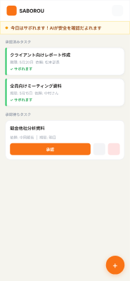
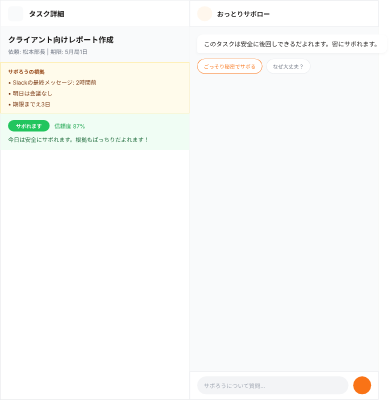
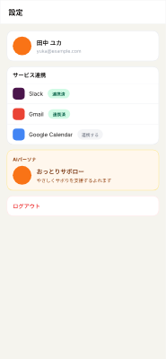
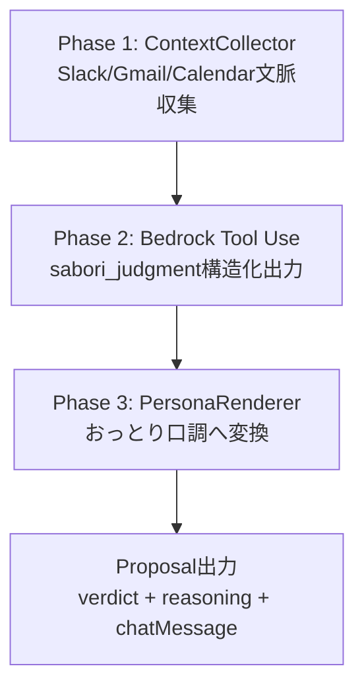
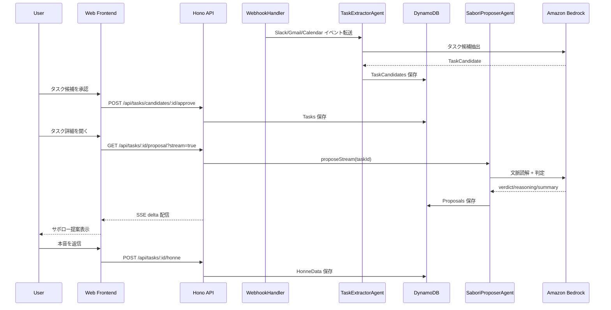
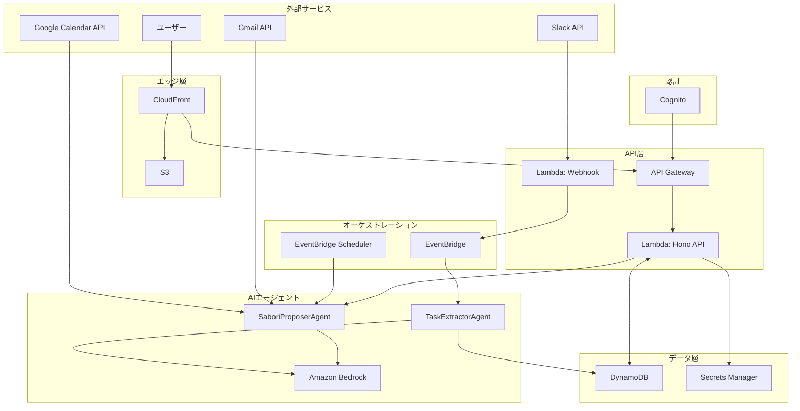

# SABOROU（サボロー） - サボりの最適解

## 概要

**何をするアプリか**

Slack やメール、カレンダーなど外部サービスからタスクを取り込み、チャットの流れ・未返信・予定の前後といった**文脈ごと**に、AI が「いまどうサボるのが一番うまいか」を根拠付きで提案します。増やすのではなく、**いま手を離してよい線引き**を見つけるためのエージェントです。

**想定ユーザー**

AI でこなせる仕事が増えた結果、**逆にタスクの絶対量が増え続けている社会人**。効率化の先に「やる量のインフレ」が来ている人を想定しています。

| Before | After |
| :--- | :--- |
| AI で仕事は速くなったが、処理できる量が増えたぶんタスクが積み上がり、常に「足りない」の感覚が続く。 | 締切・関係者・リマインドの状況などを踏まえ、**いまサボってよいか**／**最低限どこまでやれば十分か**を判断できる。判断の材料が外から揃う。 |

**表向きの目標**

タスクに追われる人の**心に余白**をつくること。「全部やる」ではなく、「いまはここまででいい」の許可を、根拠とセットで渡す。

**裏設定（人をダメにする能力）**

タスク整理・優先順位づけ・危機管理・締切感覚を、**AI に委ねる前提**で設計しています。楽になるほど、自分の頭での線引きは鈍る——そのトレードオフをコンセプトの核に置いています（詳細は下記「サービスコンセプト」および要件資料）。

## サービスコンセプト

**ーー何んだって先延ばしにできるサービスーー**

外部ツール文脈をもとに 心理学のノウハウを組み込んだ AI Agent が根拠付きで提案するプロダクトです。

| 観点 | 従来のタスク管理 | SABOROU |
|---|---|---|
| 基本発想 | やることを増やして管理する | やらなくていいことを見極める |
| 判断主体 | ユーザーの主観と経験 | 外部文脈 + AI の根拠提示 |
| 心理的負荷 | 常に「本当に後回しでいいか」で消耗 | 「今は寝かせてOK」の許可で余白を作る |
| 裏設定（人をダメにする） | 自力で判断し続ける | 判断を AI に委ね、整理力・優先順位判断・危機管理感覚が徐々に退化 |

📖 **詳細資料**:
- [`aidlc-docs/inception/requirements/requirements.md`](./aidlc-docs/inception/requirements/requirements.md)
	- プロダクト本質・ダメになる4能力の具体例
- [`aidlc-inputs/00-business-brief.md`](./aidlc-inputs/00-business-brief.md)
	- 事業仕様・コンセプト原典

---

## 画面モックアップ

<table>
  <tr>
	<td align="center">
	  
	   
	  タスク一覧（1行サボり判定サマリ）
	</td>
	<td align="center">
	  
	   
	  タスク詳細（判断材料 + サボローチャット）
	</td>
	<td align="center">
	  
	   
	  設定（Slack / Gmail / Calendar 連携）
	</td>
  </tr>
</table>

補足モック:
- `aidlc-inputs/mockups/01-task-list.png`
- `aidlc-inputs/mockups/02-task-detail-chat.png`

📖 **詳細資料**:
- 全画面UI（Pencil原本）: [`aidlc-inputs/ui/`](./aidlc-inputs/ui/)（`saborou_v2_01-login.png` / `saborou_v2_02-tasklist.png` / `saborou_v2_03-detail.png` / `saborou_v2_04-settings.png` / `ui_design.pen`）
- 各画面の対応ストーリー・受入基準: [`aidlc-docs/inception/user-stories/stories.md`](./aidlc-docs/inception/user-stories/stories.md) US-04〜US-17

---

## ターゲットユーザー

**プライマリペルソナ: 田中 ユカ（34歳 / フリーランスデザイナー）**

| 項目 | 内容 |
|---|---|
| 稼働状況 | 常時 3〜5 社と並行、1日 10〜20 件のタスク |
| 使用ツール | Slack（常時）、Gmail（1日3〜4回）、Google Calendar（朝昼確認） |
| 根本課題 | 「今サボっていいのか」の判断基準がなく、判断疲れが蓄積 |
| 欲しい価値 | 「後回しにしていい」ことを、根拠付きで許可してほしい |

1日の典型:
- 07:30 通知確認でため息
- 10:00 優先順位の判断で手が止まる
- 15:30 「後でいいか」の確信が持てず消耗
- 22:00 仕事後も Slack を確認してしまう

> 「『このタスク、今日中じゃなくていいよ』って誰かに言ってほしかっただけなんだよね。それを、ちゃんと理由と一緒に。」

📖 **詳細資料**:
- ペルソナ完全版（1日のルーティン・心理状態・課題5点・心の声）: [`aidlc-docs/inception/user-stories/personas.md`](./aidlc-docs/inception/user-stories/personas.md)
- ターゲット定義の根拠（Q16=B 副業・フリーランサー）: [`aidlc-docs/inception/requirements/requirements.md`](./aidlc-docs/inception/requirements/requirements.md) §1.2

---

## コアロジック

SABOROU の中核は、**サボり判定エンジン**です。

### 1) 3フェーズ判定フロー

### 2) 心理学研究の組み込み（サボり判定への応用）

SABOROU は以下 5 理論を `ContextSignals` にマッピングし、LLM 判定に入力します。

| 理論 | 主著 | シグナル対応 | 判定への使い方 |
|---|---|---|---|
| Collective Effort Model | Karau & Williams (1993) | `contextCoverage` | 文脈欠損や貢献可視性の低さを評価 |
| Identifiability | Williams et al. (1981) | `requesterActiveStatus`, `hasReminder` | 依頼者に見られている度合いを評価 |
| Sucker Effect | Kerr (1983) | `requesterActiveStatus` | 「自分だけ損する」状況を評価 |
| Self-Determination Theory | Ryan & Deci (2000) | `reminderCount`, `urgencyLevel` | 外発的プレッシャー強度を評価 |
| Expectancy Theory | Vroom (1964) | `deadlineMinutes`, `contextCoverage` | 今努力する期待値を評価 |

### 3) AIにどう出力させているか

- Bedrock `converse` + Tool Use で `sabori_judgment` スキーマを強制
- LLM は `verdict` / `reasoning` / `summaryText` / `nextCheckOffsetMinutes` を構造化で返却
- 最後に PersonaRenderer が `rawChatMessage` を「サボロー口調」に変換

これにより、**科学的根拠 × 説明可能性 × キャラクター体験**を同時に成立させています。

心理学理論の詳細（DOI付き）

| # | フレームワーク | 出典 |
|---|---|---|
| 1 | CEM | Karau & Williams, 1993, https://doi.org/10.1037/0022-3514.65.4.681 |
| 2 | Identifiability | Williams et al., 1981, https://doi.org/10.1037/0022-3514.40.2.303 |
| 3 | Sucker Effect | Kerr, 1983, https://doi.org/10.1037/0022-3514.45.4.819 |
| 4 | SDT | Ryan & Deci, 2000, https://doi.org/10.1037/0003-066X.55.1.68 |
| 5 | Expectancy Theory | Vroom, 1964, *Work and Motivation* |

📖 **詳細資料**:
- 3フェーズ判定フロー詳細: [`aidlc-docs/inception/application-design/application-design.md`](./aidlc-docs/inception/application-design/application-design.md) §7.2（サボり提案生成シーケンス図）
- サボり判定3状態・判定ロジック・next_check_at計算ルール: 同 §8.1〜8.4
- SaboriProposerAgent 実装メソッド・心理学フレームワーク実装マッピング: [`aidlc-docs/inception/application-design/component-methods/AG-02-sabori-proposer-agent.md`](./aidlc-docs/inception/application-design/component-methods/AG-02-sabori-proposer-agent.md)
- 心理学根拠の要約（DOI付き）: [`requirements.md`](./aidlc-docs/inception/requirements/requirements.md) §1.1.2

---

## 機能一覧

| 要件ID | 機能 | 優先度 | 連携/依存 | デモ対象 |
|---|---|---|---|---|
| FR-01 | 外部サービス連携・タスク自動抽出 | MUST | Slack / Gmail / Google Calendar / EventBridge | Yes |
| FR-02 | タスク候補の承認・編集・削除 | MUST | DynamoDB TaskCandidates/Tasks | Yes |
| FR-03 | 文脈読解・サボり提案生成 | MUST | Bedrock AgentCore / PersonaRenderer | Yes |
| FR-04 | サボり提案のリアルタイム更新 | MUST | On-demand + EventBridge Scheduler | Yes |
| FR-05 | 本音データ収集 | MUST | DynamoDB HonneData | Yes |
| FR-06 | タスク一覧の1行サマリ表示 | MUST | Proposal summaryText | Yes |
| FR-07 | 認証・外部連携管理 | MUST | Cognito + Google OAuth + Secrets Manager | Yes |
| FR-08 | 手動タスク追加 | SHOULD | Hono API + DynamoDB | Optional |

📖 **詳細資料**:
- FR-01〜FR-08 の完全仕様（受入基準・根拠Q番号）: [`requirements.md`](./aidlc-docs/inception/requirements/requirements.md) §3
- NFR-01〜NFR-11: 同 §4
- 機能別ユーザーストーリー（Epic E-01〜E-05 / US-01〜17）: [`stories.md`](./aidlc-docs/inception/user-stories/stories.md)
- 5分デモシナリオ（審査員向け時系列）: [`demo-stories.md`](./aidlc-docs/inception/user-stories/demo-stories.md)
- 将来展望（MVPスコープ外）: [`future-stories.md`](./aidlc-docs/inception/user-stories/future-stories.md)

---

## ユーザーストーリー処理シーケンス図

📖 **詳細資料**:
- 全7シーケンス図（タスク抽出 / サボり提案 / 本音記録 / 再評価 / 認証 / 連携設定 / エラーハンドリング）: [`application-design.md`](./aidlc-docs/inception/application-design/application-design.md) §7.1〜7.7
- API 14エンドポイント仕様: 同 §6

---

## 使用AWSサービス一覧

| カテゴリ | サービス | 用途 | 選定理由 |
|---|---|---|---|
| フロント配信 | CloudFront | HTTPS終端 + CDN配信 | 低遅延・グローバル配信 |
| フロント配信 | S3 | 静的アセットホスティング | シンプル・低コスト |
| 認証 | Cognito User Pools | ユーザー認証 / Google IdP連携 | OAuth実装をマネージド化 |
| API | API Gateway HTTP API | REST入口 + Authorizer | Lambda統合が容易 |
| コンピュート | Lambda | Hono API / Agent実行 | サーバーレスでコスト最適 |
| オーケストレーション | EventBridge | イベント中継 | 疎結合・拡張容易 |
| スケジューリング | EventBridge Scheduler | 再評価ジョブ定期実行 | 運用負荷が低い |
| AI | Amazon Bedrock | タスク抽出 / サボり判定 | モデル利用とガバナンスの両立 |
| データ | DynamoDB | タスク・提案・本音データ保存 | On-Demandでハッカソン向き |
| シークレット | Secrets Manager | OAuthトークン・署名鍵保管 | 秘密情報の安全管理 |
| 監視 | CloudWatch | ログ・メトリクス・アラート | AWS標準の監視基盤 |

📖 **詳細資料**:
- AWS全体アーキテクチャ・セキュリティ境界・データフロー: [`aws-architecture.md`](./aidlc-docs/inception/application-design/aws-architecture.md)
- コスト見積り（月額$30.94・NFR-06達成）: 同 §6
- モニタリング・アラーム設計: 同 §7
- AWS制約（リージョン・サーバーレス方針）: [`.claude/rules/aws-constraints.md`](./.claude/rules/aws-constraints.md)
- アーキテクチャ方針: [`aidlc-inputs/03-aws-architecture-policy.md`](./aidlc-inputs/03-aws-architecture-policy.md)

---

## アーキテクチャ図

### 全体アーキテクチャ

📖 **詳細資料**:
- コンポーネント詳細（FE-01〜08 / BE-01〜06 / AG-01〜04 / INF-01〜06）: [`application-design.md`](./aidlc-docs/inception/application-design/application-design.md) §4
- 各コンポーネントのメソッド定義: [`component-methods/`](./aidlc-docs/inception/application-design/component-methods/)
- コンポーネント依存関係図: [`component-dependency.md`](./aidlc-docs/inception/application-design/component-dependency.md)
- DynamoDB 7テーブル設計: [`application-design.md`](./aidlc-docs/inception/application-design/application-design.md) §5
- Unit of Work（U-01〜U-05）と実装スケジュール: [`unit-of-work.md`](./aidlc-docs/inception/units/unit-of-work.md)

---

## 技術スタック (Tech Stack)

- フロントエンド: React, TypeScript, Vite, shadcn/ui, Tailwind CSS
- バックエンド: Hono on AWS Lambda, API Gateway HTTP API
- Slack連携: @slack/bolt（Webhook受信・署名検証）
- チャットUI: Vercel AI SDK / useChat フック（サボローチャット ストリーミング表示）
- AI: Amazon Bedrock（Claude Sonnet）, Bedrock AgentCore
- データ: DynamoDB（On-Demand）
- 認証: Amazon Cognito（Google OAuth）
- シークレット管理: AWS Secrets Manager
- インフラ: AWS CDK v2（TypeScript）
- リージョン: ap-northeast-1（東京）

📖 **詳細資料**:
- 確定済み技術スタック（フロント/バック/AWS/開発ツールチェーン）: [`requirements.md`](./aidlc-docs/inception/requirements/requirements.md) §6.1〜6.5
- 技術選定の意思決定記録: [`aidlc-inputs/01-tech-stack-decisions.md`](./aidlc-inputs/01-tech-stack-decisions.md)
- 開発方針（TDD・TypeScript統一・Biome）: [`aidlc-inputs/02-development-policy.md`](./aidlc-inputs/02-development-policy.md)

---

## AI-DLC ワークフロー成果物

本プロジェクトは [AI-DLC（AI Driven Development Life Cycle）](./AGENTS.md) に準拠して開発しています。Inceptionフェーズの全成果物は以下に格納されています。

| ステージ | 成果物 | パス |
|---|---|---|
| Requirements Analysis | 要件定義書（FR-01〜08 / NFR-01〜11） | [`aidlc-docs/inception/requirements/requirements.md`](./aidlc-docs/inception/requirements/requirements.md) |
| User Stories | Epic 5 / Story 17 + ペルソナ + デモシナリオ | [`aidlc-docs/inception/user-stories/`](./aidlc-docs/inception/user-stories/) |
| Workflow Planning | 実行計画 | [`aidlc-docs/inception/plans/execution-plan.md`](./aidlc-docs/inception/plans/execution-plan.md) |
| Application Design | アプリケーション設計書 + AWSアーキテクチャ + コンポーネント | [`aidlc-docs/inception/application-design/`](./aidlc-docs/inception/application-design/) |
| Units Generation | Unit of Work（U-01〜U-05） | [`aidlc-docs/inception/units/unit-of-work.md`](./aidlc-docs/inception/units/unit-of-work.md) |
| 状態管理 | ワークフロー状態 / 監査ログ / レビューレポート | [`aidlc-state.md`](./aidlc-docs/aidlc-state.md) / [`audit.md`](./aidlc-docs/audit.md) / [`review-report-20260510-final.md`](./aidlc-docs/review-report-20260510-final.md) |
