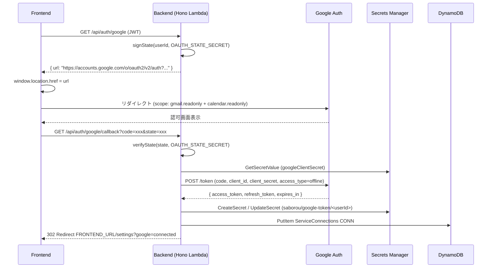
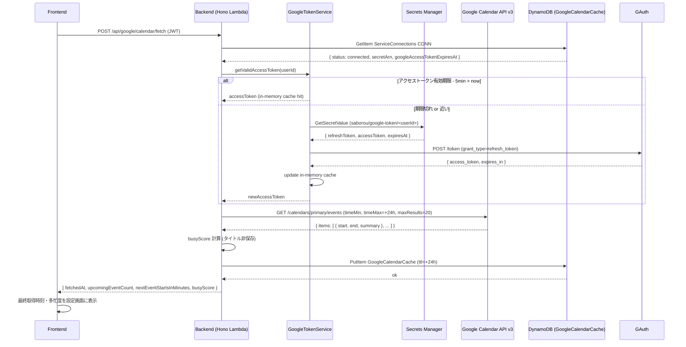
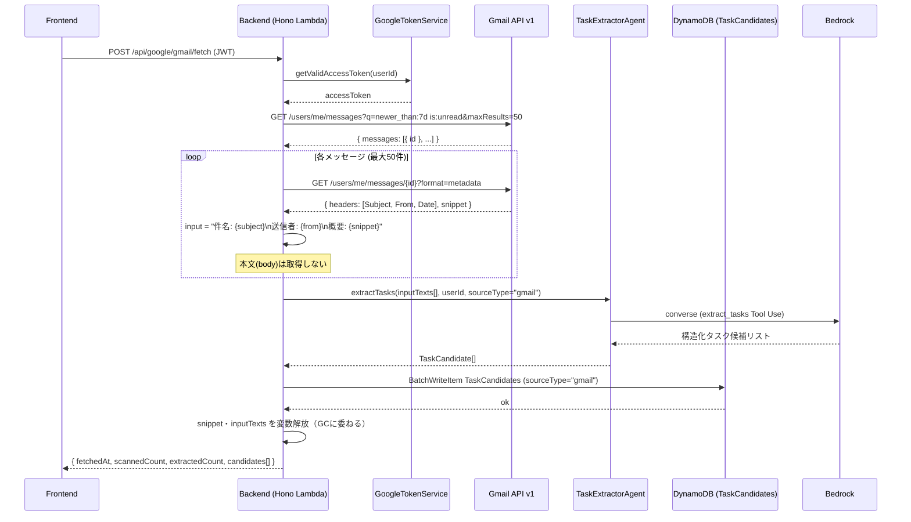
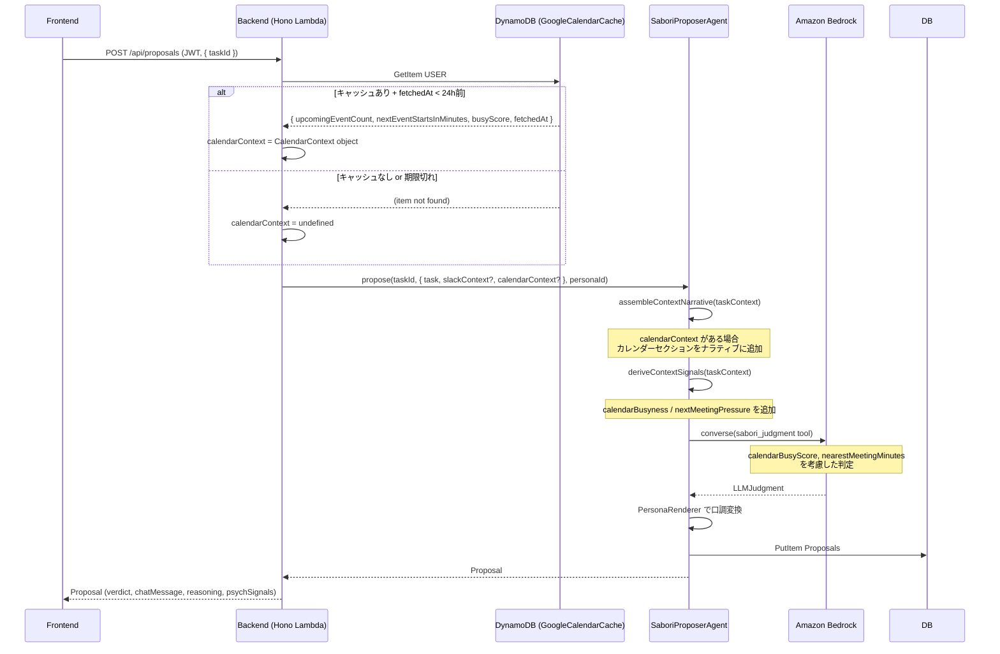

# U-07: google-integration — シーケンス図

**バージョン**: 1.0.0
**作成日**: 2026-05-24

---

## 1. Google OAuth フロー（Slack 完全踏襲）



---

## 2. Calendar 手動取り込みフロー



---

## 3. Gmail 手動取り込み → TaskCandidate 生成フロー



---

## 4. SaboriProposer — Calendar コンテキスト注入フロー



---

## 5. トークンリフレッシュ フォールバックフロー

```mermaid
sequenceDiagram
    participant BE as Backend
    participant GTS as GoogleTokenService
    participant GAPI as Google API
    participant SM as Secrets Manager
    participant DB as DynamoDB (ServiceConnections)

    BE->>GAPI: API 呼び出し (accessToken)
    GAPI-->>BE: 401 Unauthorized

    BE->>GTS: refreshAccessToken(userId) [フォールバック]
    GTS->>SM: GetSecretValue (refreshToken)

    alt refreshToken 有効
        SM-->>GTS: { refreshToken }
        GTS->>GAuth: POST /token (grant_type=refresh_token)
        GAuth-->>GTS: { access_token, expires_in }
        GTS->>GTS: update in-memory cache
        GTS-->>BE: newAccessToken

        BE->>GAPI: API 呼び出し (newAccessToken) [リトライ]
        GAPI-->>BE: 200 OK (データ)
    else refreshToken も失効
        GAuth-->>GTS: 400 { error: "invalid_grant" }
        GTS-->>BE: TokenRefreshError

        BE->>DB: UpdateItem CONN#google status=token_expired
        BE-->>FE: 401 { error: { code: "TOKEN_REFRESH_FAILED",
                        message: "Googleアカウントの再連携が必要です" } }

        FE->>FE: 設定画面に「再連携が必要です」バナーを表示
    end
```
