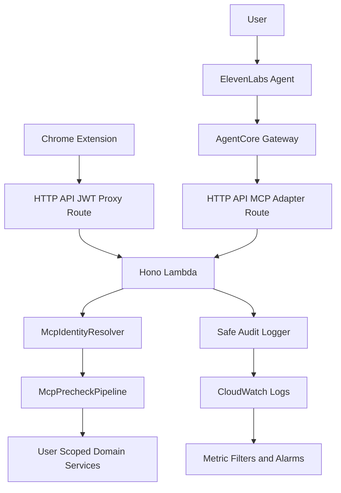

# Deployment Architecture - U-V3-01 mcp-transport-auth-adapter

**作成日**: 2026-06-17 JST
**Unit**: U-V3-01 mcp-transport-auth-adapter
**ステータス**: Review Required

---

## Architecture Overview

The deployment architecture keeps two distinct paths:

1. Existing browser/extension direct API path protected by API Gateway JWT Authorizer.
2. MCP adapter path used by AgentCore/ElevenLabs, with application-level Cognito JWT verification and fail-closed behavior.

---

## Mermaid Diagram



### Text Alternative

1. User speaks to ElevenLabs Agent.
2. ElevenLabs calls AgentCore Gateway.
3. AgentCore invokes the SABOROU MCP adapter route.
4. The Hono Lambda receives the request and runs `McpIdentityResolver`.
5. The precheck pipeline validates identity, allowlist, args, and approval metadata.
6. Only after precheck does the Lambda call user-scoped domain services.
7. Every attempt emits a safe audit event to CloudWatch Logs.
8. Existing Chrome extension traffic continues through the JWT-protected proxy route.

---

## Environment Design

| Environment | Purpose | Notes |
|-------------|---------|-------|
| `dev` | Local/cloud development and demo rehearsals | Retain fast iteration; still keep access logs for MCP path. |
| `test` | CDK assertion templates | No live AWS requirement; assertions verify route/log/IAM shape. |
| `prod` | Final demo or production-like deployment | `ExceptionLevel = INFO`, 90-day logs, no debug payloads. |

---

## Deployment Sequence

1. Build backend assets.
2. Run CDK tests for `SaborouApiStack` and `SaborouAgentCoreStack`.
3. Run Lean proof:

```bash
lean aidlc-docs/construction/u-v3-01-mcp-transport-auth-adapter/formal-verification/McpTransportAuthAdapter.lean
```

4. Synthesize CDK stacks.
5. Deploy API stack updates.
6. Deploy AgentCore stack updates.
7. Verify API Gateway access log group and Lambda log retention.
8. Verify AgentCore Gateway/Target status.

---

## Rollback Design

| Failure | Rollback / Mitigation |
|---------|------------------------|
| MCP adapter route fails auth | Keep direct Hono JWT fallback path unchanged. |
| API access log CDK change fails | Roll back API stack; no data loss expected. |
| Gateway role scoping breaks target invocation | Revert to API-ID-scoped execute-api resource with documented wildcard route exception. |
| Metric filter/alarms are noisy | Adjust thresholds without changing adapter semantics. |
| AgentCore does not forward usable user context | Adapter fails closed; U-V3-04/U-V3-05 must verify alternate `streamable_http`/`sse` registration path. |

---

## CDK Assertion Requirements

| Assertion | Stack |
|-----------|-------|
| HTTP API has access logging configured. | `SaborouApiStack` |
| Hono Lambda log retention is at least 90 days or exception is documented. | `SaborouApiStack` |
| Existing `/{proxy+}` route keeps JWT authorizer. | `SaborouApiStack` |
| Public routes are limited to health and OAuth callbacks. | `SaborouApiStack` |
| MCP adapter route exists if implemented as distinct route. | `SaborouApiStack` |
| AgentCore Gateway uses Custom JWT. | `SaborouAgentCoreStack` |
| Gateway role has no wildcard actions. | `SaborouAgentCoreStack` |
| Gateway role resource scope is limited to SABOROU API or documented MCP route wildcard. | `SaborouAgentCoreStack` |
| Schema bucket remains encrypted and private. | `SaborouAgentCoreStack` |

---

## Operational Checks

| Check | Tool |
|-------|------|
| API Gateway access logs appear after MCP call. | CloudWatch Logs |
| Safe audit event includes requestId/toolName/status/duration. | CloudWatch Logs Insights |
| Unauthorized MCP calls emit `unauthorized` status. | CloudWatch Logs Insights |
| No Authorization header or raw args appear in logs. | Logs Insights search |
| Alarm exists for repeated unauthorized/forbidden events. | CloudWatch Alarms |
| Lean proof still compiles. | `lean` command |

---

## Open Verification Item

AgentCore Gateway's exact target forwarding behavior must be verified in real AWS:

- Whether the original Cognito `Authorization` header is forwarded to the target.
- Whether verified JWT claims are exposed to the OpenAPI target request.
- Whether route-level narrowing of `execute-api:Invoke` works with the selected target path.

Until this is verified, the infrastructure design is fail-closed: absence of verified user identity results in `UNAUTHORIZED`, not fallback to IAM user authorization.
