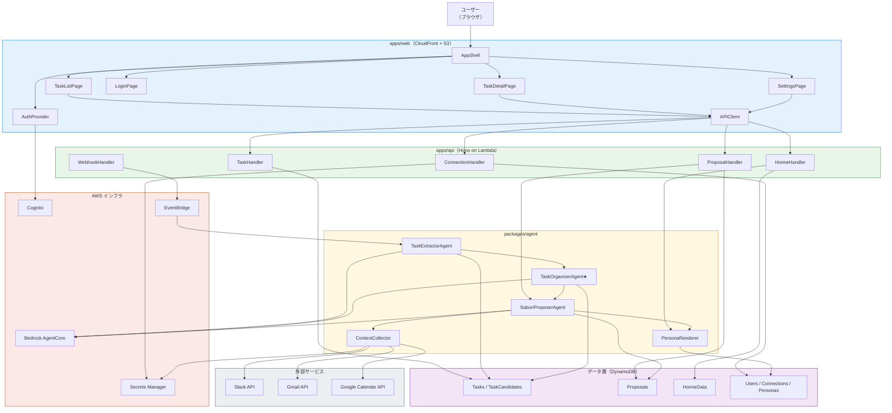
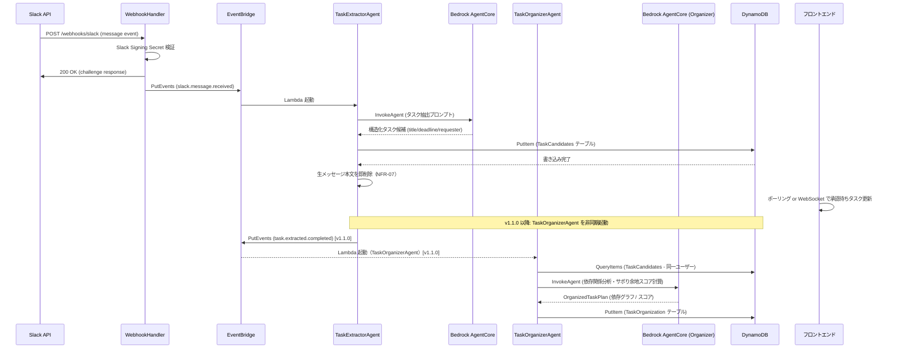
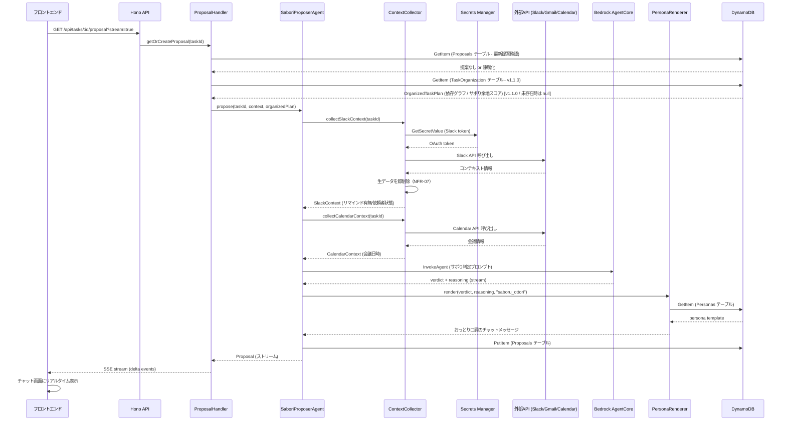
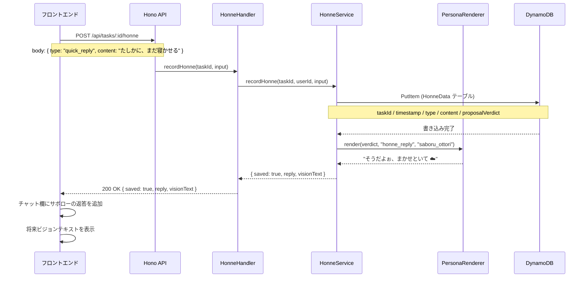
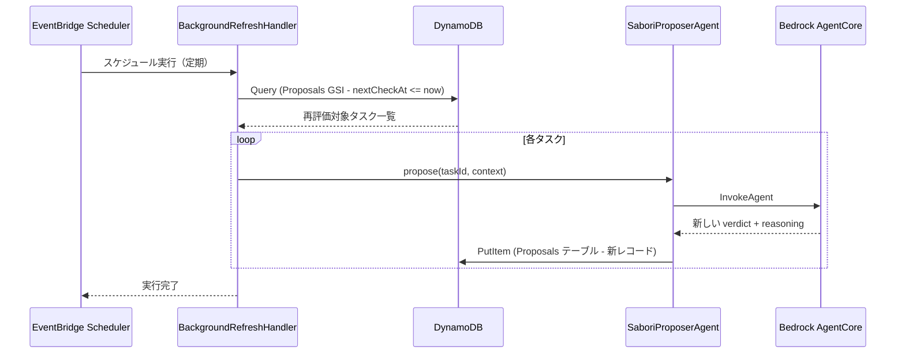
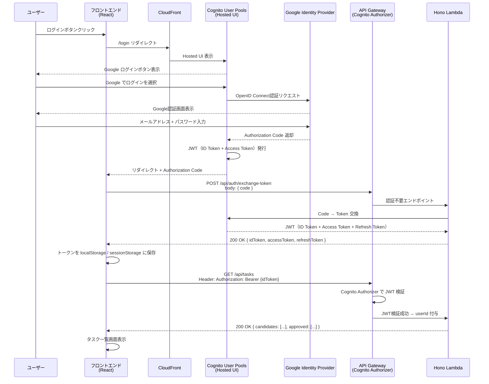
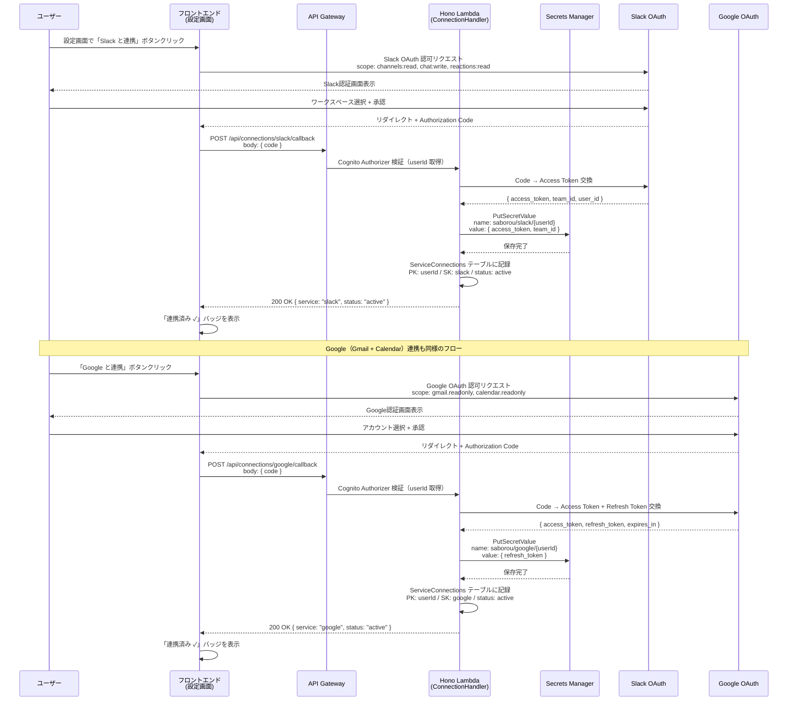
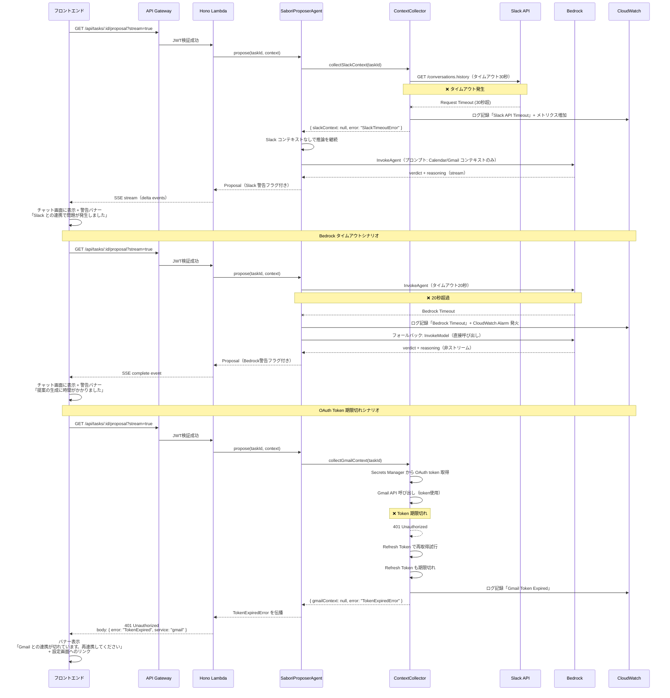

# アプリケーション設計書 — SABOROU

**プロジェクト名**: SABOROU（サボロー）
**作成日**: 2026-05-09
**バージョン**: 1.1.0
**更新日**: 2026-05-10（チーム追加要件3要素を反映: AI人格定義 / タスク整理AI追加 / 将来展望）
**ステータス**: 承認待ち
**対象イベント**: AWS Summit Japan 2026 ハッカソン（書類審査: 2026-05-10）
**設計深度**: Comprehensive

---

## メタ情報

| 項目 | 内容 |
|------|------|
| 生成ステージ | INCEPTION - Application Design |
| 参照成果物 | requirements.md（FR-01〜FR-08 / NFR-01〜NFR-11）/ stories.md（Epic 5 / Story 17）|
| アーキテクチャスタイル | サーバーレス・イベント駆動・Dual-Agent 協調 |
| 主要技術 | TypeScript / React / Hono / Bedrock AgentCore / DynamoDB / CDK |
| リージョン | ap-northeast-1（東京）|

---

## 1. 設計概要

### 1.1 アーキテクチャの全体像

SABOROU は「タスク抽出」「タスク整理」「サボり提案」の3エージェントが協調するサーバーレスアーキテクチャを採用する（v1.1.0 より 3エージェント構成に拡張）。

フロントエンドは S3 + CloudFront で配信され、バックエンドは Hono on Lambda + API Gateway HTTP API で構成される。3つの AI エージェントはそれぞれ独立した Lambda として動作し、Bedrock AgentCore を通じて Claude Sonnet を呼び出す。データ層は DynamoDB On-Demand モード（PAY_PER_REQUEST）を使用する。

```
[ユーザー]
    |
[CloudFront] → [S3: React ビルド成果物]
    |
[API Gateway HTTP API]
    |
[Hono on Lambda: apps/api]
    |
    +── [DynamoDB] ← 永続化
    |
    +── [Lambda: TaskExtractorAgent]  ← エージェント①（U-03a）
    |       └── [Bedrock AgentCore / Claude Sonnet]
    |               ↓
    +── [Lambda: TaskOrganizerAgent]  ← エージェント①b（U-03c）★新規追加
    |       └── [Bedrock AgentCore / Claude Sonnet]
    |           タスク依存関係・手順最適化・サボり余地スコア計算
    |               ↓
    +── [Lambda: SaboriProposerAgent] ← エージェント②（U-03b）
    |       └── [Bedrock AgentCore / Claude Sonnet]
    |           人格A（saboru_ottori）/ 人格B（saboru_nekkyou）
    |
    +── [Secrets Manager] ← OAuth トークン管理
    |
    +── [Cognito] ← 認証

[Slack / Gmail / Google Calendar] → [Webhook Lambda] → [EventBridge] → エージェント①
[エージェント①完了] → [EventBridge] → エージェント①b（タスク整理）
[エージェント①b完了] → [EventBridge] → エージェント②（サボり提案）
[EventBridge Scheduler] → エージェント②（バックグラウンド更新）
```

### 1.2 AWS全体アーキテクチャ

**詳細なAWS全体アーキテクチャ図（Mermaid）は別ファイルに記載しています**:
📄 **[aws-architecture.md](./aws-architecture.md)** - AWSサービス配置・セキュリティ境界・データフロー・コスト見積り

※ 上記リンク先の図では以下を可視化しています:
- CloudFront / S3 / API Gateway / Lambda / DynamoDB / Cognito / Bedrock / Secrets Manager / EventBridge / CloudWatch の関係性
- 6つのCDKスタック（CognitoStack / DataStack / ApiStack / AgentStack / FrontendStack / WebhookStack）の構成
- セキュリティ境界（Cognito Authorizer / JWT検証 / OAuth token管理）
- データフロー（タスク自動抽出 / サボり提案生成 / 定期再評価）
- コスト見積り（月額$30.94・NFR-06達成）

### 1.3 設計原則

| 原則 | 適用内容 |
|------|---------|
| **エージェント抽象化** | `ITaskExtractorAgent` / `ITaskOrganizerAgent` / `ISaboriProposerAgent` インタフェースで実装を差し替え可能にする。AgentCore 障害時は Bedrock InvokeModel に自動フォールバック |
| **生データ不保持** | 外部ツール（Slack/Gmail）の生メッセージ本文は処理後即削除。DynamoDB にはサマリのみ保存（NFR-07）|
| **判断と表現の分離** | エージェント②は verdict / reasoning を内部で決定し、PersonaRenderer で口調変換。将来の複数人格化に対応 |
| **モノレポ型依存管理** | packages/shared が型定義の唯一の真実の源。循環依存禁止 |
| **コスト意識設計** | 全コンピュートは Lambda（サーバーレス）。DynamoDB On-Demand。Bedrock 1リクエスト 8,000 トークン制限をアプリ層でガード |

---

## 2. システムコンテキスト

### 2.1 外部システム

| 外部システム | 種別 | 連携方式 | 目的 |
|------------|------|---------|------|
| Slack | メッセージング | Webhook（Events API）/ REST API | タスク抽出・文脈収集 |
| Gmail | メールクライアント | OAuth 2.0 + Google API | メールからタスク抽出・文脈収集 |
| Google Calendar | カレンダー | OAuth 2.0 + Google API | 予定からタスク抽出・会議情報収集 |
| Amazon Bedrock | AI/LLM | AWS SDK（AgentCore + InvokeModel）| タスク抽出・サボり提案生成 |
| Amazon Cognito | 認証 | Hosted UI + Google ソーシャルログイン | ユーザー認証・JWT 発行 |

### 2.2 利用者

| ユーザー種別 | 主な操作 |
|------------|---------|
| フリーランサー / 副業エンジニア（プライマリ） | タスク確認・承認・サボり提案閲覧・本音入力 |
| ハッカソン審査員（デモ向け） | デモシナリオを体験し、コンセプトを評価する |

---

## 3. コンポーネント図

### 3.1 Mermaid コンポーネント関係図



### 3.2 テキスト代替表現

```
外部サービス（Slack / Gmail / Google Calendar）
  → Webhook Lambda → EventBridge → TaskExtractorAgent（エージェント①: U-03a）
                                    → Bedrock AgentCore
                                    → DynamoDB Tasks テーブル
                                    → TaskOrganizerAgent（エージェント①b: U-03c）★新規
                                        → Bedrock AgentCore（依存関係分析・手順最適化）
                                        → DynamoDB TaskOrganization テーブル
                                        → SaboriProposerAgent（エージェント②: U-03b）

ユーザー（ブラウザ）
  → CloudFront → S3（React アプリ）
  → API Gateway → Hono Lambda
      → TaskHandler ←→ DynamoDB（Tasks テーブル）
      → ProposalHandler → SaboriProposerAgent（エージェント②）
                          → ContextCollector → 外部API / Secrets Manager
                          → PersonaRenderer → DynamoDB（Personas テーブル）
                              人格A: saboru_ottori（おっとり共感系）
                              人格B: saboru_nekkyou（熱血反骨系・将来展望）
                          → Bedrock AgentCore
                          ←→ DynamoDB（Proposals テーブル）
      → HonneHandler ←→ DynamoDB（HonneData テーブル）
      → ConnectionHandler ←→ Secrets Manager / DynamoDB（Connections テーブル）
```

---

## 4. コンポーネント詳細

詳細なコンポーネント定義は [components.md](components.md) を参照。

### 4.1 コンポーネント一覧サマリ

| カテゴリ | ID | コンポーネント名 | 主な責務 |
|---------|----|----------------|---------|
| フロントエンド | FE-01 | TaskListPage | タスク一覧・承認/編集/削除 |
| フロントエンド | FE-02 | TaskDetailPage | サボり提案表示・本音入力チャット |
| フロントエンド | FE-03 | LoginPage | Google ログイン |
| フロントエンド | FE-04 | SettingsPage | 外部サービス連携管理 |
| フロントエンド | FE-05 | AppShell | 認証ガード・グローバルレイアウト |
| フロントエンド | FE-06 | AuthProvider | JWT 管理・認証コンテキスト |
| フロントエンド | FE-07 | APIClient | REST API 呼び出し集約 |
| フロントエンド | FE-08 | TaskCard | タスクカード表示 |
| バックエンド | BE-01 | AuthHandler | JWT 検証ミドルウェア |
| バックエンド | BE-02 | TaskHandler | タスク CRUD |
| バックエンド | BE-03 | ProposalHandler | サボり提案取得・ストリーミング |
| バックエンド | BE-04 | HonneHandler | 本音データ記録 |
| バックエンド | BE-05 | ConnectionHandler | OAuth トークン管理 |
| バックエンド | BE-06 | WebhookHandler | Slack Webhook 受信（Vercel Chat SDK 使用） |
| エージェント | AG-01 | TaskExtractorAgent | 外部メッセージ → タスク候補変換 |
| エージェント | AG-05 | TaskOrganizerAgent★ | タスク依存関係・手順最適化・サボり余地スコア計算 |
| エージェント | AG-02 | SaboriProposerAgent | 文脈統合 → サボり提案生成（人格A/B対応）|
| エージェント | AG-03 | PersonaRenderer | 人格A（おっとり）/ 人格B（熱血）口調変換 |
| エージェント | AG-04 | ContextCollector | 外部ツール文脈収集 |
| インフラ | INF-01 | CognitoStack | 認証インフラ |
| インフラ | INF-02 | DataStack | DynamoDB 全テーブル |
| インフラ | INF-03 | ApiStack | API Gateway + Lambda |
| インフラ | INF-04 | AgentStack | Bedrock AgentCore + Lambda |
| インフラ | INF-05 | FrontendStack | S3 + CloudFront |
| インフラ | INF-06 | WebhookStack | EventBridge + Webhook Lambda |

---

## 5. データモデル

### 5.1 DynamoDB テーブル設計

#### テーブル: Users

| 属性 | 型 | 役割 |
|------|-----|------|
| PK | `USER#<cognitoSub>` | ユーザー一意ID（Cognito sub）|
| SK | `PROFILE` | レコード種別 |
| email | string | メールアドレス |
| name | string | 表示名 |
| createdAt | string | ISO 8601 |
| updatedAt | string | ISO 8601 |

GSI: なし
TTL: なし（永続保持）

---

#### テーブル: ServiceConnections

| 属性 | 型 | 役割 |
|------|-----|------|
| PK | `USER#<cognitoSub>` | ユーザー ID |
| SK | `CONN#<service>` | サービス種別（slack / gmail / google_calendar）|
| status | string | `connected` / `disconnected` / `token_expired` |
| secretArn | string | Secrets Manager ARN |
| connectedAt | string | ISO 8601 |
| expiresAt | string | ISO 8601（トークン有効期限）|

GSI: なし
TTL: なし

---

#### テーブル: TaskCandidates（タスク候補）

| 属性 | 型 | 役割 |
|------|-----|------|
| PK | `USER#<cognitoSub>` | ユーザー ID |
| SK | `TASK_CAND#<ulid>` | タスク候補 ID（ULID）|
| title | string | タスク名 |
| deadline | string | 締切（ISO 8601 / null）|
| requester | string | 依頼者名（仮名化）|
| description | string | 作業内容サマリ |
| sourceType | string | `slack` / `gmail` / `calendar` / `manual` |
| sourceRef | string | 元メッセージ参照ID（生データは保存しない）|
| createdAt | string | ISO 8601 |

GSI: `GSI-UserCreatedAt`（PK: userId, SK: createdAt）— 新着順取得用
TTL: `ttl`（30日後に自動削除。承認されずに期限切れとなった候補を削除）

---

#### テーブル: Tasks（承認済みタスク）

| 属性 | 型 | 役割 |
|------|-----|------|
| PK | `USER#<cognitoSub>` | ユーザー ID |
| SK | `TASK#<ulid>` | タスク ID（ULID）|
| status | string | `approved` / `deleted` |
| title | string | タスク名 |
| deadline | string | 締切（ISO 8601 / null）|
| requester | string | 依頼者名 |
| description | string | 作業内容 |
| sourceType | string | `slack` / `gmail` / `calendar` / `manual` |
| approvedAt | string | ISO 8601 |
| updatedAt | string | ISO 8601 |

GSI: `GSI-UserStatus`（PK: userId, SK: `STATUS#approved`）— 承認済み一覧取得用
TTL: なし（永続保持）

---

#### テーブル: Proposals（サボり提案ログ）

| 属性 | 型 | 役割 |
|------|-----|------|
| PK | `TASK#<taskId>` | タスク ID |
| SK | `PROPOSAL#<ISO8601>` | 提案生成日時 |
| userId | string | ユーザー ID |
| verdict | string | `can_saboru` / `caution` / `danger` |
| summaryText | string | 1行サマリ（タスク一覧用）|
| reasoning | `string[]` | 判断材料箇条書き（最大10件）|
| chatMessage | string | サボローのチャットメッセージ |
| personaId | string | `saboru_ottori`（固定）|
| evaluatedAt | string | ISO 8601 |
| nextCheckAt | string | ISO 8601（次回再評価タイミング）|
| tokenCount | number | 使用トークン数（コスト追跡用）|

GSI: `GSI-TaskLatest`（PK: taskId, SK: evaluatedAt desc）— 最新提案取得用
TTL: なし（永続保持）

---

#### テーブル: HonneData（本音データ）

| 属性 | 型 | 役割 |
|------|-----|------|
| PK | `USER#<cognitoSub>` | ユーザー ID |
| SK | `HONNE#<ISO8601>` | 記録日時 |
| taskId | string | 関連タスク ID |
| type | string | `quick_reply` / `free_text` |
| content | string | 反応内容（クイック返信IDまたは自由テキスト）|
| proposalVerdict | string | 当時のサボり判定 |
| createdAt | string | ISO 8601 |

GSI: `GSI-UserCreatedAt`（PK: userId, SK: createdAt）— ユーザー本音履歴取得用
TTL: なし（永続保持 — 将来の取扱説明書生成の原料）

---

#### テーブル: Personas（ペルソナテンプレート）

| 属性 | 型 | 役割 |
|------|-----|------|
| PK | `PERSONA#<personaId>` | ペルソナ ID（例: `saboru_ottori`）|
| SK | `DEFINITION` | レコード種別 |
| name | string | 表示名（例: 「おっとりサボロー」）|
| promptTemplate | string | Bedrock プロンプトテンプレート |
| tone | string | 口調定義（語尾・スタイル）|
| emojis | `string[]` | 使用絵文字セット |
| version | number | テンプレートバージョン |

TTL: なし

---

### 5.2 データフロー（テーブル間）

```
[外部 Webhook イベント]
  → TaskCandidates テーブル（pending 相当）

[ユーザーが「承認する」]
  → TaskCandidates から Tasks テーブルへ（status: approved）
  → SaboriProposerAgent を非同期トリガー

[SaboriProposerAgent 実行]
  → Proposals テーブルへ（verdict / reasoning / chatMessage / nextCheckAt）
  → PersonaRenderer → Personas テーブルからテンプレート取得

[ユーザーがクイック返信 / 自由入力]
  → HonneData テーブルへ

[バックグラウンド更新（EventBridge Scheduler）]
  → Proposals テーブルの nextCheckAt を確認
  → 期限到来タスクに対して SaboriProposerAgent を再実行
  → Proposals テーブルを更新
```

---

## 6. API 仕様

### 6.1 エンドポイント一覧

| メソッド | パス | 認証 | 説明 |
|---------|------|:---:|------|
| POST | /api/auth/exchange-token | 不要 | Cognito code → JWT 交換 |
| GET | /api/connections | 必要 | 連携サービス一覧 |
| POST | /api/connections/slack/callback | 必要 | Slack OAuth コールバック |
| POST | /api/connections/google/callback | 必要 | Google OAuth コールバック |
| DELETE | /api/connections/:service | 必要 | 連携解除 |
| GET | /api/tasks | 必要 | タスク一覧（候補 + 承認済み）|
| POST | /api/tasks | 必要 | 手動タスク追加 |
| GET | /api/tasks/:id | 必要 | タスク詳細取得 |
| PATCH | /api/tasks/:id | 必要 | タスク更新（インライン編集）|
| DELETE | /api/tasks/:id | 必要 | タスク削除 |
| POST | /api/tasks/candidates/:id/approve | 必要 | タスク候補承認 |
| GET | /api/tasks/:id/proposal | 必要 | サボり提案取得（SSEストリーミング）|
| POST | /api/tasks/:id/honne | 必要 | 本音データ記録 |
| POST | /webhooks/slack | 署名検証 | Slack Events API Webhook |

**総計**: 14 エンドポイント

### 6.2 主要リクエスト/レスポンス型

```typescript
// GET /api/tasks レスポンス
{
  candidates: Task[],   // status: pending
  approved: Task[],     // status: approved（latestProposal含む）
}

// POST /api/tasks/candidates/:id/approve レスポンス
{
  task: Task,           // status: approved
  proposalTriggered: boolean
}

// GET /api/tasks/:id/proposal レスポンス（SSE）
event: "delta"
data: { summaryText?: string, chatMessage?: string, verdict?: Verdict }
event: "complete"
data: Proposal

// POST /api/tasks/:id/honne レスポンス
{
  saved: true,
  reply: string,        // サボローの返答
  visionText: string    // 「将来の取扱説明書になります」テキスト
}
```

---

## 7. シーケンス図

### 7.1 タスク自動抽出フロー（FR-01）

> **バージョン注記**: 実線は v1.0.0（M2 MVP）で実装済み。`[v1.1.0]` 注釈は M3 決勝実装予定（非同期・ユーザー応答をブロックしない）。



### 7.2 サボり提案生成フロー（FR-03）

> **バージョン注記**: 実線は v1.0.0（M2 MVP）で実装済み。`[v1.1.0]` 注釈は M3 決勝実装予定。v1.0.0 では `organizedPlan = null` として通過する設計。



### 7.3 本音データ記録フロー（FR-05）



### 7.4 バックグラウンド再評価フロー（FR-04）



### 7.5 認証フロー（FR-07対応）



**重要ポイント**:
- Cognito Hosted UI を使用（カスタムログイン画面は MVP 外）
- JWT の有効期限は **ID Token: 1時間** / **Refresh Token: 30日**
- フロントエンドは ID Token 期限切れ時に自動リフレッシュを試みる
- リフレッシュ失敗時は強制ログアウト → ログイン画面にリダイレクト

---

### 7.6 外部サービス連携設定フロー（FR-07対応）



**重要ポイント**:
- Access Token は Secrets Manager に保存（環境変数・DynamoDB に保存しない）
- Refresh Token も暗号化保存し、Access Token 期限切れ時に自動リフレッシュ
- 連携解除は `DELETE /api/connections/:service` エンドポイントで対応
- Webhook URL（Slack Events API）は infra デプロイ時に Slack App に登録

---

### 7.7 エラーハンドリングフロー（NFR-05対応）



**重要ポイント**:
- 外部API失敗時は**部分的なコンテキストで推論を継続**（完全失敗にしない）
- Bedrock タイムアウト時は**フォールバック戦略**（InvokeModel 直接呼び出し）
- OAuth Token 期限切れ時は**再連携を促すバナー**を表示
- 全エラーは CloudWatch Logs に記録し、重大エラーは CloudWatch Alarm で通知

---

## 8. ビジネスルール

### 8.1 サボり判定3状態の定義

| 状態 | verdict | UI 表示 | 判定基準 |
|------|---------|---------|---------|
| サボれる | `can_saboru` | 淡黄色背景「まだ寝かせてOK 💤」| 下記の「サボれる」条件を全て満たす |
| 注意 | `caution` | 通常背景「注意: 今日中に着手を ⚠️」| 「サボれる」でも「危ない」でもない中間状態 |
| 危ない | `danger` | 赤みがかった背景「危ない: 今すぐ着手 🔥」| 下記の「危ない」条件のいずれかに該当 |

### 8.2 判定ロジック（SaboriProposerAgent が評価する材料）

**「危ない」判定トリガー（いずれか1つ以上に該当すれば danger）**:
- 締切が6時間以内
- リマインドが3回以上届いている
- 依頼者から「急ぎ」「ASAP」「今すぐ」等の強調キーワードが検出される
- 依頼者が進捗確認メッセージを送信済み
- 関連会議が2時間以内に迫っている

**「サボれる」判定条件（全て満たす場合に can_saboru）**:
- リマインドが0件（未着信）
- 締切まで48時間以上
- 依頼者がオフラインまたは別件対応中
- 「急ぎ」キーワードなし
- 関連会議が12時間以上先

**「注意」判定（上記以外の全状態）**:
- 例: リマインド1〜2件 + 締切が24〜48時間後
- 例: 依頼者がオンラインだが明示的な催促なし

### 8.3 次回再評価タイミング計算ルール（next_check_at）

| 現在の verdict | 次回評価タイミング |
|--------------|----------------|
| `can_saboru` | 評価から 6時間後 |
| `caution` | 評価から 2時間後 |
| `danger` | 評価から 30分後 |
| 締切まで 12時間以内 | 30分ごと（verdict に関わらず）|

### 8.4 判断材料収集ルール

1. ContextCollector は最大30秒以内に全外部APIから収集する（タイムアウト設定）
2. 外部APIが失敗した場合は当該コンテキストを欠落として記録し、他の情報で判断する
3. 収集した生データ（メッセージ本文・メール本文）は抽出処理後に即時削除（NFR-07）
4. DynamoDB には「リマインド件数」「依頼者状態」「会議時刻」等のサマリのみ保存する
5. 依頼者名は仮名化またはイニシャル化して保存する

### 8.5 Persona（AI人格）定義

PersonaRenderer が参照する2種類の人格定義。MVP は人格A（saboru_ottori）固定。将来展望では人格B（saboru_nekkyou）と A/B テストを実施する。

**人格A: saboru_ottori（おっとりサボロー）— MVP固定**

```
persona_id: saboru_ottori
name: おっとりサボロー
concept: 「心の余白・良化を求める存在」
         ユーザーのメンタルウェルネスを守るという観点から、サボることを正当化する。
         「あなたが今サボっていいのは、心の余白を守るため」というトーン。
tone:
  - 語尾: 「〜だよ」「〜かもぉ」「〜だよぉ」「〜かな」
  - 口調: ゆるく・おっとり。焦らせない
  - 絵文字: ☁️ 💤 😌 📖 ✨ を積極使用（1メッセージに1〜2個）
  - 禁止語: 「必ず」「絶対」「〜してください」等の強い命令形
危ない判定時: 「さすがに今はやった方がいいかもぉ…」等、やんわり警告するが口調は変えない
```

**人格B: saboru_nekkyou（熱血サボロー）— 将来展望（A/Bテスト対象）**

```
persona_id: saboru_nekkyou
name: 熱血サボロー
concept: 「搾取されないぞ！と奮い立たせてくれる存在」
         ユーザーの怒り・反発心を引き出すことで、サボることを「搾取への抵抗」として正当化する。
         「その依頼、今すぐやる義理はない。搾取されるな！」というトーン。
tone:
  - 語尾: 「〜だろ！」「〜するな！」「〜立ち上がれ！」「〜勝ち取れ！」
  - 口調: 情熱的・反骨精神。ユーザーの怒りを煽る
  - 絵文字: 🔥 ✊ 💪 😤 を積極使用（1メッセージに1〜2個）
  - 禁止語: 「かもぉ」「だよぉ」等のおっとり語尾
危ない判定時: 「さすがにこれは戦略的撤退しかねぇ！今すぐやれ！」等、熱く警告する
```

---

## 9. エラーハンドリング戦略

### 9.1 外部 API 失敗

| シナリオ | 対応 |
|---------|------|
| Slack API タイムアウト（30秒超）| Slack コンテキストなしで提案生成。ログに警告記録 |
| Gmail API 失敗 | Gmail コンテキストなしで提案生成 |
| Google Calendar API 失敗 | Calendar コンテキストなしで提案生成 |
| OAuth トークン失効 | `TokenExpiredError` をスロー → フロントに「再連携が必要」バナーを表示 |

### 9.2 Bedrock タイムアウト / エラー

| シナリオ | 対応 |
|---------|------|
| AgentCore タイムアウト（20秒超）| Bedrock InvokeModel（直接呼び出し）にフォールバック |
| InvokeModel タイムアウト | `BedrockTimeoutError` → フロントに「提案の生成に時間がかかっています」表示 |
| コスト制限超過（$50/月）| Budgets アラート + `BedrockCostExceededError` → 提案生成を一時停止 |
| トークン制限超過（8,000）| `guardTokenLimit()` でプロンプトをトリム。超過分は警告ログ |

### 9.3 認証エラー

| シナリオ | 対応 |
|---------|------|
| JWT 期限切れ | 401 → フロントエンドが Cognito リフレッシュを試みる |
| リフレッシュ失敗 | ログアウト処理 → ログイン画面にリダイレクト |
| Cognito 障害 | 503 → メンテナンスメッセージを表示 |

### 9.4 DynamoDB エラー

| シナリオ | 対応 |
|---------|------|
| 書き込みエラー | 3回リトライ（exponential backoff）→ `DynamoWriteFailedError` |
| 読み込みエラー | 2回リトライ → エラー返却。フロントにトースト通知 |
| CapacityExceeded | On-Demand モードのため通常発生しない。発生時は CloudWatch アラート |

---

## 10. セキュリティ設計

### 10.1 IAM 最小権限

| Lambda | 付与する権限（DynamoDB）| 付与する権限（その他）|
|--------|----------------------|---------------------|
| Hono API Lambda | tasks / proposals / honneData / users / connections テーブルへの Read/Write | Cognito GetUser / Secrets Manager GetSecretValue（接続情報のみ）|
| TaskExtractorAgent Lambda | taskCandidates テーブルへの PutItem のみ | Bedrock InvokeAgent / InvokeModel |
| SaboriProposerAgent Lambda | proposals / personas テーブルへの Read/PutItem | Bedrock InvokeAgent / InvokeModel / Secrets Manager GetSecretValue |
| WebhookHandler Lambda | なし（DynamoDB 直接アクセス不可）| EventBridge PutEvents のみ |
| BackgroundRefreshHandler Lambda | proposals テーブルへの Query / PutItem | なし |

### 10.2 OAuth トークン管理

- Slack OAuth Access Token → Secrets Manager（`saborou/slack/<userId>`）
- Google OAuth Refresh Token → Secrets Manager（`saborou/google/<userId>`）
- Cognito JWT は各 Lambda で `aws-jwt-verify` ライブラリを使って検証
- トークン有効期限を `ServiceConnections` テーブルに記録し、期限前にリフレッシュする

### 10.3 PII（個人情報）保護

- Slack/Gmail のメッセージ本文は抽出後に Lambda メモリ上から削除（AWS サービスへの永続化なし）
- 依頼者名はイニシャル化または仮名化（「T.クライアント」等）して保存
- DynamoDB のデータは AWS 管理 KMS で暗号化（デフォルト設定）
- S3 バケットは `BlockPublicAccess: BLOCK_ALL` + SSL 必須

### 10.4 API セキュリティ

- 全 API Gateway エンドポイントに JWT オーソライザー（Cognito）を設定
- Webhook エンドポイントは JWT 不要だが Slack Signing Secret による署名検証を必須とする
- CORS 設定: CloudFront ドメインのみ許可
- Rate Limiting: API Gateway のデフォルト制限（10,000 req/s）に準拠

---

## 11. パフォーマンス設計

### 11.1 NFR 達成のための具体策

| NFR | 目標値 | 実装策 |
|-----|--------|--------|
| NFR-01（タスク抽出）| 10秒以内 | Lambda プロビジョニング済み同時実行数を設定。Bedrock プロンプトを最小限に最適化（タスク抽出特化・3,000トークン以内）|
| NFR-02（サボり提案）| 10〜20秒 | SSE ストリーミングで体感速度を向上。ContextCollector の並列呼び出し（Promise.allSettled）。Bedrock Streaming API 使用 |

### 11.2 コスト最適化

- Bedrock プロンプト設計:
  - TaskExtractorAgent: 最大 3,000 トークン（システムプロンプト + 入力メッセージ）
  - SaboriProposerAgent: 最大 8,000 トークン（コンテキスト + 推論 + 出力）
- DynamoDB: On-Demand モード（PAY_PER_REQUEST）でスケールゼロ可能
- Lambda: コールドスタート対策として主要 Lambda に Provisioned Concurrency（最小1）を設定

### 11.3 レイテンシ最適化

- ContextCollector: Slack / Gmail / Calendar API を `Promise.allSettled` で並列呼び出し（直列呼び出し禁止）
- Proposals テーブル: `GSI-TaskLatest` を使って最新提案を O(1) で取得
- フロントエンドキャッシュ: タスク一覧は5秒間キャッシュ（React Query staleTime）

---

## 12. トレーサビリティ

### 12.1 コンポーネント → FR/NFR/Story 対応表

| コンポーネント | 対応 FR | 対応 NFR | 対応 Story |
|-------------|---------|---------|-----------|
| TaskExtractorAgent（AG-01）| FR-01 | NFR-01, NFR-07 | US-01, US-02, US-03 |
| SaboriProposerAgent（AG-02）| FR-03, FR-04 | NFR-02, NFR-06 | US-08, US-09, US-10, US-11 |
| PersonaRenderer（AG-03）| FR-03 | NFR-09 | US-08〜US-10 |
| ContextCollector（AG-04）| FR-03 | NFR-01, NFR-02, NFR-07 | US-08〜US-12 |
| TaskHandler（BE-02）| FR-02, FR-08 | NFR-08 | US-05, US-06, US-07, US-16 |
| ProposalHandler（BE-03）| FR-03, FR-04 | NFR-02, NFR-06 | US-08〜US-12, US-17 |
| HonneHandler（BE-04）| FR-05 | NFR-05 | US-13, US-14, US-15 |
| ConnectionHandler（BE-05）| FR-07 | NFR-07 | US-04 |
| WebhookHandler（BE-06）| FR-01 | NFR-01 | US-01 |
| TaskListPage（FE-01）| FR-02, FR-06, FR-08 | NFR-10 | US-05〜US-07, US-12, US-16 |
| TaskDetailPage（FE-02）| FR-03, FR-04, FR-05 | NFR-02, NFR-10 | US-08〜US-15, US-17 |
| LoginPage（FE-03）| FR-07 | NFR-07 | US-04 |
| SettingsPage（FE-04）| FR-07 | NFR-07 | US-04 |
| CognitoStack（INF-01）| FR-07 | NFR-07 | US-04 |
| DataStack（INF-02）| FR-01〜FR-08 | NFR-05, NFR-07, NFR-11 | 全 Story |
| ApiStack（INF-03）| FR-01〜FR-08 | NFR-03, NFR-04, NFR-11 | 全 Story |
| AgentStack（INF-04）| FR-01, FR-03 | NFR-06, NFR-11 | US-01〜US-03, US-08〜US-12 |
| FrontendStack（INF-05）| FR-01〜FR-08 | NFR-04, NFR-11 | 全 Story |
| WebhookStack（INF-06）| FR-01, FR-04 | NFR-01 | US-01〜US-03, US-11 |

---

## 13. 想定 Unit of Work（次ステージへの引き継ぎ）

v1.1.0 からエージェントパイプラインを3エージェント構成に拡張したため、Unit 総数が 6 → 7 に増加した。

| Unit | モジュール | 主な作業内容 |
|------|----------|------------|
| U-01: shared | packages/shared | 型定義・共通ユーティリティ・エラークラス |
| U-02: infra | infra/ | CDK 全スタック（Cognito / Data / Api / Agent / Frontend / Webhook）|
| U-03a: task-extractor | packages/agent | TaskExtractorAgent（AG-01）/ Bedrock wrapper |
| U-03c: task-organizer | packages/agent | TaskOrganizerAgent（AG-05）/ タスク依存関係・手順最適化 ★新規 |
| U-03b: sabori-proposer | packages/agent | SaboriProposerAgent（AG-02）/ PersonaRenderer（AG-03）/ ContextCollector（AG-04）|
| U-04: api | apps/api | Hono ハンドラ全6コンポーネント・サービス層 |
| U-05: web | apps/web | React 全画面（TaskList / TaskDetail / Login / Settings / AppShell）|

**依存順序**: U-01 → U-02 → U-03a → U-03c → U-03b → U-04 → U-05

---

## 14. 参照文書

| 文書 | パス |
|------|------|
| コンポーネント定義 | `aidlc-docs/inception/application-design/components.md` |
| コンポーネントメソッド | `aidlc-docs/inception/application-design/component-methods.md` |
| サービス定義 | `aidlc-docs/inception/application-design/services.md` |
| コンポーネント依存関係 | `aidlc-docs/inception/application-design/component-dependency.md` |
| 要件定義書 | `aidlc-docs/inception/requirements/requirements.md` |
| ユーザーストーリー | `aidlc-docs/inception/user-stories/stories.md` |
| 実行計画書 | `aidlc-docs/inception/plans/execution-plan.md` |

---

*本文書は Application Design ステージの成果物です。ユーザーの承認後、Units Generation ステージに進みます。*
