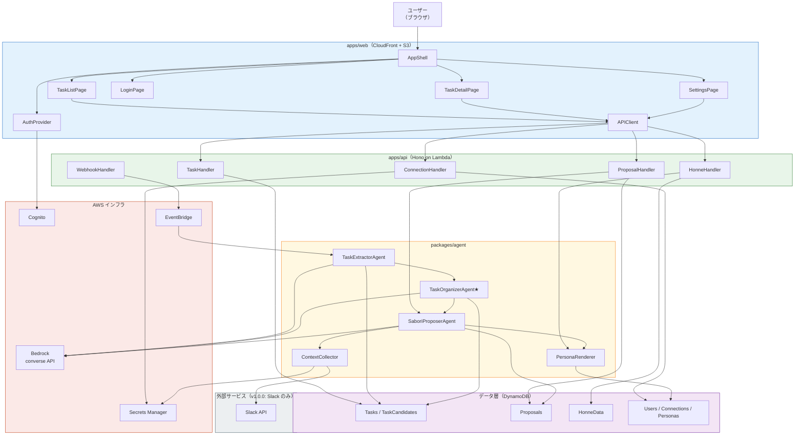

# アプリケーション設計書 — SABOROU

**プロジェクト名**: SABOROU（サボロー）
**作成日**: 2026-05-09
**バージョン**: 1.1.0
**更新日**: 2026-05-10（チーム追加要件3要素を反映: AI人格定義 / タスク整理AI追加 / 将来展望）
**ステータス**: 承認待ち
**対象イベント**: AWS Summit Japan 2026 ハッカソン（書類審査: 2026-05-10）
**設計深度**: Comprehensive

---

## メタ情報

| 項目 | 内容 |
|------|------|
| 生成ステージ | INCEPTION - Application Design |
| 参照成果物 | requirements.md（FR-01〜FR-08 / NFR-01〜NFR-11）/ stories.md（Epic 5 / Story 17）|
| アーキテクチャスタイル | サーバーレス・イベント駆動・Dual-Agent 協調 |
| 主要技術 | TypeScript / React / Hono / Bedrock converse API + Tool Use / DynamoDB / CDK |
| リージョン | ap-northeast-1（東京）|

---

## 1. 設計概要

### 1.1 アーキテクチャの全体像

SABOROU は「タスク抽出」「タスク整理」「サボり提案」の3エージェントが協調するサーバーレスアーキテクチャを採用する（v1.1.0 より 3エージェント構成に拡張）。

フロントエンドは S3 + CloudFront で配信され、バックエンドは Hono on Lambda + API Gateway HTTP API で構成される。3つの AI エージェントはそれぞれ独立した Lambda として動作し、Bedrock converse API + Tool Use を通じて Claude Sonnet を呼び出す。データ層は DynamoDB On-Demand モード（PAY_PER_REQUEST）を使用する。

```
[ユーザー]
    |
[CloudFront] → [S3: React ビルド成果物]
    |
[API Gateway HTTP API]
    |
[Hono on Lambda: apps/api]
    |
    +── [DynamoDB] ← 永続化
    |
    +── [Lambda: TaskExtractorAgent]  ← エージェント①（U-03a）
    |       └── [Bedrock converse API + Tool Use  / Claude Sonnet]
    |               ↓
    +── [Lambda: TaskOrganizerAgent]  ← エージェント①b（U-03c）★新規追加
    |       └── [Bedrock converse API + Tool Use  / Claude Sonnet]
    |           タスク依存関係・手順最適化・サボり余地スコア計算
    |               ↓
    +── [Lambda: SaboriProposerAgent] ← エージェント②（U-03b）
    |       └── [Bedrock converse API + Tool Use  / Claude Sonnet]
    |           人格A（saboru_ottori）/ 人格B（saboru_nekkyou）
    |
    +── [Secrets Manager] ← OAuth トークン管理
    |
    +── [Cognito] ← 認証

[Slack ] → [Webhook Lambda] → [EventBridge] → エージェント①
[エージェント①完了] → [EventBridge] → エージェント①b（タスク整理）
[エージェント①b完了] → [EventBridge] → エージェント②（サボり提案）
[EventBridge Scheduler] → エージェント②（バックグラウンド更新）
```

### 1.2 AWS全体アーキテクチャ

**詳細なAWS全体アーキテクチャ図（Mermaid）は別ファイルに記載しています**:
📄 **[aws-architecture.md](./aws-architecture.md)** - AWSサービス配置・セキュリティ境界・データフロー・コスト見積り

※ 上記リンク先の図では以下を可視化しています:
- CloudFront / S3 / API Gateway / Lambda / DynamoDB / Cognito / Bedrock / Secrets Manager / EventBridge / CloudWatch の関係性
- 6つのCDKスタック（CognitoStack / DataStack / ApiStack / AgentStack / FrontendStack / WebhookStack）の構成
- セキュリティ境界（Cognito Authorizer / JWT検証 / OAuth token管理）
- データフロー（タスク自動抽出 / サボり提案生成 / 定期再評価）
- コスト見積り（月額$30.94・NFR-06達成）

### 1.3 設計原則

| 原則 | 適用内容 |
|------|---------|
| **エージェント抽象化** | `ITaskExtractorAgent` / `ITaskOrganizerAgent` / `ISaboriProposerAgent` インタフェースで実装を差し替え可能にする。converse API 直接実装。`IBedrockClient` インタフェースで将来の AgentCore 移行に対応 |
| **生データ不保持** | 外部ツール（Slack）の生メッセージ本文は処理後即削除。DynamoDB にはサマリのみ保存（NFR-07）|
| **判断と表現の分離** | エージェント②は verdict / reasoning を内部で決定し、PersonaRenderer で口調変換。将来の複数人格化に対応 |
| **モノレポ型依存管理** | packages/shared が型定義の唯一の真実の源。循環依存禁止 |
| **コスト意識設計** | 全コンピュートは Lambda（サーバーレス）。DynamoDB On-Demand。Bedrock 1リクエスト 8,000 トークン制限をアプリ層でガード |

---

## 2. システムコンテキスト

### 2.1 外部システム

| 外部システム | 種別 | 連携方式 | 目的 |
|------------|------|---------|------|
| Slack | メッセージング | Webhook（Events API）/ REST API | タスク抽出・文脈収集 |
| Amazon Bedrock | AI/LLM | AWS SDK（converse API + Tool Use）| タスク抽出・サボり提案生成 |
| Amazon Cognito | 認証 | Hosted UI + Google ソーシャルログイン | ユーザー認証・JWT 発行 |

### 2.2 利用者

| ユーザー種別 | 主な操作 |
|------------|---------|
| フリーランサー / 副業エンジニア（プライマリ） | タスク確認・承認・サボり提案閲覧・本音入力 |
| ハッカソン審査員（デモ向け） | デモシナリオを体験し、コンセプトを評価する |

---

## 3. コンポーネント図

### 3.1 Mermaid コンポーネント関係図



### 3.2 テキスト代替表現

```
外部サービス（Slack）
  → Webhook Lambda → EventBridge → TaskExtractorAgent（エージェント①: U-03a）
                                    → Bedrock converse API（Tool Use）
                                    → DynamoDB Tasks テーブル
                                    → TaskOrganizerAgent（エージェント①b: U-03c）★v1.1.0 以降
                                        → Bedrock converse API（依存関係分析・手順最適化）
                                        → DynamoDB TaskOrganization テーブル
                                        → SaboriProposerAgent（エージェント②: U-03b）

ユーザー（ブラウザ）
  → CloudFront → S3（React アプリ）
  → API Gateway → Hono Lambda
      → TaskHandler ←→ DynamoDB（Tasks テーブル）
      → ProposalHandler → SaboriProposerAgent（エージェント②）
                          → ContextCollector → Slack API / Secrets Manager
                          → PersonaRenderer → DynamoDB（Personas テーブル）
                              人格A: saboru_ottori（おっとり共感系）
                              人格B: saboru_nekkyou（熱血反骨系・将来展望）
                          → Bedrock converse API（Tool Use）
                          ←→ DynamoDB（Proposals テーブル）
      → HonneHandler ←→ DynamoDB（HonneData テーブル）
      → ConnectionHandler ←→ Secrets Manager / DynamoDB（Connections テーブル）
```

---

## 4. コンポーネント詳細

詳細なコンポーネント定義は [components.md](components.md) を参照。

### 4.1 コンポーネント一覧サマリ

| カテゴリ | ID | コンポーネント名 | 主な責務 |
|---------|----|----------------|---------|
| フロントエンド | FE-01 | TaskListPage | タスク一覧・承認/編集/削除 |
| フロントエンド | FE-02 | TaskDetailPage | サボり提案表示・本音入力チャット |
| フロントエンド | FE-03 | LoginPage | Google ログイン |
| フロントエンド | FE-04 | SettingsPage | 外部サービス連携管理 |
| フロントエンド | FE-05 | AppShell | 認証ガード・グローバルレイアウト |
| フロントエンド | FE-06 | AuthProvider | JWT 管理・認証コンテキスト |
| フロントエンド | FE-07 | APIClient | REST API 呼び出し集約 |
| フロントエンド | FE-08 | TaskCard | タスクカード表示 |
| バックエンド | BE-01 | AuthHandler | JWT 検証ミドルウェア |
| バックエンド | BE-02 | TaskHandler | タスク CRUD |
| バックエンド | BE-03 | ProposalHandler | サボり提案取得・ストリーミング |
| バックエンド | BE-04 | HonneHandler | 本音データ記録 |
| バックエンド | BE-05 | ConnectionHandler | OAuth トークン管理 |
| バックエンド | BE-06 | WebhookHandler | Slack Webhook 受信（@slack/bolt 使用）|
| エージェント | AG-01 | TaskExtractorAgent | 外部メッセージ → タスク候補変換 |
| エージェント | AG-05 | TaskOrganizerAgent★ | タスク依存関係・手順最適化・サボり余地スコア計算 |
| エージェント | AG-02 | SaboriProposerAgent | 文脈統合 → サボり提案生成（人格A/B対応）|
| エージェント | AG-03 | PersonaRenderer | 人格A（おっとり）/ 人格B（熱血）口調変換 |
| エージェント | AG-04 | ContextCollector | 外部ツール文脈収集 |
| インフラ | INF-01 | CognitoStack | 認証インフラ |
| インフラ | INF-02 | DataStack | DynamoDB 全テーブル |
| インフラ | INF-03 | ApiStack | API Gateway + Lambda |
| インフラ | INF-04 | AgentStack | TaskExtractor / SaboriProposer / BackgroundRefresh Lambda + IAM ロール + Bedrock converse API アクセス設定 |
| インフラ | INF-05 | FrontendStack | S3 + CloudFront |
| インフラ | INF-06 | WebhookStack | EventBridge + Webhook Lambda |

---

## 5. データモデル

### 5.1 DynamoDB テーブル設計

#### テーブル: Users

| 属性 | 型 | 役割 |
|------|-----|------|
| PK | `USER#<cognitoSub>` | ユーザー一意ID（Cognito sub）|
| SK | `PROFILE` | レコード種別 |
| email | string | メールアドレス |
| name | string | 表示名 |
| createdAt | string | ISO 8601 |
| updatedAt | string | ISO 8601 |

GSI: なし
TTL: なし（永続保持）

---

#### テーブル: ServiceConnections

| 属性 | 型 | 役割 |
|------|-----|------|
| PK | `USER#<cognitoSub>` | ユーザー ID |
| SK | `CONN#<service>` | サービス種別（v1.0: `slack`。v1.1.0 以降: `gmail` / `google_calendar` 追加予定）|
| status | string | `connected` / `disconnected` / `token_expired` |
| secretArn | string | Secrets Manager ARN |
| connectedAt | string | ISO 8601 |
| expiresAt | string | ISO 8601（トークン有効期限）|

GSI: なし
TTL: なし

---

#### テーブル: TaskCandidates（タスク候補）

| 属性 | 型 | 役割 |
|------|-----|------|
| PK | `USER#<cognitoSub>` | ユーザー ID |
| SK | `TASK_CAND#<ulid>` | タスク候補 ID（ULID）|
| title | string | タスク名 |
| deadline | string | 締切（ISO 8601 / null）|
| requester | string | 依頼者名（仮名化）|
| description | string | 作業内容サマリ |
| sourceType | string | v1.0: `slack` / `manual`（v1.1.0 以降: `gmail` / `calendar` 追加予定）|
| sourceRef | string | 元メッセージ参照ID（生データは保存しない）|
| createdAt | string | ISO 8601 |

GSI: `GSI-UserCreatedAt`（PK: userId, SK: createdAt）— 新着順取得用
TTL: `ttl`（30日後に自動削除。承認されずに期限切れとなった候補を削除）

---

#### テーブル: Tasks（承認済みタスク）

| 属性 | 型 | 役割 |
|------|-----|------|
| PK | `USER#<cognitoSub>` | ユーザー ID |
| SK | `TASK#<ulid>` | タスク ID（ULID）|
| status | string | `approved` / `deleted` |
| title | string | タスク名 |
| deadline | string | 締切（ISO 8601 / null）|
| requester | string | 依頼者名 |
| description | string | 作業内容 |
| sourceType | string | v1.0: `slack` / `manual`（v1.1.0 以降: `gmail` / `calendar` 追加予定）|
| approvedAt | string | ISO 8601 |
| updatedAt | string | ISO 8601 |

GSI: `GSI-UserStatus`（PK: userId, SK: `STATUS#approved`）— 承認済み一覧取得用
TTL: なし（永続保持）

---

#### テーブル: Proposals（サボり提案ログ）

| 属性 | 型 | 役割 |
|------|-----|------|
| PK | `TASK#<taskId>` | タスク ID |
| SK | `PROPOSAL#<ISO8601>` | 提案生成日時 |
| userId | string | ユーザー ID |
| verdict | string | `can_saboru` / `caution` / `danger` |
| summaryText | string | 1行サマリ（タスク一覧用）|
| reasoning | `string[]` | 判断材料箇条書き（最大10件）|
| chatMessage | string | サボローのチャットメッセージ |
| personaId | string | `saboru_ottori`（固定）|
| evaluatedAt | string | ISO 8601 |
| nextCheckAt | string | ISO 8601（次回再評価タイミング）|
| tokenCount | number | 使用トークン数（コスト追跡用）|

GSI: `GSI-TaskLatest`（PK: taskId, SK: evaluatedAt desc）— 最新提案取得用
TTL: なし（永続保持）

---

#### テーブル: HonneData（本音データ）

| 属性 | 型 | 役割 |
|------|-----|------|
| PK | `USER#<cognitoSub>` | ユーザー ID |
| SK | `HONNE#<ISO8601>` | 記録日時 |
| taskId | string | 関連タスク ID |
| type | string | `quick_reply` / `free_text` |
| content | string | 反応内容（クイック返信IDまたは自由テキスト）|
| proposalVerdict | string | 当時のサボり判定 |
| createdAt | string | ISO 8601 |

GSI: `GSI-UserCreatedAt`（PK: userId, SK: createdAt）— ユーザー本音履歴取得用
TTL: なし（永続保持 — 将来の取扱説明書生成の原料）

---

#### テーブル: Personas（ペルソナテンプレート）

| 属性 | 型 | 役割 |
|------|-----|------|
| PK | `PERSONA#<personaId>` | ペルソナ ID（例: `saboru_ottori`）|
| SK | `DEFINITION` | レコード種別 |
| name | string | 表示名（例: 「おっとりサボロー」）|
| promptTemplate | string | Bedrock プロンプトテンプレート |
| tone | string | 口調定義（語尾・スタイル）|
| emojis | `string[]` | 使用絵文字セット |
| version | number | テンプレートバージョン |

TTL: なし

---

### 5.2 データフロー（テーブル間）

```
[外部 Webhook イベント]
  → TaskCandidates テーブル（pending 相当）

[ユーザーが「承認する」]
  → TaskCandidates から Tasks テーブルへ（status: approved）
  → SaboriProposerAgent を非同期トリガー

[SaboriProposerAgent 実行]
  → Proposals テーブルへ（verdict / reasoning / chatMessage / nextCheckAt）
  → PersonaRenderer → Personas テーブルからテンプレート取得

[ユーザーがクイック返信 / 自由入力]
  → HonneData テーブルへ

[バックグラウンド更新（EventBridge Scheduler）]
  → Proposals テーブルの nextCheckAt を確認
  → 期限到来タスクに対して SaboriProposerAgent を再実行
  → Proposals テーブルを更新
```

---

## 6. API 仕様

### 6.1 エンドポイント一覧

| メソッド | パス | 認証 | 説明 |
|---------|------|:---:|------|
| POST | /api/auth/exchange-token | 不要 | Cognito code → JWT 交換 |
| GET | /api/connections | 必要 | 連携サービス一覧 |
| POST | /api/connections/slack/callback | 必要 | Slack OAuth コールバック |
| DELETE | /api/connections/:service | 必要 | 連携解除 |
| GET | /api/tasks | 必要 | タスク一覧（候補 + 承認済み）|
| POST | /api/tasks | 必要 | 手動タスク追加 |
| GET | /api/tasks/:id | 必要 | タスク詳細取得 |
| PATCH | /api/tasks/:id | 必要 | タスク更新（インライン編集）|
| DELETE | /api/tasks/:id | 必要 | タスク削除 |
| POST | /api/tasks/candidates/:id/approve | 必要 | タスク候補承認 |
| GET | /api/tasks/:id/proposal | 必要 | サボり提案取得（SSEストリーミング）|
| POST | /api/tasks/:id/honne | 必要 | 本音データ記録 |
| POST | /webhooks/slack | 署名検証 | Slack Events API Webhook |

**総計**: 14 エンドポイント

### 6.2 主要リクエスト/レスポンス型

```typescript
// GET /api/tasks レスポンス
{
  candidates: Task[],   // status: pending
  approved: Task[],     // status: approved（latestProposal含む）
}

// POST /api/tasks/candidates/:id/approve レスポンス
{
  task: Task,           // status: approved
  proposalTriggered: boolean
}

// GET /api/tasks/:id/proposal レスポンス（SSE）
event: "delta"
data: { summaryText?: string, chatMessage?: string, verdict?: Verdict }
event: "complete"
data: Proposal

// POST /api/tasks/:id/honne レスポンス
{
  saved: true,
  reply: string,        // サボローの返答
  visionText: string    // 「将来の取扱説明書になります」テキスト
}
```

---

## 7. シーケンス図

> **ファイル分割済み**: シーケンス図（全7フロー）は [`sequence-diagrams.md`](sequence-diagrams.md) に移動しました。
> ビジネスルール・エラー戦略・セキュリティ・パフォーマンス・トレーサビリティは [`design-rules.md`](design-rules.md) を参照してください。

### フロー一覧

| # | フロー | 対応 FR |
|---|--------|---------|
| 7.1 | タスク自動抽出フロー（v1.0.0/v1.1.0）| FR-01 |
| 7.2 | サボり提案生成フロー（v1.0.0/v1.1.0）| FR-03 |
| 7.3 | 本音データ記録フロー | FR-05 |
| 7.4 | バックグラウンド再評価フロー | FR-04 |
| 7.5 | 認証フロー（Google OAuth / Cognito）| FR-07 |
| 7.6 | 外部サービス連携設定フロー（Slack / Google）| FR-07 |
| 7.7 | エラーハンドリングフロー（3シナリオ）| NFR-05 |

詳細: **[sequence-diagrams.md](sequence-diagrams.md)**

---

## 8〜14. ビジネスルール / エラー / セキュリティ / パフォーマンス / トレーサビリティ

> **ファイル分割済み**: 詳細は **[design-rules.md](design-rules.md)** を参照してください。

| セクション | 内容 |
|-----------|------|
| §8 | ビジネスルール（サボり判定3状態・判定ロジック・再評価タイミング・AI人格定義）|
| §9 | エラーハンドリング戦略（外部API / Bedrock / 認証 / DynamoDB）|
| §10 | セキュリティ設計（IAM最小権限・OAuthトークン管理・PII保護・APIセキュリティ）|
| §11 | パフォーマンス設計（NFR達成策・コスト最適化・レイテンシ最適化）|
| §12 | トレーサビリティ（コンポーネント → FR/NFR/Story 対応表）|
| §13 | 想定 Unit of Work（Construction フェーズへの引き継ぎ）|
| §14 | 参照文書一覧 |

---

*本文書は Application Design ステージの成果物です。ユーザーの承認後、Units Generation ステージに進みます。*
