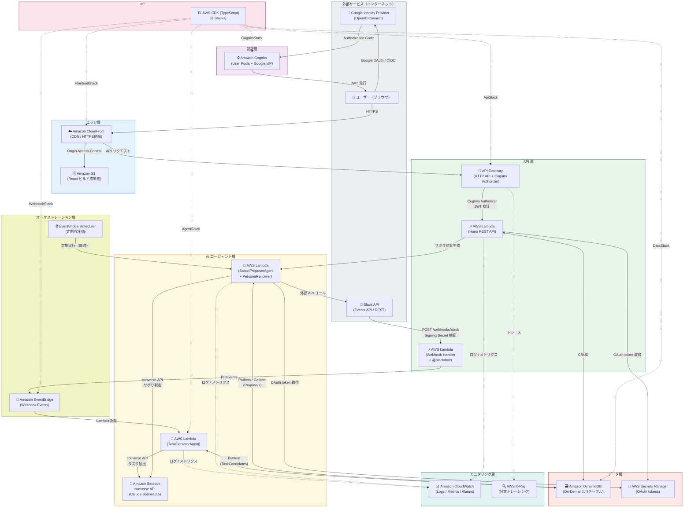
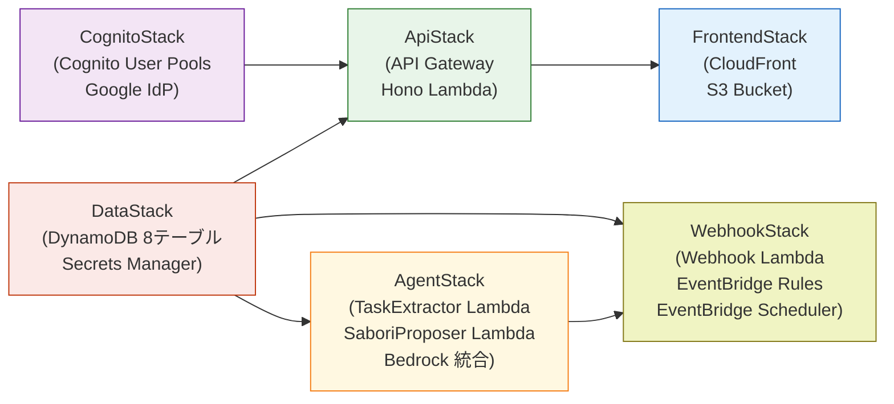

# AWS全体アーキテクチャ

**プロジェクト名**: SABOROU（サボロー）  
**作成日**: 2026-05-09  
**バージョン**: 1.0.0  
**対象環境**: AWS ap-northeast-1 (東京)

---

## 1. AWS全体アーキテクチャ図

### 1.1 Mermaid 全体アーキテクチャ図（サービス間連携）



### 1.2 CDK スタック構成図（デプロイ依存関係）



### 1.3 セキュリティ境界図（テキスト表現）

```
┌──────────────────────────────────────────────────────────────┐
│ パブリックゾーン（インターネット）                              │
│  - ユーザー（ブラウザ）                                        │
│  - Slack（外部 SaaS）                                          │
│  - Google Identity Provider（OpenID Connect）                  │
└────────────────────────┬─────────────────────────────────────┘
                         │ HTTPS（TLS 1.2以上）
         ┌───────────────┴────────────────┐
         │ Amazon CloudFront（エッジ）     │
         │ - HTTPS 強制                   │
         │ - Origin Access Control        │
         │ - WAF（オプション）             │
         └───────────────┬────────────────┘
                         │
         ┌───────────────┴────────────────┐
         │ Amazon Cognito User Pools       │
         │ - JWT Bearer Token 発行         │
         │ - Google OAuth 2.0 統合         │
         │ - ID Token / Access Token       │
         └───────────────┬────────────────┘
                         │ JWT 検証（Cognito Authorizer）
         ┌───────────────┴────────────────┐
         │ API Gateway HTTP API            │
         │ - Cognito Authorizer            │
         │ - CORS 設定                     │
         │ - スロットリング                 │
         └───────────────┬────────────────┘
                         │
┌────────────────────────┴────────────────────────────────────┐
│ Lambda 実行環境（マネージドサンドボックス）                    │
│  - IAM ロール最小権限                                          │
│  - 環境変数（KMS 暗号化）                                      │
│  - Secrets Manager 統合（OAuth トークン管理）                  │
│  - VPC 不要（サーバーレス・ゼロ常時起動）                      │
└─────────────────────────────────────────────────────────────┘
                         │
         ┌───────────────┴────────────────┐
         │ DynamoDB / Secrets Manager      │
         │ - 保存時暗号化（AWS 管理 KMS）   │
         │ - VPC エンドポイント不要         │
         │ - IAM ポリシーで細粒度アクセス制御│
         └────────────────────────────────┘
```

---

## 2. AWS CDKスタック構成

このアーキテクチャは6つのCDKスタックで構成されます：

| スタック名 | 主要リソース | 依存関係 |
|-----------|------------|---------|
| **CognitoStack** | Cognito User Pools / Google IdP / JWT設定 | なし |
| **DataStack** | DynamoDB 8テーブル / Secrets Manager | なし |
| **ApiStack** | API Gateway HTTP API / Hono Lambda / Cognito Authorizer | CognitoStack, DataStack |
| **AgentStack** | TaskExtractor Lambda / SaboriProposer Lambda / Bedrock統合 | DataStack |
| **WebhookStack** | Webhook Lambda / EventBridge Rules / EventBridge Scheduler | DataStack, AgentStack |
| **FrontendStack** | CloudFront Distribution / S3 Bucket | ApiStack |

**スタックデプロイ順序**:
```
1. CognitoStack ─┐
2. DataStack ────┼─> 3. ApiStack ────┐
                 │                    ├─> 6. FrontendStack
                 ├─> 4. AgentStack ─┤
                 └─> 5. WebhookStack ┘
```

---

## 3. DynamoDBテーブル構成

| テーブル名 | パーティションキー | ソートキー | GSI | TTL |
|-----------|------------------|----------|-----|-----|
| **Users** | userId (String) | - | - | - |
| **ServiceConnections** | userId (String) | service (String) | - | - |
| **TaskCandidates** | candidateId (String) | - | GSI-UserCreatedAt | 30日 |
| **Tasks** | taskId (String) | - | - | - |
| **Proposals** | proposalId (String) | - | - | - |
| **HonneData** | honneId (String) | - | - | - |
| **Personas** | personaId (String) | - | - | - |

---

## 4. セキュリティ境界

```
┌─────────────────────────────────────────────────────┐
│ 外部（インターネット）                                │
│ - Slack（OAuth 2.0）                                  │
│ - Google Identity Provider（OpenID Connect）          │
└────────────────────┬────────────────────────────────┘
                     │
         ┌───────────┴───────────┐
         │ CloudFront（CDN）      │
         │ - HTTPS必須            │
         │ - Origin Access Identity│
         └───────────┬───────────┘
                     │
         ┌───────────┴───────────┐
         │ Cognito User Pools     │
         │ - JWT Bearer Token発行 │
         │ - Google OAuth         │
         └───────────┬───────────┘
                     │
         ┌───────────┴───────────┐
         │ API Gateway            │
         │ - Cognito Authorizer   │
         │ - CORS設定             │
         └───────────┬───────────┘
                     │
┌────────────────────┴────────────────────────────────┐
│ Lambda実行環境（プライベート）                        │
│ - VPC不要（サーバーレス）                             │
│ - IAMロール最小権限                                   │
│ - 環境変数（暗号化）                                  │
│ - Secrets Manager統合                                │
└─────────────────────────────────────────────────────┘
                     │
         ┌───────────┴───────────┐
         │ DynamoDB / Secrets Mgr │
         │ - 暗号化保存（KMS）     │
         │ - VPCエンドポイント不要 │
         └───────────────────────┘
```

---

## 5. データフロー（3つの主要シナリオ）

### 5.1 タスク自動抽出フロー

```
Slack → Webhook Lambda → EventBridge → TaskExtractor Lambda → Bedrock
  ↓
TaskCandidates Table（DynamoDB）
  ↓
フロントエンド（ポーリング）
```

### 5.2 サボり提案生成フロー

```
フロントエンド → API Gateway → Hono Lambda → SaboriProposer Lambda
  ↓
Secrets Manager（OAuth tokens取得）
  ↓
外部API呼び出し（Slack）
  ↓
Bedrock（サボり判定推論）
  ↓
Proposals Table（DynamoDB）
  ↓
SSEストリーム → フロントエンド
```

### 5.3 定期再評価フロー

```
EventBridge Scheduler（毎時実行）
  ↓
SaboriProposer Lambda
  ↓
DynamoDB Query（nextCheckAt <= now）
  ↓
外部API + Bedrock 推論
  ↓
Proposals Table更新
```

---

## 6. コスト見積り（NFR-06: 月額$50以内）

| サービス | 想定使用量 | 月額コスト（USD） |
|---------|-----------|-----------------|
| **Lambda** | 10,000 invocations × 1GB × 5秒 | $1.00 |
| **API Gateway** | 10,000 requests | $0.04 |
| **DynamoDB** | On-Demand / 1GB / 100K RCU + WCU | $5.00 |
| **Bedrock** | 100 invocations × 8K tokens × Claude Sonnet | $20.00 |
| **Cognito** | 100 MAU（無料枠） | $0.00 |
| **CloudFront** | 10GB転送 | $1.00 |
| **S3** | 5GB保存 + 1,000 GET | $0.20 |
| **Secrets Manager** | 3シークレット | $1.20 |
| **CloudWatch** | ログ5GB | $2.50 |
| **合計** | | **$30.94** |

**備考**:
- Free Tier適用で初月は**$10以下**に抑制可能
- Bedrock呼び出しが最大コスト（トークン制限8,000で管理）
- スケールアップ時はDynamoDB Provisioned Capacityへ移行

---

## 7. モニタリング・アラーム設計

| メトリクス | 閾値 | アラーム内容 |
|-----------|------|------------|
| **Lambda実行時間** | >10秒 | NFR-01違反（タスク抽出） |
| **Lambda実行時間** | >20秒 | NFR-02違反（提案生成） |
| **Lambda同時実行数** | >100 | スロットリング警告 |
| **DynamoDB読み込み** | >80% キャパシティ | スケールアップ検討 |
| **Bedrock Token使用量** | >8,000 tokens/request | NFR-06違反（コスト超過リスク） |
| **API Gateway 5xx** | >1% | バックエンドエラー調査 |
| **Cognito認証失敗** | >10回/時間 | セキュリティインシデント疑い |

---

## 8. デプロイパイプライン

```
開発環境（ローカル）
  ↓ cdk deploy --profile dev
開発環境（AWS）
  ↓ テスト通過
  ↓ cdk deploy --profile staging
ステージング環境（AWS）
  ↓ 受入テスト通過
  ↓ cdk deploy --profile prod
本番環境（AWS）
```

**CI/CD（将来拡張）**:
- GitHub Actions → cdk synth → cdk deploy
- Slack通知（デプロイ成功/失敗）

---

## 9. 拡張性・スケーラビリティ

| 拡張ポイント | 現状（MVP） | スケールアップ時 |
|------------|-----------|----------------|
| **同時ユーザー数** | 100 MAU | 10,000 MAU |
| **DynamoDB** | On-Demand | Provisioned Capacity（オートスケーリング） |
| **Lambda同時実行** | デフォルト | Reserved Concurrency設定 |
| **CloudFront** | 単一ディストリビューション | 複数オリジン（API + Web分離） |
| **Bedrock** | Claude Sonnet | モデル切り替え可能（Haiku / Sonnet / Opus） |

---

## 10. 参考リンク

- [application-design.md](./application-design.md) - コンポーネント詳細設計
- [unit-of-work.md](../units/unit-of-work.md) - Unit分解とCDKスタック実装順序
- [requirements.md](../requirements/requirements.md) - NFR-01〜NFR-11（パフォーマンス・セキュリティ・コスト要件）
- [03-aws-architecture-policy.md](../../../aidlc-inputs/03-aws-architecture-policy.md) - AWSアーキテクチャ方針

---

## 11. AWS Well-Architected Framework 準拠

SABOROU のアーキテクチャは AWS Well-Architected Framework の5本柱すべてに準拠する設計を採用している。

### 11.1 5本柱への対応マッピング

| 柱 | 設計方針 | 具体的な実装 |
|----|---------|------------|
| **運用上の優秀性** | 可観測性の組み込みと自動復旧 | CloudWatch Logs / Metrics / Alarms（Lambda実行時間・DynamoDB容量・Bedrock Token使用量を常時監視）/ CloudWatch Alarm による自動アラート / エラーハンドリングフローでのフォールバック自動実行 |
| **セキュリティ** | 最小権限原則と機密情報の完全分離 | IAM ロールを Lambda 単位で最小権限設定（PutItemのみ等）/ OAuth トークンは全て Secrets Manager に暗号化保存（環境変数・DynamoDB 保存禁止）/ Cognito Authorizer による全エンドポイントの JWT 検証 / Slack Signing Secret による Webhook 署名検証 / PII（個人情報）は Lambda メモリ上で即時削除 |
| **信頼性** | マネージドサービスによる高可用性 | DynamoDB On-Demand（マルチAZ自動レプリケーション）/ Lambda マルチAZ自動実行 / 外部API失敗時の部分的コンテキストでの推論継続 / DynamoDB 書き込みエラー時の Exponential Backoff リトライ（3回）/ Bedrock converse API タイムアウト時の exponential backoff リトライ（v1.2.0: AgentCore フォールバック廃止・IBedrockClient インタフェースで将来移行に対応）|
| **パフォーマンス効率** | ストリーミングと並列処理による体感速度向上 | Bedrock ストリーミングレスポンス（InvokeModelWithResponseStream）による first chunk を20秒以内に表示 / ContextCollector の外部API並列呼び出し（Promise.allSettled）/ EventBridge 非同期処理による TaskOrganizerAgent のノンブロッキング起動 / Proposals テーブル GSI-TaskLatest による O(1) 最新提案取得 |
| **コスト最適化** | サーバーレス・従量課金によるゼロ常時コスト | Lambda / API Gateway / DynamoDB On-Demand でスケールゼロ可能（ユーザーゼロ時のコスト最小化）/ Bedrock プロンプトを最大8,000トークンでガード（NFR-06）/ CloudWatch Budgets アラート（$50/月）でコスト超過を自動検知 / 月額見積り $30.94（NFR-06 の $50/月制約を達成）|

### 11.2 Well-Architected Review チェックリスト

| チェック項目 | 対応状況 |
|------------|---------|
| IAMロールは最小権限か | ✅ Lambda単位で個別に定義 |
| シークレットはコードにハードコードされていないか | ✅ Secrets Manager / 環境変数のみ使用 |
| データは暗号化されているか | ✅ DynamoDB KMS暗号化 / S3 SSL必須 |
| 障害発生時に自動復旧するか | ✅ フォールバック戦略・リトライ設計済み |
| 監視・アラームが設定されているか | ✅ CloudWatch Alarm 7項目定義済み |
| コストが追跡・管理されているか | ✅ AWS Budgets アラート + 月次見積り $30.94 |
| スケールアップ計画があるか | ✅ §9 拡張性・スケーラビリティで定義済み |

---

## 12. 参考リンク

- [application-design.md](./application-design.md) - コンポーネント詳細設計
- [unit-of-work.md](../units/unit-of-work.md) - Unit分解とCDKスタック実装順序
- [requirements.md](../requirements/requirements.md) - NFR-01〜NFR-11（パフォーマンス・セキュリティ・コスト要件）
- [03-aws-architecture-policy.md](../../../aidlc-inputs/03-aws-architecture-policy.md) - AWSアーキテクチャ方針

---

**作成者**: AI-DLC Specialist（aidlc-specialist mode）
**最終更新**: 2026-05-10T10:00:00Z（Well-Architected Framework 準拠表追加）
