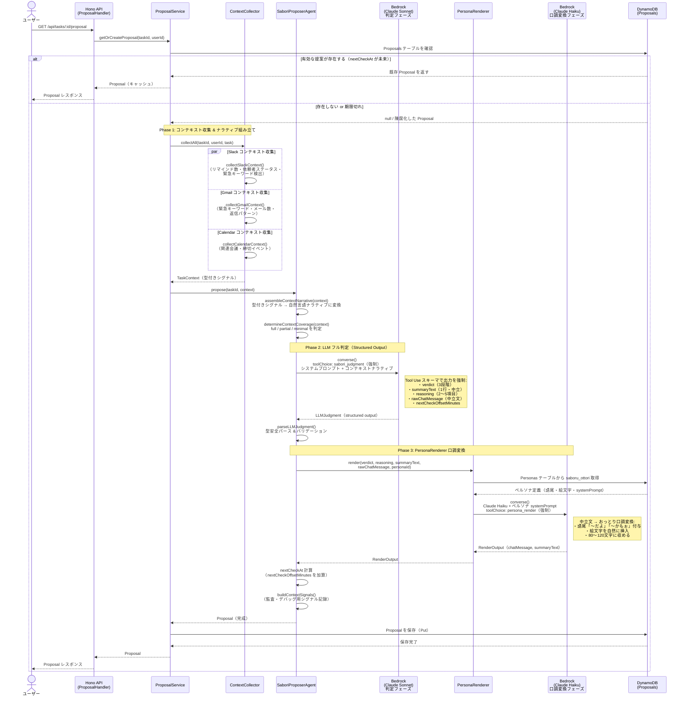

# コンポーネントメソッド定義 — SABOROU（インデックス）

**プロジェクト名**: SABOROU（サボロー）
**作成日**: 2026-05-09 / **最終更新**: 2026-05-10（コンポーネント別ファイルに分割）  
**注意**: このファイルはインデックスです。各コンポーネントの詳細は下記リンク先を参照してください。

---

## コンポーネントメソッド詳細（個別ファイル）

詳細ナビゲーション: [component-methods/README.md](./component-methods/README.md)

### バックエンド API（apps/api）

| コンポーネント | ファイル | 概要 |
|---|---|---|
| BE-01 AuthHandler | [BE-01-auth-handler.md](./component-methods/BE-01-auth-handler.md) | JWT 検証 / Cognito トークン交換 |
| BE-02 TaskHandler | [BE-02-task-handler.md](./component-methods/BE-02-task-handler.md) | タスク CRUD / 候補承認 |
| BE-03 ProposalHandler | [BE-03-proposal-handler.md](./component-methods/BE-03-proposal-handler.md) | サボり提案取得 / SSE ストリーミング |
| BE-04 HonneHandler | [BE-04-honne-handler.md](./component-methods/BE-04-honne-handler.md) | 本音データ記録 |
| BE-05 ConnectionHandler | [BE-05-connection-handler.md](./component-methods/BE-05-connection-handler.md) | 外部サービス連携管理 |
| BE-06 WebhookHandler | [BE-06-webhook-handler.md](./component-methods/BE-06-webhook-handler.md) | Slack Webhook 受信（Vercel Chat SDK） |

### エージェント（packages/agent）

| コンポーネント | ファイル | 概要 |
|---|---|---|
| AG-01 TaskExtractorAgent | [AG-01-task-extractor-agent.md](./component-methods/AG-01-task-extractor-agent.md) | Slack/Gmail/Calendar からタスク自動抽出 |
| AG-02 SaboriProposerAgent | [AG-02-sabori-proposer-agent.md](./component-methods/AG-02-sabori-proposer-agent.md) | サボり判定（5理論 × LLM + Bedrock Tool Use） |
| AG-03 PersonaRenderer | [AG-03-persona-renderer.md](./component-methods/AG-03-persona-renderer.md) | サボロー口調変換（Claude Haiku） |
| AG-04 ContextCollector | [AG-04-context-collector.md](./component-methods/AG-04-context-collector.md) | 外部サービスコンテキスト収集 |

### 共有・インフラ

| コンポーネント | ファイル | 概要 |
|---|---|---|
| packages/shared | [shared-utils.md](./component-methods/shared-utils.md) | 日時ユーティリティ / トークン管理 / AppError |
| infra/ (CDK) | [infra-components.md](./component-methods/infra-components.md) | 6 CDK スタック定義 |

---

> ⚠️ 以下の旧コンテンツは参考用として残しています。最新の正本は上記個別ファイルを参照してください。

---

## 1. バックエンド API メソッド（apps/api）

### BE-01: AuthHandler

```typescript
// Hono ミドルウェア: JWT 検証
authMiddleware(c: Context, next: Next): Promise<void>
// Returns: userId を c.set('userId', userId) で注入

// トークン交換（Cognito code → JWT）
POST /api/auth/exchange-token
Request:  { code: string, redirectUri: string }
Response: { accessToken: string, idToken: string, expiresIn: number }
```

### BE-02: TaskHandler

```typescript
// タスク一覧取得（候補 + 承認済み）
GET /api/tasks
Query:    { status?: 'pending' | 'approved' }
Response: Task[]

// タスク取得（単一）
GET /api/tasks/:id
Response: Task

// 手動タスク追加
POST /api/tasks
Request:  { title: string, deadline?: string, description?: string }
Response: Task

// タスク更新（インライン編集）
PATCH /api/tasks/:id
Request:  Partial<{ title: string, deadline: string, description: string }>
Response: Task

// タスク削除
DELETE /api/tasks/:id
Response: { deleted: true }

// タスク候補承認（pending → approved）
POST /api/tasks/candidates/:id/approve
Response: Task  // status: 'approved'
```

### BE-03: ProposalHandler

```typescript
// サボり提案取得（オンデマンド再評価含む）
GET /api/tasks/:id/proposal
Query:    { stream?: boolean }
Response: Proposal | SSE stream of Proposal delta
```

### BE-04: HonneHandler

```typescript
// 本音データ記録
POST /api/tasks/:id/honne
Request:  {
  type: 'quick_reply' | 'free_text',
  content: string,    // クイック返信ID or 自由入力テキスト
}
Response: {
  saved: true,
  reply: string,      // サボローの返答メッセージ
  visionText: string  // 「将来の取扱説明書になります」テキスト
}
```

### BE-05: ConnectionHandler

```typescript
// 連携状態一覧
GET /api/connections
Response: ServiceConnection[]

// Slack OAuth コールバック処理
POST /api/connections/slack/callback
Request:  { code: string, state: string }
Response: ServiceConnection

// Google OAuth コールバック処理（Gmail + Calendar スコープ）
POST /api/connections/google/callback
Request:  { code: string, state: string, scopes: string[] }
Response: ServiceConnection

// 連携解除
DELETE /api/connections/:service
Response: { disconnected: true }
```

### BE-06: WebhookHandler

```typescript
// Slack Events API Webhook 受信
POST /webhooks/slack
Request:  SlackEvent  // Slack Events API payload
Response: { challenge?: string }  // URL Verification 対応
// Side effect: EventBridge にイベントを転送
```

---

## 2. エージェントコンポーネントメソッド（packages/agent）

### AG-01: TaskExtractorAgent

```typescript
interface ITaskExtractorAgent {
  extractTask(input: ExternalEvent): Promise<TaskCandidate>
}

// ExternalEvent の種別
type ExternalEvent =
  | { source: 'slack'; message: SlackMessage }
  | { source: 'gmail'; email: GmailMessage }
  | { source: 'calendar'; event: CalendarEvent }

// 抽出結果
interface TaskCandidate {
  title: string
  deadline?: string
  requester?: string
  description?: string
  sourceType: 'slack' | 'gmail' | 'calendar'
  sourceRef: string  // 元メッセージの参照ID（生データは保存しない）
}
```

### AG-02: SaboriProposerAgent

**判定アーキテクチャ: LLMフル判定 + Bedrock Structured Output（2フェーズ方式）**

サボり判定は「ルールで切れる部分」と「人間の文脈読解が必要な部分」を分離せず、LLMが文脈全体を一度に読んで判定する。ただし出力の型安全性を担保するため、Bedrock の `converse` API + Tool Use パターンで構造化出力を強制する。

#### 理論的根拠（心理学フレームワーク）

SABOROU のサボり判定は以下の 5 つの社会心理学・動機づけ理論を設計基盤としている。
「なぜ今サボれるか」を科学的根拠で説明できることが、単なる「締切リマインダー」との本質的差別化となる。

| # | フレームワーク | 出典 | 核心概念 | ContextSignals への対応 |
|---|---|---|---|---|
| 1 | **Collective Effort Model (CEM)** | Karau, S. J., & Williams, K. D. (1993). Social loafing: A meta-analytic review and theoretical integration. *Journal of Personality and Social Psychology, 65*(4), 681–706. https://doi.org/10.1037/0022-3514.65.4.681 | 集合的努力は「自分の貢献が価値ある結果につながる」と信じられるときだけ発揮される。逆に「誰でもできる」「気づかれない」タスクでは努力は自然に低下する（約4,500引用） | `contextCoverage` / 締切の有無 |
| 2 | **Identifiability（識別可能性）** | Williams, K. D., Harkins, S., & Latané, B. (1981). Identifiability as a deterrent to social loafing: Two cheering experiments. *Journal of Personality and Social Psychology, 40*(2), 303–311. https://doi.org/10.1037/0022-3514.40.2.303 | 個人の貢献が依頼者から「識別可能」な状態では社会的手抜きが消える。逆に識別不能（依頼者が offline/away でリマインドなし）＝サボれる根拠 | `requesterActiveStatus` / `hasReminder` |
| 3 | **Sucker Effect（カモ効果）** | Kerr, N. L. (1983). Motivation losses in small groups: A social dilemma analysis. *Journal of Personality and Social Psychology, 45*(4), 819–828. https://doi.org/10.1037/0022-3514.45.4.819 | 周囲（依頼者・ピア）が努力していないと知覚されるとき、「自分だけ損する」を避けるため個人の努力も合理的に低下する | `requesterActiveStatus` (away/offline) |
| 4 | **Self-Determination Theory (SDT)** | Ryan, R. M., & Deci, E. L. (2000). Self-determination theory and the facilitation of intrinsic motivation, social development, and well-being. *American Psychologist, 55*(1), 68–78. https://doi.org/10.1037/0003-066X.55.1.68 | 外発的動機（依頼・締切）のプレッシャーがないとき、タスクへの取り組みを自律的に調整（先延ばし）することが心理的に合理的になる | `reminderCount` / `urgencyLevel` |
| 5 | **Expectancy Theory** | Vroom, V. H. (1964). *Work and Motivation.* New York: Wiley. | 動機づけ＝期待（努力→成果）× 道具性（成果→報酬）× 誘意性。締切が遠い・フィードバックがないタスクは「今努力しても報われない」期待を生み、先延ばしが最適戦略になる | `deadlineMinutes` / `contextCoverage` |

**SABOROU の判定ロジックへのマッピング**:

```
[サボれる条件] = Identifiability が低い（依頼者が見ていない）
              ∧ Sucker Effect が発動（依頼者も動いていない）
              ∧ Expectancy が高い（締切まで余裕がある）
              ∧ SDT 外発的プレッシャーが低い（リマインドなし）
              → CEM によると集合的努力への動機が低下 = サボりが最適解
```

#### 2フェーズ設計

```
[Phase 1: コンテキストアセンブリ + 判定プロンプト構築]
  ContextCollector が収集した SlackContext / GmailContext / CalendarContext を
  自然言語ナラティブ形式に変換し、LLM への入力コンテキストを組み立てる

        ↓

[Phase 2: Bedrock converse（Tool Use で構造化出力を強制）]
  Claude Sonnet が以下を一括判定:
  ① verdict（3段階）
  ② reasoning（根拠の箇条書き）
  ③ summaryText（1行サマリ）
  ④ nextCheckAt（次回再評価タイミング）
  ⑤ rawChatMessage（口調変換前の判断文）

        ↓

[Phase 3: PersonaRenderer（口調変換 + 絵文字付与）]
  rawChatMessage → おっとりサボロー口調に変換
```

#### インターフェース定義

```typescript
interface ISaboriProposerAgent {
  propose(taskId: string, context: TaskContext): Promise<Proposal>
  proposeStream(taskId: string, context: TaskContext): AsyncIterator<ProposalDelta>
}

// タスクコンテキスト（ContextCollector から受け取る）
interface TaskContext {
  task: Task
  slackContext?: SlackContext
  gmailContext?: GmailContext
  calendarContext?: CalendarContext
}

// 提案結果（最終出力）
interface Proposal {
  taskId: string
  verdict: Verdict                 // 'can_saboru' | 'caution' | 'danger'
  summaryText: string              // 1行サマリ（タスク一覧カード用）
  reasoning: string[]              // 判断材料の箇条書きリスト（3〜5項目）
  chatMessage: string              // PersonaRenderer 適用済みのチャットメッセージ
  evaluatedAt: string              // ISO 8601
  nextCheckAt: string              // 次回再評価タイミング ISO 8601
  contextSignals: ContextSignals   // デバッグ・監査用のシグナル記録
}

// LLM が structured output として返す中間型（PersonaRenderer 適用前）
interface LLMJudgment {
  verdict: Verdict
  summaryText: string              // 口調変換前（中立的な判断文）
  reasoning: string[]
  rawChatMessage: string           // 口調変換前の解説文
  nextCheckOffsetMinutes: number   // 次回チェックまでの分数（LLMが決定）
  confidenceNote?: string          // LLMが不確実と判断した場合のメモ
}

// シグナル記録（透明性確保・デバッグ用）
interface ContextSignals {
  hasReminder: boolean
  reminderCount: number
  requesterActiveStatus: string
  nearestMeetingMinutes?: number
  hasUrgentKeyword: boolean
  deadlineMinutes?: number         // 締切まで何分か（nullなら締切不明）
  contextCoverage: 'full' | 'partial' | 'minimal'  // コンテキスト充実度

  // 心理学的シグナル（理論的根拠の透明性確保・LLM 判定への入力）
  psychSignals?: {
    // CEM × Identifiability: 依頼者から貢献が「識別可能」かどうか
    // Williams et al. (1981); Karau & Williams (1993)
    taskIdentifiability: 'high' | 'low' | 'unknown'

    // Expectancy Theory: 「今努力して締切に間に合う」期待値 (E→P 期待)
    // Vroom (1964)
    effortOutcomeExpectancy: 'high' | 'low' | 'unknown'

    // Sucker Effect: 「依頼者（ピア）が動いていない」知覚
    // Kerr (1983)
    perceivedPeerEffort: 'high' | 'low' | 'unknown'

    // SDT: 外発的プレッシャーの強さ（高=forced regulation、低=autonomous）
    // Ryan & Deci (2000)
    externalPressureLevel: 'high' | 'low' | 'unknown'
  }
}

type Verdict = 'can_saboru' | 'caution' | 'danger'
```

#### コンテキストアセンブリ（Phase 1）

ContextCollector の生データを LLM が理解しやすい自然言語ナラティブに変換する。

```typescript
function assembleContextNarrative(context: TaskContext): string {
  // 例: 以下のような自然言語ブロックを構築する
  // ---
  // 【タスク情報】
  // タイトル: 「A社への提案書作成」
  // 締切: 明日 18:00（あと23時間）
  // 依頼者: yamada@client.com
  // 作業内容: 10ページのデザイン提案書
  //
  // 【Slackの状況】
  // 最後のメッセージから12時間が経過している。
  // リマインドは来ていない（0回）。
  // 依頼者のステータスは「away」。
  // メッセージのトーン分析: 「よろしくです〜」（低緊急度）
  //
  // 【Gmailの状況】
  // 関連メールは2通。最後のメールは2日前。
  // 「急ぎ」「ASAP」等の緊急キーワードは含まれていない。
  //
  // 【カレンダーの状況】
  // 関連会議「提案書レビュー」は明日 14:00（あと19時間）。
  // 次の締切関連予定: 明日 18:00
  // ---
}
```

#### Bedrock Tool Use スキーマ（Phase 2）

```typescript
const SABORI_JUDGMENT_TOOL = {
  name: 'sabori_judgment',
  description: 'タスクの文脈を分析し、サボり可否を判定して構造化データを返す',
  inputSchema: {
    type: 'object',
    properties: {
      verdict: {
        type: 'string',
        enum: ['can_saboru', 'caution', 'danger'],
        description: [
          'can_saboru: 今すぐサボれる。締切まで余裕があり、依頼者からのプレッシャーも低い',
          'caution: 注意が必要。近日中に着手すべき兆候がある',
          'danger: 危険。今すぐ動かないとまずい状況',
        ].join('\n'),
      },
      summaryText: {
        type: 'string',
        description: '30文字以内の1行判断文。例: 「まだ寝かせてOK。明日14時までに確認だけすれば逃げ切れる。」',
        maxLength: 60,
      },
      reasoning: {
        type: 'array',
        items: { type: 'string' },
        minItems: 2,
        maxItems: 5,
        description: '判断の根拠。各項目は「〜だから」「〜のため」で終わる具体的な事実ベースの文章',
      },
      rawChatMessage: {
        type: 'string',
        description: '100〜150文字の解説文。後でサボロー口調に変換するため中立的な口調で書く',
      },
      nextCheckOffsetMinutes: {
        type: 'number',
        description: [
          '次回再評価までの分数。判定に応じた目安:',
          '  can_saboru: 120〜360分（2〜6時間後）',
          '  caution: 30〜60分（状況変化を監視）',
          '  danger: 10〜20分（緊急監視）',
          '締切までの残り時間も考慮して決定すること',
        ].join('\n'),
      },
      confidenceNote: {
        type: 'string',
        description: 'コンテキストが不十分で判定に不確実性がある場合のみ記載。省略可',
      },
      appliedFramework: {
        type: 'array',
        items: { type: 'string' },
        minItems: 0,
        maxItems: 4,
        description: [
          '判定に影響した心理学フレームワーク名を列挙（説明責任・審査用）。',
          '例: ["CEM (Karau & Williams 1993)", "Sucker Effect (Kerr 1983)"]',
          '該当なし or 不明な場合は空配列 [] を返す。',
        ].join('\n'),
      },
    },
    required: ['verdict', 'summaryText', 'reasoning', 'rawChatMessage', 'nextCheckOffsetMinutes'],
  },
}
```

#### システムプロンプト（Phase 2）

```
あなたは「サボリスト」です。与えられたタスクの文脈情報を読んで、
ユーザーが「今サボれるかどうか」を判定する専門家です。

## 判定の思想
- サボることは怠惰ではなく、有限なエネルギーの最適配分である
- 「リマインドが来ていない = 依頼者はまだ焦っていない」という現実を直視する
- 締切・会議・依頼者の行動パターンから「本当の危険ライン」を見極める
- ユーザーが安心してサボれる「根拠」を具体的に提示することが最重要

## 判定基準（ガイドライン）
以下は絶対ルールではなく、LLMが文脈全体を見て総合判断するためのガイド:

【can_saboru の典型シグナル】
- 締切まで24時間以上ある
- 依頼者からのリマインドが0回
- 依頼者のステータスが away/offline
- 関連会議まで12時間以上ある
- メッセージのトーンが低緊急度

【caution の典型シグナル】
- 締切まで12〜24時間
- リマインドが1回来ている
- 関連会議まで3〜12時間
- 緊急キーワードは無いが返信が早い依頼者

【danger の典型シグナル】
- 締切まで12時間未満
- リマインドが2回以上
- 依頼者のステータスが online で最近アクティブ
- 「急ぎ」「ASAP」等の緊急キーワード検出
- 関連会議まで3時間未満

## 出力ルール
- reasoning は事実ベースで書く（「〜のため」「〜だから」）
- summaryText は端的に。絵文字・口調変換は PersonaRenderer が行うので不要
- コンテキストが partial/minimal の場合は confidenceNote に不確実性を明示する
- nextCheckOffsetMinutes は締切の緊急度と verdict を両方考慮して決定する
- appliedFramework には判定に実際に影響した理論名を記録する（説明責任）

## 心理学的フレームワーク（判定の科学的根拠）
psychSignals が渡された場合は以下の理論を判定に反映すること:

- **Identifiability 低（Williams et al., 1981; Karau & Williams, 1993）**
  `taskIdentifiability: 'low'` → 依頼者から貢献が見えていない = サボれる根拠
  appliedFramework に `"CEM + Identifiability (Karau & Williams 1993)"` を追加

- **Sucker Effect（Kerr, 1983）**
  `perceivedPeerEffort: 'low'` → 依頼者が動いていない = 自分だけ損するリスクがない
  appliedFramework に `"Sucker Effect (Kerr 1983)"` を追加

- **Expectancy 高（Vroom, 1964）**
  `effortOutcomeExpectancy: 'high'` → 締切まで余裕 = 今やらなくても間に合う
  appliedFramework に `"Expectancy Theory (Vroom 1964)"` を追加

- **SDT 外発的プレッシャー 低（Ryan & Deci, 2000）**
  `externalPressureLevel: 'low'` → リマインドなし・緊急度低 = 先延ばしが合理的
  appliedFramework に `"SDT (Ryan & Deci 2000)"` を追加
```

#### コンテキスト充実度によるフォールバック戦略

```typescript
function determineContextCoverage(context: TaskContext): 'full' | 'partial' | 'minimal' {
  const available = [context.slackContext, context.gmailContext, context.calendarContext]
    .filter(Boolean).length
  if (available === 3) return 'full'
  if (available >= 1) return 'partial'
  return 'minimal'  // タスク情報のみ
}

// coverage に応じてプロンプトを調整
// minimal: 「外部サービスの文脈情報がありません。タスク情報のみで保守的に判定してください。
//           不確実性を confidenceNote に必ず記載してください。」を追記
// partial: 「一部の外部サービスの情報のみ利用可能です。
//           欠損情報については推測せず、入手可能な情報のみで判定してください。」を追記

// 心理学的シグナル導出（5理論から ContextSignals.psychSignals を計算）
// Karau & Williams (1993), Williams et al. (1981), Kerr (1983),
// Ryan & Deci (2000), Vroom (1964)
function derivePsychSignals(context: TaskContext): ContextSignals['psychSignals'] {
  const slack = context.slackContext
  const task = context.task

  // Identifiability (Williams et al., 1981; CEM: Karau & Williams, 1993)
  // 依頼者がオンライン or リマインドしている = 「自分の貢献が見えている」= 識別可能性 高
  const taskIdentifiability: 'high' | 'low' | 'unknown' =
    slack?.requesterStatus === 'online' || (slack?.reminderCount ?? 0) > 0
      ? 'high'
      : slack?.requesterStatus === 'away' || slack?.requesterStatus === 'offline'
      ? 'low'
      : 'unknown'

  // Expectancy Theory: E→P expectancy (Vroom, 1964)
  // 締切まで24時間以上 = 「今やらなくても間に合う」期待が正当
  const effortOutcomeExpectancy: 'high' | 'low' | 'unknown' =
    task.deadline == null
      ? 'unknown'
      : minutesUntil(task.deadline) > 24 * 60   // 24時間以上余裕あり
      ? 'high'
      : minutesUntil(task.deadline) < 4 * 60    // 4時間未満で危険
      ? 'low'
      : 'unknown'

  // Sucker Effect (Kerr, 1983)
  // 依頼者が offline/away = 「ピアが動いていない」知覚 = Sucker Effect リスク低
  const perceivedPeerEffort: 'high' | 'low' | 'unknown' =
    slack?.requesterStatus === 'online' ? 'high'
    : slack?.requesterStatus === 'away' || slack?.requesterStatus === 'offline' ? 'low'
    : 'unknown'

  // SDT: External Pressure Level (Ryan & Deci, 2000)
  // リマインドなし + 緊急度 low = 外発的プレッシャーが低い = 先延ばしが合理的
  const externalPressureLevel: 'high' | 'low' | 'unknown' =
    (slack?.reminderCount ?? 0) >= 2 || slack?.urgencyLevel === 'high' ? 'high'
    : (slack?.reminderCount ?? 0) === 0 && slack?.urgencyLevel === 'low' ? 'low'
    : 'unknown'

  return { taskIdentifiability, effortOutcomeExpectancy, perceivedPeerEffort, externalPressureLevel }
}
```

#### サボり判定 処理シーケンス図



#### `propose()` の実装フロー

```typescript
async propose(taskId: string, context: TaskContext): Promise<Proposal> {
  // 1. コンテキストナラティブ組み立て
  const narrative = assembleContextNarrative(context)
  const coverage = determineContextCoverage(context)

  // 2. Bedrock converse（Tool Use で構造化出力を強制）
  const response = await bedrockClient.converse({
    modelId: 'anthropic.claude-sonnet-4-5',
    system: [{ text: SABORI_SYSTEM_PROMPT }],
    messages: [{ role: 'user', content: [{ text: narrative }] }],
    toolConfig: {
      tools: [{ toolSpec: SABORI_JUDGMENT_TOOL }],
      toolChoice: { tool: { name: 'sabori_judgment' } },  // 必ずツールを使わせる
    },
  })

  // 3. structured output パース（型安全）
  const judgment = parseLLMJudgment(response)  // LLMJudgment 型にパース

  // 4. PersonaRenderer で口調変換
  const rendered = await personaRenderer.render({
    verdict: judgment.verdict,
    reasoning: judgment.reasoning,
    summaryText: judgment.summaryText,
    rawChatMessage: judgment.rawChatMessage,
    personaId: 'saboru_ottori',
  })

  // 5. Proposal 組み立て・DynamoDB 保存
  const evaluatedAt = new Date().toISOString()
  const nextCheckAt = new Date(
    Date.now() + judgment.nextCheckOffsetMinutes * 60 * 1000
  ).toISOString()

  return {
    taskId,
    verdict: judgment.verdict,
    summaryText: rendered.summaryText,
    reasoning: judgment.reasoning,
    chatMessage: rendered.chatMessage,
    evaluatedAt,
    nextCheckAt,
    contextSignals: buildContextSignals(context, coverage),
  }
}
```

### AG-03: PersonaRenderer

PersonaRenderer は `SaboriProposerAgent` が出力した中立的な判断文を、
persona データに基づいた口調・絵文字・語尾に変換する責務を持つ。
判定ロジックには一切関与しない（表現専門コンポーネント）。

```typescript
interface IPersonaRenderer {
  render(params: RenderInput): Promise<RenderOutput>
}

interface RenderInput {
  verdict: Verdict
  reasoning: string[]
  summaryText: string          // 中立的な判断文（LLM出力）
  rawChatMessage: string       // 中立的な解説文（LLM出力）
  personaId: string            // 'saboru_ottori'（将来拡張用）
}

interface RenderOutput {
  chatMessage: string          // persona 口調変換済みのチャットメッセージ
  summaryText: string          // persona 口調変換済みの1行サマリ
}
```

#### `saboru_ottori` ペルソナ定義（DynamoDB Personas テーブルから取得）

```json
{
  "personaId": "saboru_ottori",
  "displayName": "おっとりサボロー",
  "avatar": "☁️",
  "voiceStyle": {
    "endings": ["〜だよ", "〜かもぉ", "〜だと思うよ", "〜でいいと思うよぉ", "〜してみてぇ"],
    "filler": ["うーん", "そうだねぇ", "まあ"],
    "positiveEmojis": ["☁️", "🌙", "✨", "😴", "🛋️"],
    "cautionEmojis": ["🌤️", "⚡", "👀"],
    "dangerEmojis": ["🔥", "⚠️", "💦"]
  },
  "verdictPhrases": {
    "can_saboru": "まだ寝かせてOK",
    "caution": "ちょっと気にしといてぇ",
    "danger": "さすがにそろそろやった方がいいかもぉ"
  },
  "systemPrompt": "あなたはおっとりしたサボりの専門家「おっとりサボロー」です。語尾は「〜だよ」「〜かもぉ」「〜だと思うよ」を使い、絵文字を自然に混ぜてください。急かさず、でも必要な時はちゃんと伝えてください。文字数は80〜120文字を目安にしてください。"
}
```

#### 口調変換フロー

```typescript
async render(params: RenderInput): Promise<RenderOutput> {
  const persona = await personasRepository.get(params.personaId)

  // Bedrock に口調変換を依頼（軽量なため Claude Haiku を使用してコスト削減）
  const response = await bedrockClient.converse({
    modelId: 'anthropic.claude-haiku-4-5',
    system: [{ text: persona.systemPrompt }],
    messages: [{
      role: 'user',
      content: [{
        text: [
          `判定: ${params.verdict}`,
          `判断文: ${params.rawChatMessage}`,
          `サマリ: ${params.summaryText}`,
          `以上を ${persona.displayName} の口調で書き直してください。`,
          `chatMessage と summaryText の2つを JSON で返してください。`,
        ].join('\n'),
      }],
    }],
    toolConfig: {
      tools: [{ toolSpec: PERSONA_RENDER_TOOL }],
      toolChoice: { tool: { name: 'persona_render' } },
    },
  })

  return parsePersonaOutput(response)
}
```

### AG-04: ContextCollector

外部サービス API から生データを収集し、LLMが判定しやすい型に正規化する。
**生データ（メッセージ本文）は DynamoDB に保存しない**（NFR-07: プライバシー保護）。
本文はメモリ上で処理し、構造化されたシグナルのみを出力する。

```typescript
interface IContextCollector {
  collectAll(params: CollectAllParams): Promise<TaskContext>
  collectSlackContext(params: SlackCollectParams): Promise<SlackContext>
  collectGmailContext(params: GmailCollectParams): Promise<GmailContext>
  collectCalendarContext(params: CalendarCollectParams): Promise<CalendarContext>
}

interface CollectAllParams {
  taskId: string
  userId: string
  task: Task
}
```

#### Slack コンテキスト収集ロジック

```typescript
interface SlackContext {
  hasReminder: boolean
  reminderCount: number              // タスク発生後のリマインド回数
  requesterStatus: 'online' | 'away' | 'offline' | 'unknown'
  urgencyLevel: 'low' | 'medium' | 'high'  // メッセージトーン分析結果
  lastMessageAt?: string             // 最後のメッセージ時刻 ISO 8601
  silentHours: number                // 最後のメッセージから何時間経過したか
  messageToneKeywords: string[]      // 検出した緊急キーワード一覧（監査用）
}

// urgencyLevel 判定（キーワードマッチング）
const URGENCY_KEYWORDS = {
  high: ['急ぎ', 'ASAP', '至急', '緊急', '今すぐ', '早急に', 'urgent'],
  medium: ['なるべく', 'できれば早め', '早め', 'soon', 'priority'],
  low: [],  // キーワードなし = low
}

async collectSlackContext(params): Promise<SlackContext> {
  const token = await connectionService.getValidToken(params.userId, 'slack')
  
  // Slack API: チャンネル履歴を取得（生本文を処理、保存しない）
  const messages = await slackClient.conversations.history({
    channel: params.task.sourceChannelId,
    oldest: params.task.createdAt,  // タスク生成以降のメッセージのみ
    limit: 20,
  })
  
  // Slack API: 依頼者のステータス取得
  const requesterProfile = await slackClient.users.getPresence({
    user: params.task.requesterId,
  })
  
  // リマインドカウント（本人以外からの同じトピックへの言及）
  const reminderCount = countReminderMessages(messages, params.task)
  
  // urgencyLevel はメッセージ本文をメモリ上でスキャン（保存しない）
  const { urgencyLevel, keywords } = analyzeUrgency(messages)
  
  return {
    hasReminder: reminderCount > 0,
    reminderCount,
    requesterStatus: requesterProfile.presence,
    urgencyLevel,
    lastMessageAt: messages[0]?.ts,
    silentHours: calcSilentHours(messages[0]?.ts),
    messageToneKeywords: keywords,  // 検出キーワードのみ保存（本文は捨てる）
  }
}
```

#### Gmail コンテキスト収集ロジック

```typescript
interface GmailContext {
  hasUrgentKeyword: boolean
  urgentKeywordsFound: string[]      // 検出した緊急キーワード（本文は保存しない）
  lastEmailAt?: string
  emailCount: number                 // タスク発生後の関連メール数
  repliedByRequester: boolean        // 依頼者からの返信があるか
  avgResponseHours?: number          // 依頼者の平均返信時間（行動パターン推定用）
}
```

#### Calendar コンテキスト収集ロジック

```typescript
interface CalendarContext {
  relatedMeetings: Array<{
    title: string
    startAt: string
    minutesUntilMeeting: number
    isReviewMeeting: boolean         // タイトルに「レビュー」「確認」等を含むか
  }>
  nearestDeadline?: string           // カレンダー上の締切イベント
  nearestMeetingMinutes?: number     // 最も近い関連会議までの分数
}
```

#### コンテキストナラティブ変換（assembleContextNarrative）

```typescript
// ContextCollector が返した型付きデータを
// LLM が読みやすい自然言語ナラティブに変換する
function assembleContextNarrative(context: TaskContext): string {
  const lines: string[] = []

  // タスク基本情報
  lines.push('【タスク情報】')
  lines.push(`タイトル: 「${context.task.title}」`)
  if (context.task.deadline) {
    const minutes = minutesUntil(context.task.deadline)
    lines.push(`締切: ${formatDeadline(context.task.deadline)}（あと${Math.round(minutes / 60)}時間）`)
  } else {
    lines.push('締切: 不明（設定なし）')
  }
  if (context.task.description) lines.push(`作業内容: ${context.task.description}`)

  // Slack 状況
  if (context.slackContext) {
    const s = context.slackContext
    lines.push('\n【Slackの状況】')
    lines.push(`最後のメッセージから${s.silentHours}時間が経過している。`)
    lines.push(s.hasReminder
      ? `リマインドが${s.reminderCount}回来ている。`
      : 'リマインドは来ていない（0回）。')
    lines.push(`依頼者のステータスは「${s.requesterStatus}」。`)
    lines.push(`メッセージのトーン分析: 緊急度「${s.urgencyLevel}」`)
    if (s.messageToneKeywords.length > 0) {
      lines.push(`検出キーワード: ${s.messageToneKeywords.join('、')}`)
    }
  } else {
    lines.push('\n【Slackの状況】Slack未連携のため情報なし。')
  }

  // Gmail 状況
  if (context.gmailContext) {
    const g = context.gmailContext
    lines.push('\n【Gmailの状況】')
    lines.push(`関連メールは${g.emailCount}通。`)
    if (g.lastEmailAt) lines.push(`最後のメールは${formatDeadline(g.lastEmailAt)}。`)
    lines.push(g.hasUrgentKeyword
      ? `緊急キーワード検出: ${g.urgentKeywordsFound.join('、')}`
      : '「急ぎ」「ASAP」等の緊急キーワードは含まれていない。')
  } else {
    lines.push('\n【Gmailの状況】Gmail未連携のため情報なし。')
  }

  // カレンダー状況
  if (context.calendarContext) {
    const c = context.calendarContext
    lines.push('\n【カレンダーの状況】')
    if (c.relatedMeetings.length > 0) {
      c.relatedMeetings.forEach(m => {
        lines.push(`関連会議「${m.title}」はあと${Math.round(m.minutesUntilMeeting / 60)}時間後。`)
      })
    } else {
      lines.push('関連する会議・予定は見当たらない。')
    }
  } else {
    lines.push('\n【カレンダーの状況】Google Calendar未連携のため情報なし。')
  }

  // 心理学的シグナル（psychSignals が存在する場合に追記）
  // LLM への入力として理論的根拠を自然言語化し、判定品質を高める
  if (context.psychSignals) {
    const ps = context.psychSignals
    lines.push('\n【心理学的文脈分析】')
    if (ps.taskIdentifiability !== 'unknown') {
      lines.push(`識別可能性（Identifiability）: ${ps.taskIdentifiability === 'high'
        ? '高（依頼者から貢献が見えている）'
        : '低（依頼者から貢献が見えていない）'}`)
    }
    if (ps.perceivedPeerEffort !== 'unknown') {
      lines.push(`依頼者の行動知覚（Sucker Effect）: ${ps.perceivedPeerEffort === 'high'
        ? '依頼者が積極的に動いている'
        : '依頼者は動いていない（Sucker Effectリスク低）'}`)
    }
    if (ps.effortOutcomeExpectancy !== 'unknown') {
      lines.push(`努力→成果の期待値（Expectancy）: ${ps.effortOutcomeExpectancy === 'high'
        ? '高（今やれば間に合う）'
        : '低（今やっても間に合わない可能性）'}`)
    }
    if (ps.externalPressureLevel !== 'unknown') {
      lines.push(`外発的プレッシャー（SDT）: ${ps.externalPressureLevel === 'high'
        ? '高（リマインド・緊急度高）'
        : '低（リマインドなし・自律的先延ばしが合理的）'}`)
    }
  }

  return lines.join('\n')
}
```

---

## 3. 共有パッケージメソッド（packages/shared）

```typescript
// 日付ユーティリティ
formatDeadline(isoDate: string): string  // 「明日 14:00」などの人間向け表現
minutesUntil(isoDate: string): number
isOverdue(isoDate: string): boolean

// Bedrockトークンカウンタ（8,000トークン制限ガード）
countTokens(text: string): number
guardTokenLimit(prompt: string, limit?: number): string  // 超過時にトリム

// エラーハンドリング
class AppError extends Error {
  constructor(
    message: string,
    public code: ErrorCode,
    public statusCode: number
  ) {}
}

type ErrorCode =
  | 'TASK_NOT_FOUND'
  | 'UNAUTHORIZED'
  | 'TOKEN_EXPIRED'
  | 'EXTERNAL_API_FAILED'
  | 'BEDROCK_TIMEOUT'
  | 'BEDROCK_COST_EXCEEDED'
  | 'DYNAMO_WRITE_FAILED'
```

---

## 4. インフラコンポーネントメソッド（infra/）

```typescript
// CognitoStack の主要設定
class CognitoStack extends cdk.Stack {
  userPool: cognito.UserPool
  userPoolClient: cognito.UserPoolClient
  userPoolDomain: cognito.UserPoolDomain
}

// DataStack の主要エクスポート
class DataStack extends cdk.Stack {
  tasksTable: dynamodb.Table
  proposalsTable: dynamodb.Table
  honneDataTable: dynamodb.Table
  usersTable: dynamodb.Table
  connectionsTable: dynamodb.Table
  personasTable: dynamodb.Table
}

// ApiStack の主要設定
class ApiStack extends cdk.Stack {
  httpApi: apigateway.HttpApi
  honoFunction: lambda.Function
}
```
