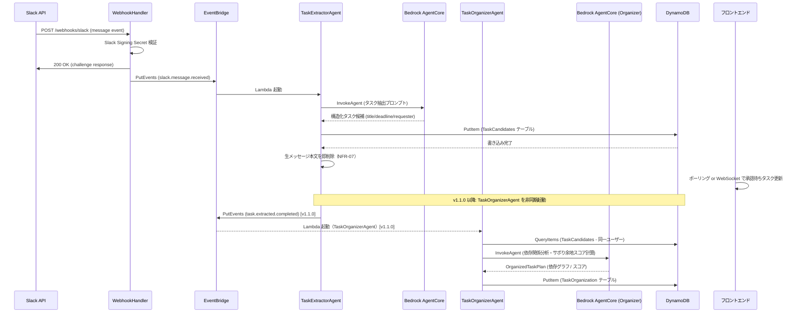
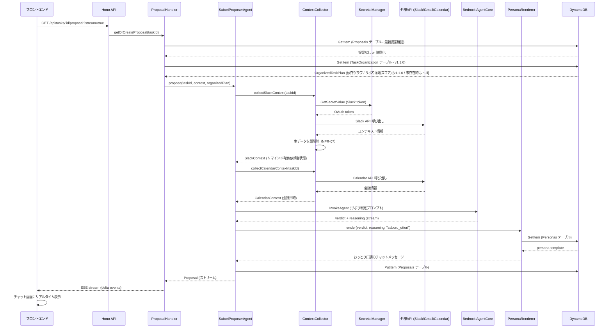
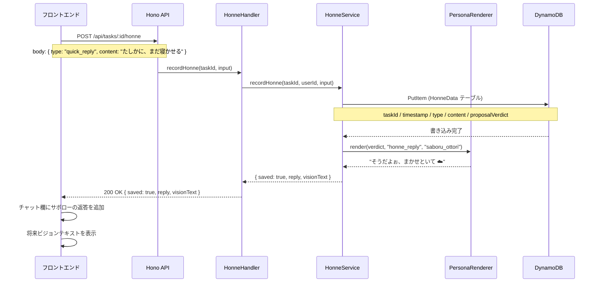
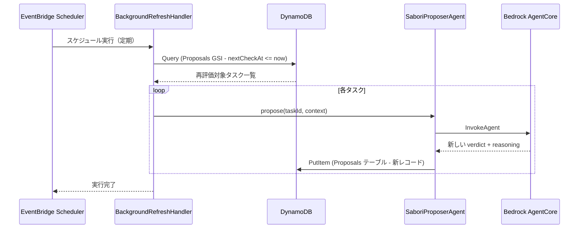
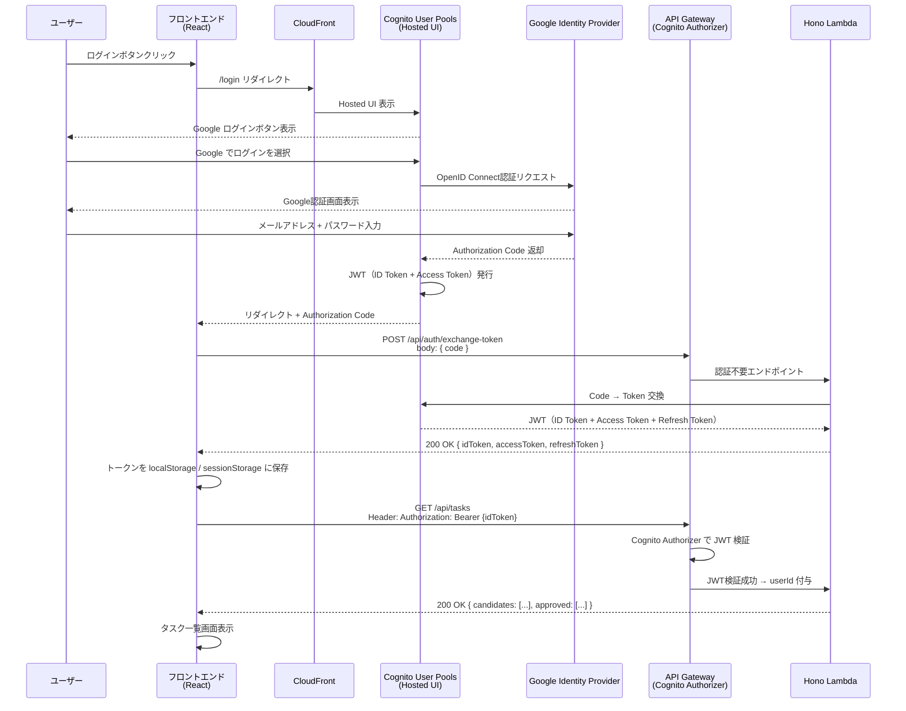
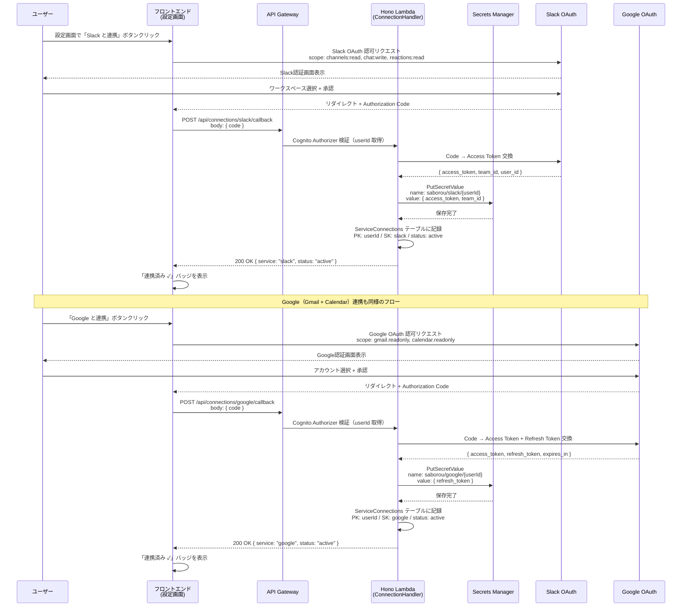
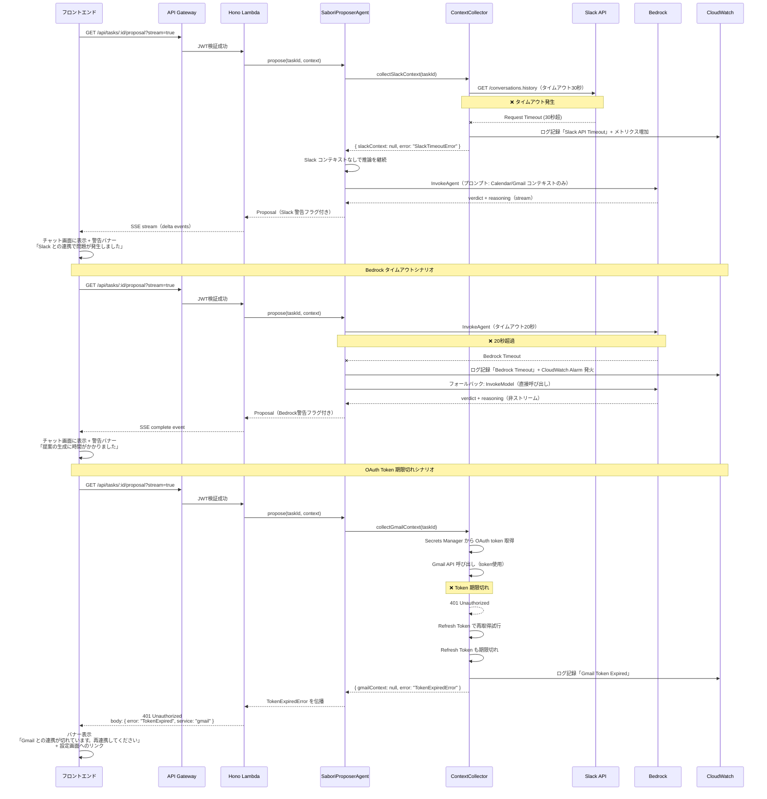

# シーケンス図 — SABOROU

**プロジェクト名**: SABOROU（サボロー）
**作成日**: 2026-05-09
**バージョン**: 1.1.0
**更新日**: 2026-05-10（application-design.md 7 より分割 / TaskOrganizerAgent フロー追加）
**対象**: 全7フローのシーケンス図

> 本ファイルは `application-design.md` の §7 を独立ファイルとして切り出したものです。
> 設計概要・コンポーネント図・データモデル・API仕様は [`application-design.md`](application-design.md) を参照。

---

## 7. シーケンス図

### 7.1 タスク自動抽出フロー（FR-01）

> **バージョン注記**: 実線は v1.0.0（M2 MVP）で実装済み。`[v1.1.0]` 注釈は M3 決勝実装予定（非同期・ユーザー応答をブロックしない）。

---

### 7.2 サボり提案生成フロー（FR-03）

> **バージョン注記**: 実線は v1.0.0（M2 MVP）で実装済み。`[v1.1.0]` 注釈は M3 決勝実装予定。v1.0.0 では `organizedPlan = null` として通過する設計。

---

### 7.3 本音データ記録フロー（FR-05）

---

### 7.4 バックグラウンド再評価フロー（FR-04）

---

### 7.5 認証フロー（FR-07対応）

**重要ポイント**:
- Cognito Hosted UI を使用（カスタムログイン画面は MVP 外）
- JWT の有効期限は **ID Token: 1時間** / **Refresh Token: 30日**
- フロントエンドは ID Token 期限切れ時に自動リフレッシュを試みる
- リフレッシュ失敗時は強制ログアウト → ログイン画面にリダイレクト

---

### 7.6 外部サービス連携設定フロー（FR-07対応）

**重要ポイント**:
- Access Token は Secrets Manager に保存（環境変数・DynamoDB に保存しない）
- Refresh Token も暗号化保存し、Access Token 期限切れ時に自動リフレッシュ
- 連携解除は `DELETE /api/connections/:service` エンドポイントで対応
- Webhook URL（Slack Events API）は infra デプロイ時に Slack App に登録

---

### 7.7 エラーハンドリングフロー（NFR-05対応）

**重要ポイント**:
- 外部API失敗時は**部分的なコンテキストで推論を継続**（完全失敗にしない）
- Bedrock タイムアウト時は**フォールバック戦略**（InvokeModel 直接呼び出し）
- OAuth Token 期限切れ時は**再連携を促すバナー**を表示
- 全エラーは CloudWatch Logs に記録し、重大エラーは CloudWatch Alarm で通知

---

*本ファイルは `application-design.md` §7 の分割ファイルです。*
*ビジネスルール・セキュリティ設計・トレーサビリティは [`design-rules.md`](design-rules.md) を参照。*
