# 実行計画書 — SABOROU

**プロジェクト名**: SABOROU（サボロー）
**作成日**: 2026-05-09
**バージョン**: 1.0.0
**ステータス**: レビュー中
**対象イベント**: AWS Summit Japan 2026 ハッカソン（書類審査: 2026-05-10）

---

## 1. Detailed Analysis Summary

### 1.1 Change Impact Assessment（変更影響評価）

本プロジェクトは Greenfield（新規開発）であるため、全領域に新規構築の影響がある。

| 影響領域 | 評価 | 詳細 |
|---------|------|------|
| **User-facing changes** | Yes（新規） | タスク一覧・タスク詳細・チャット・認証・連携設定の全画面を新規構築 |
| **Structural changes** | Yes（新規） | Dual-Agent 協調構成（エージェント①タスク抽出 / エージェント②サボり提案）を新規設計 |
| **Data model changes** | Yes（新規） | Tasks / Proposals / HonneData / Personas テーブル（DynamoDB）を新規設計 |
| **API changes** | Yes（新規） | REST API（Hono on Lambda + API Gateway HTTP API）を新規設計。Slack / Gmail / Google Calendar Webhook エンドポイントを含む |
| **NFR impact** | Yes（要設計） | NFR-01〜NFR-11: パフォーマンス・セキュリティ・コスト・モニタリングすべて設計対象 |

### 1.2 Risk Assessment（リスク評価）

**総合リスクレベル: Medium-High**

| リスク要因 | レベル | 詳細 |
|-----------|-------|------|
| **外部API 3サービス同時連携** | High | Slack OAuth / Google OAuth（Gmail + Calendar スコープ） / Bedrock AgentCore と3系統の認証・API連携が必須。1つでも失敗するとコア機能が動作しない |
| **Bedrock AgentCore の新興性** | High | 2024〜2025年リリースの新しいマネージドエージェント基盤。ドキュメント・サンプルが限定的 |
| **マルチエージェント協調** | Medium | エージェント①→②のデータフロー設計・エラーハンドリングが複雑。DynamoDB を介した非同期連携の整合性確保が必要 |
| **ハッカソン時間制約** | High | 書類審査 2026-05-10（翌日）/ MVP デモ 2026-05-30（21日後）/ 決勝 2026-06-26（48日後）の3段階締切 |
| **Bedrock コスト超過** | Medium | 1リクエスト最大 8,000 トークン制限あり。トークン管理ロジックの実装が必須（NFR-06） |
| **データプライバシー** | Low-Medium | Slack/Gmail 本文の生データ不保持方針（NFR-07）の実装を全 Lambda で遵守する必要あり |

**ロールバック複雑度**: Moderate（サーバーレスのため差し替えは容易だが、DynamoDB スキーマ変更は慎重に対応）

**テスト複雑度**: Complex（外部 API モック / Bedrock 推論モック / EventBridge 統合テスト）

---

## 2. Workflow Visualization

### 2.1 Mermaid フローチャート

```mermaid
flowchart TD
    Start(["ユーザーリクエスト"])

    subgraph INCEPTION["INCEPTION フェーズ"]
        WD["Workspace Detection<br/><b>COMPLETED</b>"]
        RE["Reverse Engineering<br/><b>SKIPPED</b><br/>Greenfield のため不要"]
        RA["Requirements Analysis<br/><b>COMPLETED</b>"]
        US["User Stories<br/><b>COMPLETED</b>"]
        WP["Workflow Planning<br/><b>IN PROGRESS</b>"]
        AD["Application Design<br/><b>EXECUTE</b>"]
        UG["Units Generation<br/><b>EXECUTE</b>"]
    end

    subgraph CONSTRUCTION["CONSTRUCTION フェーズ（Unit ループ）"]
        FD["Functional Design<br/><b>EXECUTE</b><br/>各 Unit"]
        NFRA["NFR Requirements<br/><b>EXECUTE</b><br/>各 Unit"]
        NFRD["NFR Design<br/><b>EXECUTE</b><br/>各 Unit"]
        ID["Infrastructure Design<br/><b>EXECUTE</b><br/>各 Unit"]
        CG["Code Generation<br/><b>EXECUTE</b><br/>各 Unit（必須）"]
        BT["Build and Test<br/><b>EXECUTE</b><br/>全 Unit 完了後（必須）"]
    end

    subgraph OPERATIONS["OPERATIONS フェーズ"]
        OPS["Operations<br/><b>PLACEHOLDER</b>"]
    end

    Start --> WD
    WD --> RE
    RE --> RA
    RA --> US
    US --> WP
    WP --> AD
    AD --> UG
    UG --> FD
    FD --> NFRA
    NFRA --> NFRD
    NFRD --> ID
    ID --> CG
    CG --> BT
    BT --> OPS
    OPS --> End(["完了"])

    style Start fill:#CE93D8,stroke:#6A1B9A,stroke-width:3px,color:#000
    style End fill:#CE93D8,stroke:#6A1B9A,stroke-width:3px,color:#000
    style WD fill:#4CAF50,stroke:#1B5E20,stroke-width:3px,color:#fff
    style RE fill:#BDBDBD,stroke:#424242,stroke-width:2px,stroke-dasharray: 5 5,color:#000
    style RA fill:#4CAF50,stroke:#1B5E20,stroke-width:3px,color:#fff
    style US fill:#4CAF50,stroke:#1B5E20,stroke-width:3px,color:#fff
    style WP fill:#4CAF50,stroke:#1B5E20,stroke-width:3px,color:#fff
    style AD fill:#FFA726,stroke:#E65100,stroke-width:3px,stroke-dasharray: 5 5,color:#000
    style UG fill:#FFA726,stroke:#E65100,stroke-width:3px,stroke-dasharray: 5 5,color:#000
    style FD fill:#FFA726,stroke:#E65100,stroke-width:3px,stroke-dasharray: 5 5,color:#000
    style NFRA fill:#FFA726,stroke:#E65100,stroke-width:3px,stroke-dasharray: 5 5,color:#000
    style NFRD fill:#FFA726,stroke:#E65100,stroke-width:3px,stroke-dasharray: 5 5,color:#000
    style ID fill:#FFA726,stroke:#E65100,stroke-width:3px,stroke-dasharray: 5 5,color:#000
    style CG fill:#4CAF50,stroke:#1B5E20,stroke-width:3px,color:#fff
    style BT fill:#4CAF50,stroke:#1B5E20,stroke-width:3px,color:#fff
    style OPS fill:#BDBDBD,stroke:#424242,stroke-width:2px,stroke-dasharray: 5 5,color:#000
```



### 2.2 テキスト代替表現（Mermaid 非対応環境用）

```
[START] ユーザーリクエスト

INCEPTION フェーズ:
  [COMPLETED] Workspace Detection
  [SKIPPED]   Reverse Engineering（Greenfield のため不要）
  [COMPLETED] Requirements Analysis
  [COMPLETED] User Stories
  [IN PROGRESS] Workflow Planning
  [EXECUTE]   Application Design
  [EXECUTE]   Units Generation

CONSTRUCTION フェーズ（Unit ごとのループ）:
  [EXECUTE]   Functional Design（各 Unit）
  [EXECUTE]   NFR Requirements（各 Unit）
  [EXECUTE]   NFR Design（各 Unit）
  [EXECUTE]   Infrastructure Design（各 Unit）
  [EXECUTE]   Code Generation（各 Unit・必須）
  [EXECUTE]   Build and Test（全 Unit 完了後・必須）

OPERATIONS フェーズ:
  [PLACEHOLDER] Operations

[END] 完了
```

---

## 3. Phases to Execute（実行判定一覧）

### INCEPTION フェーズ

| ステージ | 判定 | 根拠 |
|---------|------|------|
| Workspace Detection | COMPLETED | 完了済み（2026-05-09T07:00:00Z） |
| Reverse Engineering | SKIPPED | Greenfield のため不要。既存コードベースなし |
| Requirements Analysis | COMPLETED | 完了済み（FR-01〜FR-08 / NFR-01〜NFR-11 確定） |
| User Stories | COMPLETED | 完了済み（Epic 5件 / Story 17件） |
| Workflow Planning | IN PROGRESS | 本ステージ（実行中） |
| **Application Design** | **EXECUTE** | 新規コンポーネント多数（フロントエンド / バックエンド / Dual-Agent）。サービス層・コンポーネント責務・API インタフェースの定義が必須 |
| **Units Generation** | **EXECUTE** | システム規模が大きく（フロント / バック / エージェント / インフラ / 共有パッケージ）、並行開発可能な Unit への分解が必要 |

### CONSTRUCTION フェーズ（全 Unit 共通）

| ステージ | 判定 | 根拠 |
|---------|------|------|
| **Functional Design** | **EXECUTE** | 新規データモデル（Tasks / Proposals / HonneData / Personas）・複雑なビジネスロジック（Dual-Agent フロー・Persona レンダリング）が存在するため |
| **NFR Requirements** | **EXECUTE** | パフォーマンス（NFR-01: 10秒以内 / NFR-02: 10〜20秒）・セキュリティ（NFR-07）・コスト（NFR-06: $50/月）・モニタリング（NFR-11）が明示的に定義されているため |
| **NFR Design** | **EXECUTE** | NFR Requirements を実行するため自動的に対象。Bedrock トークン制御・CloudWatch アラーム・Secrets Manager 設計が必要 |
| **Infrastructure Design** | **EXECUTE** | AWS インフラを全て新規構築（Lambda / API Gateway / DynamoDB / Cognito / Bedrock / CloudFront + S3 / Secrets Manager / EventBridge）。CDK スタック設計が必要 |
| **Code Generation** | **EXECUTE（必須）** | 常に実行。実装計画 → コード生成の2部構成 |
| **Build and Test** | **EXECUTE（必須）** | 常に実行。ビルド / ユニットテスト / 統合テスト / E2E テスト手順を生成 |

### OPERATIONS フェーズ

| ステージ | 判定 | 根拠 |
|---------|------|------|
| Operations | PLACEHOLDER | 将来の拡張予定。現時点では Build and Test フェーズで対応 |

---

## 4. Module Update Strategy（モジュール更新戦略）

### 4.1 モノレポ構成と依存関係

```
AWS-SummitHackathon-2026/
├── apps/
│   ├── web/              # フロントエンド（React + Vite + shadcn/ui）
│   └── api/              # バックエンド（Hono on Lambda）
├── packages/
│   ├── shared/           # 型定義・共通ユーティリティ（全モジュールが依存）
│   └── agent/            # エージェント実装（Bedrock AgentCore）
└── infra/                # AWS CDK スタック
```

**依存関係の方向**:

```
infra/ → （全リソース定義）
shared/ ← api/, agent/, web/ （全モジュールが依存）
agent/ ← api/ （API からエージェントを呼び出す）
api/ ← web/ （フロントエンドが API を呼び出す）
```

### 4.2 推奨実装順序

| 順序 | モジュール | 理由 |
|------|-----------|------|
| 1 | `packages/shared` | 型定義・共通インタフェースを先に確定。全モジュールがここに依存 |
| 2 | `infra/` | AWS リソース（DynamoDB / Cognito / Secrets Manager / API Gateway / S3 / CloudFront）を先にプロビジョニング。ローカル開発でモック代替も可 |
| 3 | `packages/agent` | Bedrock AgentCore エージェント①②の実装。shared の型に依存 |
| 4 | `apps/api` | Hono ハンドラ・Webhook エンドポイント。shared + agent に依存 |
| 5 | `apps/web` | React フロントエンド。API エンドポイントが確定してから結合 |

**更新アプローチ**: Sequential（順次更新）
**クリティカルパス**: shared → infra → agent → api → web
**テストチェックポイント**:
1. `infra/` デプロイ後: AWS コンソールでリソース確認
2. `agent/` 完成後: Bedrock API 疎通テスト（モックデータ）
3. `api/` 完成後: Postman / curl での API 単体テスト
4. `web/` 完成後: E2E デモシナリオ通し確認

---

## 5. Estimated Timeline（推定スケジュール）

### マイルストーン構成

| マイルストーン | 日程 | 目標 |
|-------------|------|------|
| **M1: 書類審査提出** | 2026-05-10（翌日） | Inception フェーズ 4成果物（requirements.md / user-stories.md / execution-plan.md / application-design.md）を最上品質で提出 |
| **M2: MVP デモ** | 2026-05-30（21日後） | 動作する MVP + プレゼン（デモ完走・外部API連携・Dual-Agent 動作確認） |
| **M3: 決勝** | 2026-06-26（48日後） | AWS デプロイ済み完成品 + 本番品質のデモ |

### フェーズ別タイムライン（推定）

```
2026-05-09〜05-10（書類審査まで）:
  [完了] Workspace Detection
  [完了] Requirements Analysis
  [完了] User Stories
  [実行中] Workflow Planning
  [次]   Application Design（本日中に完了目標）
  [次]   Units Generation（本日中に完了目標）

2026-05-10〜05-22（書類審査後〜実装前半）:
  Functional Design（全 Unit）
  NFR Requirements + NFR Design（全 Unit）
  Infrastructure Design → CDK スタック実装
  Code Generation: shared / infra / agent

2026-05-22〜05-30（実装後半〜MVP デモ）:
  Code Generation: api / web
  Build and Test（全 Unit 統合）
  デモシナリオ通し確認・修正
  MVP デプロイ（CloudFront + S3 / API Gateway + Lambda）

2026-05-30〜06-26（予選後〜決勝）:
  フィードバック反映
  本番品質への仕上げ
  完成品デプロイ・ドキュメント整備
```

---

## 6. Success Criteria（成功基準）

### 6.1 Primary Goal（最重要目標）

**「人をダメにするサービス」コンセプトの訴求力**: 審査員が笑いと共感を感じ、「タスク整理能力が AI に委ねられて退化していく」というコンセプトを直感的に理解できること。

### 6.2 Key Deliverables（主要成果物）

#### 書類審査（2026-05-10）必須成果物

| 成果物 | パス | 品質基準 |
|--------|------|---------|
| requirements.md | `aidlc-docs/inception/requirements/requirements.md` | FR-01〜FR-08 / NFR-01〜NFR-11 全項目記載。受入基準明確 |
| user-stories.md（stories.md） | `aidlc-docs/inception/user-stories/stories.md` | Epic 5件・Story 17件。Given-When-Then 形式・エラーシナリオ完備 |
| execution-plan.md | `aidlc-docs/inception/plans/execution-plan.md` | 本文書（Mermaid 付き・3マイルストーン明記） |
| application-design.md | `aidlc-docs/inception/application-design/application-design.md` | コンポーネント・サービス・API・依存関係マトリクス完備 |

#### MVP デモ（2026-05-30）必須成果物

- 外部ツール連携（Slack / Gmail / Google Calendar）からのタスク自動抽出が動作
- エージェント②によるサボり提案生成（おっとりサボロー口調）が動作
- タスク一覧・タスク詳細・チャット画面の UI が動作
- 本音データ収集（クイック返信 4種 + 自由入力）が動作
- 5分デモシナリオが完走できること

#### 決勝（2026-06-26）必須成果物

- AWS（ap-northeast-1）へのデプロイが完了し、公開 URL が存在
- CDK スタックでインフラが完全コード化
- ユニットテスト（主要ロジック 80%以上カバレッジ）+ 統合テスト
- README（日本語）に環境構築手順・デモ手順が記載

### 6.3 Quality Gates（品質ゲート）

| ゲート | 基準 |
|--------|------|
| Mermaid 構文 | 全 Mermaid 図が構文エラーなし |
| TypeScript | strict mode 有効・any 原則禁止・Biome チェック通過 |
| セキュリティ | API キーハードコード禁止・Secrets Manager 使用・HTTPS 全通信 |
| コスト | Bedrock 1リクエスト 8,000 トークン以内・月額 $50 以内 |
| パフォーマンス | タスク抽出 10秒以内 / サボり提案 10〜20秒以内 |
| データ保護 | 外部ツール生データは処理後即削除（NFR-07 準拠） |
| GitHub | パブリックリポジトリ必須（書類審査要件） |

---

## 7. Risk Mitigation Plan（リスク対応策）

### 7.1 外部API 依存リスク

**リスク**: Slack / Gmail / Google Calendar OAuth の設定・承認が遅延する

**対応策**:
- MVP デモ前にシードデータをあらかじめ DynamoDB に投入しておき、Webhook トリガーなしでもデモが成立するようにする（フォールバック）
- OAuth フローを先に疎通確認してから他の機能開発に入る
- 書類審査では動作確認は不要なため、Inception フェーズは OAuth 設計のみで進む

### 7.2 Bedrock AgentCore 新興性リスク

**リスク**: Bedrock AgentCore の API 仕様が公式ドキュメント不足・SDK 非対応

**対応策**:
- AgentCore の代替として Bedrock InvokeModel 直接呼び出しを設計段階から用意しておく
- インタフェースを抽象化し、エージェント実装を差し替え可能な設計にする（Interface Segregation）
- Application Design で `ITaskExtractAgent` / `ISuggestAgent` インタフェースを定義し、実装を後回しにできる構造にする

### 7.3 Bedrock コストリスク

**リスク**: 開発・テスト中のトークン消費で $50/月 を超過する

**対応策**:
- ローカル開発・ユニットテスト時は Bedrock を完全モック化（vitest + モック実装）
- AWS Budgets で $30（警告）/ $50（通知）のアラートを設定
- プロンプトを Application Design フェーズで最適化し、トークン上限を事前にガード

### 7.4 ハッカソン時間制約リスク

**リスク**: 書類審査（翌日）までに application-design.md が間に合わない

**対応策**:
- **本日（2026-05-09）のうちに**: Workflow Planning → Application Design → Units Generation を完了させる
- application-design.md は Comprehensive 品質で生成するが、コンポーネント設計・API 定義の詳細レベルを MVP スコープ（FR-01〜FR-08）に絞る
- 審査員が最も重視するのはコンセプト訴求力（要件・ユーザーストーリー）のため、application-design.md はユーザーストーリーほど完璧でなくても審査を通過できる可能性が高い（ただし最上品質を目指す）

---

## 8. Hackathon Specific Plan（ハッカソン特化計画）

### 8.1 書類審査まで（2026-05-10）の最優先成果物

| 優先度 | 成果物 | 状態 | アクション |
|--------|--------|------|-----------|
| 1 | requirements.md | 完了 | 承認済み |
| 2 | stories.md（user-stories.md） | 完了 | 承認済み |
| 3 | **execution-plan.md** | 本文書 | 本日完了 |
| 4 | **application-design.md** | 未着手 | 本日最優先で生成 |

**提出要件**:
- GitHub リポジトリが **パブリック** であること（現状確認必須）
- `aidlc-docs/` 配下に上記4文書が存在すること
- `aidlc-docs/audit.md` に全操作ログが記録されていること
- `aidlc-docs/aidlc-state.md` に Inception フェーズの進捗が正確に記録されていること

### 8.2 MVP デモまで（2026-05-30）の実装スコープ

**MUST 実装（デモ成立の最低条件）**:
- FR-01: Slack からのタスク自動抽出（エージェント①稼働）
- FR-02: タスク候補の承認・編集・削除
- FR-03: サボり提案の生成（エージェント②稼働・おっとりサボロー口調）
- FR-05: 本音データ収集（クイック返信 4種 + 自由入力）
- FR-06: タスク一覧の1行サボり判定サマリ
- FR-07: 認証（Google ログイン + Slack 連携）

**SHOULD 実装（余裕があれば）**:
- FR-04: サボり提案のリアルタイム更新（EventBridge バックグラウンド更新）
- FR-08: 手動タスク追加
- Gmail / Google Calendar 連携（FR-01 の Gmail・Calendar 部分）

### 8.3 決勝まで（2026-06-26）の完成スコープ

- 全 FR（FR-01〜FR-08）の完全実装
- AWS 本番デプロイ（CloudFront + S3 + API Gateway + Lambda + DynamoDB + Cognito + Bedrock）
- CDK スタックによるインフラ完全コード化
- ユニットテスト（80%以上）+ 統合テスト + E2E テスト
- README（日本語）完備
- 5分デモシナリオ本番完走確認
- 将来ビジョン（取扱説明書・複数人格）の説明資料準備

---

## 9. Extension Configuration（拡張設定）

| Extension | 設定 | 理由 |
|-----------|------|------|
| Security Baseline | **無効**（Q23=B） | PoC・プロトタイプ扱い。ただし基本セキュリティ（IAM 最小権限・Secrets Manager・HTTPS）は実装する |
| Property-Based Testing | **無効**（Q24=C） | シンプルな CRUD・統合レイヤーが主体。複雑なビジネスロジックは限定的 |

---

## 10. 参照文書

| 文書 | パス |
|------|------|
| 要件定義書 | `aidlc-docs/inception/requirements/requirements.md` |
| ユーザーストーリー | `aidlc-docs/inception/user-stories/stories.md` |
| ペルソナ定義書 | `aidlc-docs/inception/user-stories/personas.md` |
| デモシナリオ | `aidlc-docs/inception/user-stories/demo-stories.md` |
| 将来展望 | `aidlc-docs/inception/user-stories/future-stories.md` |
| 状態管理 | `aidlc-docs/aidlc-state.md` |
| 監査ログ | `aidlc-docs/audit.md` |
| AWSアーキテクチャ方針 | `.claude/rules/aws-constraints.md` |

---

*本文書は Workflow Planning ステージの成果物です。ユーザーの承認後、Application Design ステージに進みます。*
