# Marp Slide Stylesheet Enhancement Execution Plan

## Detailed Analysis Summary

### Transformation Scope

- **Transformation type**: Single component enhancement.
- **Primary component**: `pkgs/backend/src/marp/MarpSlideService.ts`.
- **Related components**: Marp routes, MCP tool adapters, Slack posting service, and S3 upload path are dependent behavior but should not need direct changes.

### Change Impact Assessment

- **User-facing changes**: Yes. Generated slide decks should look more polished.
- **Structural changes**: No. Existing Marp generation architecture remains unchanged.
- **Data model changes**: No.
- **API changes**: No.
- **NFR impact**: Low. Keep output self-contained, dependency-free, and compatible with Marp Core.

### Risk Assessment

- **Risk level**: Low.
- **Rollback complexity**: Easy. Revert a focused change in the Marp service and any tests.
- **Testing complexity**: Simple. Render a fixture deck and run backend tests/typecheck.

## Workflow Decisions

| Stage | Decision | Rationale |
|---|---|---|
| Workspace Detection | Execute | Existing AI-DLC Brownfield project detected. |
| Reverse Engineering | Skip | Existing project state and prior artifacts exist; request scope is localized. |
| Requirements Analysis | Execute minimal | Requirement is clear and low-risk. |
| User Stories | Skip | Focused visual enhancement, no new workflow or persona. |
| Workflow Planning | Execute | Required by AI-DLC and useful to constrain scope. |
| Application Design | Skip | No new component or service boundary. |
| Units Generation | Skip | Single straightforward unit. |
| Functional Design | Skip | No new domain model or business rule. |
| NFR Requirements | Skip | Existing NFR posture is sufficient; security impact is unchanged. |
| NFR Design | Skip | No new NFR pattern needed. |
| Infrastructure Design | Skip | No AWS resource or IAM change. |
| Code Generation | Execute | Modify existing Marp prompt/style wrapper and add focused verification. |
| Build and Test | Execute | Run backend test/typecheck/build as appropriate. |

## Workflow Visualization

```mermaid
flowchart TD
    Start(["User Request"])
    WD["Workspace Detection<br/><b>EXECUTE</b>"]
    RE["Reverse Engineering<br/><b>SKIP</b>"]
    RA["Requirements Analysis<br/><b>EXECUTE</b>"]
    US["User Stories<br/><b>SKIP</b>"]
    WP["Workflow Planning<br/><b>EXECUTE</b>"]
    AD["Application Design<br/><b>SKIP</b>"]
    UG["Units Generation<br/><b>SKIP</b>"]
    FD["Functional Design<br/><b>SKIP</b>"]
    NFRA["NFR Requirements<br/><b>SKIP</b>"]
    NFRD["NFR Design<br/><b>SKIP</b>"]
    ID["Infrastructure Design<br/><b>SKIP</b>"]
    CG["Code Generation<br/><b>EXECUTE</b>"]
    BT["Build and Test<br/><b>EXECUTE</b>"]
    End(["Complete"])

    Start --> WD
    WD --> RE
    RE --> RA
    RA --> US
    US --> WP
    WP --> AD
    AD --> UG
    UG --> FD
    FD --> NFRA
    NFRA --> NFRD
    NFRD --> ID
    ID --> CG
    CG --> BT
    BT --> End

    style WD fill:#4CAF50,stroke:#1B5E20,stroke-width:3px,color:#fff
    style RA fill:#4CAF50,stroke:#1B5E20,stroke-width:3px,color:#fff
    style WP fill:#4CAF50,stroke:#1B5E20,stroke-width:3px,color:#fff
    style CG fill:#4CAF50,stroke:#1B5E20,stroke-width:3px,color:#fff
    style BT fill:#4CAF50,stroke:#1B5E20,stroke-width:3px,color:#fff
    style RE fill:#BDBDBD,stroke:#424242,stroke-width:2px,stroke-dasharray: 5 5,color:#000
    style US fill:#BDBDBD,stroke:#424242,stroke-width:2px,stroke-dasharray: 5 5,color:#000
    style AD fill:#BDBDBD,stroke:#424242,stroke-width:2px,stroke-dasharray: 5 5,color:#000
    style UG fill:#BDBDBD,stroke:#424242,stroke-width:2px,stroke-dasharray: 5 5,color:#000
    style FD fill:#BDBDBD,stroke:#424242,stroke-width:2px,stroke-dasharray: 5 5,color:#000
    style NFRA fill:#BDBDBD,stroke:#424242,stroke-width:2px,stroke-dasharray: 5 5,color:#000
    style NFRD fill:#BDBDBD,stroke:#424242,stroke-width:2px,stroke-dasharray: 5 5,color:#000
    style ID fill:#BDBDBD,stroke:#424242,stroke-width:2px,stroke-dasharray: 5 5,color:#000
    style Start fill:#CE93D8,stroke:#6A1B9A,stroke-width:3px,color:#000
    style End fill:#CE93D8,stroke:#6A1B9A,stroke-width:3px,color:#000
    linkStyle default stroke:#333,stroke-width:2px
```

Text alternative:

1. Workspace Detection: execute.
2. Reverse Engineering: skip.
3. Requirements Analysis: execute minimal.
4. User Stories: skip.
5. Workflow Planning: execute.
6. Application Design through Infrastructure Design: skip.
7. Code Generation: execute.
8. Build and Test: execute.

## Proposed Code Generation Scope

- [ ] Update `MarpSlideService` system prompt to request a custom, polished Marp visual system.
- [ ] Update fallback fixture markdown frontmatter/style so no-Bedrock output matches the intended visual direction.
- [ ] Replace the minimal HTML wrapper CSS with a more polished preview shell while keeping generated HTML self-contained.
- [ ] Add or update backend tests for fixture rendering and style presence.
- [ ] Run targeted backend tests, typecheck, and build.
- [ ] Record implementation summary under `aidlc-docs/construction/marp-slide-stylesheet-enhancement/code/`.

## Security Baseline Compliance

- Enabled extension: Security Baseline.
- Applicable checks: input validation, authorization boundary preservation, no new dependency, no new IAM or storage changes.
- Blocking findings: none.
