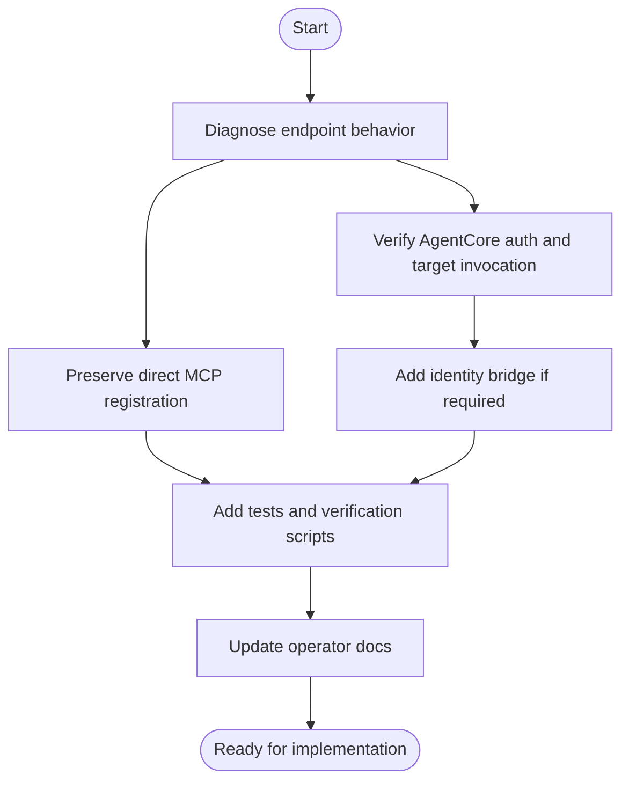

# MCP / AgentCore Gateway Connection Fix Plan

**Date**: 2026-06-20T15:16:12Z  
**Plan Status**: Proposed  
**Primary Goal**: Preserve the verified direct API Gateway `streamable_http` path and make Bedrock AgentCore Gateway work without weakening SABOROU user authorization.

## Workflow Visualization

Text alternative:

1. Diagnose endpoint behavior.
2. Preserve the verified direct MCP registration and clean up endpoint documentation.
3. Verify AgentCore Gateway authentication and target invocation.
4. Add an identity bridge only if the live Gateway target does not forward usable identity.
5. Add tests and verification scripts.
6. Update operator documentation.

## Root Cause Summary

1. **SSE is currently unsupported**: `GET /api/mcp` is not implemented as an SSE stream and falls through to a JWT-protected route.
2. **Direct Streamable HTTP works, but documentation still risks URL confusion**: `/api/mcp/tools` is REST adapter base, while direct MCP JSON-RPC is `/api/mcp`.
3. **AgentCore Gateway requires Bearer auth before initialization**: unauthenticated Gateway probes correctly return a protected-resource 401.
4. **AgentCore target identity propagation is unproven**: Gateway uses `GATEWAY_IAM_ROLE` to call `/api/mcp/tools/*`, while backend REST adapter requires a user identity from bearer token or equivalent verified bridge.

## Proposed Changes

### Step 1: Correct endpoint model and documentation

- [ ] Update `pkgs/extension/docs/ELEVENLABS_MCP_SETUP.md`:
  - Direct MCP `streamable_http`: use `McpJsonRpcUrl` (`/api/mcp`).
  - AgentCore Gateway MCP: use `GatewayUrl` (`...gateway.../mcp`).
  - REST adapter base: keep `McpToolsBaseUrl` documented as AgentCore target/internal boundary only.
  - Mark SSE as unsupported unless a future SSE bridge is implemented.
- [ ] Update AI-DLC operation docs that still instruct `McpToolsBaseUrl` for direct MCP registration.
- [ ] Add a short troubleshooting matrix for:
  - `Missing Bearer token`
  - wrong transport
  - wrong endpoint path
  - backend tool 401 after Gateway connection

### Step 2: Preserve and codify direct `streamable_http` verification

- [ ] Update or add a script that tests `POST /api/mcp` with:
  - unauthenticated `initialize` expected 200
  - authenticated `tools/list` expected 200
  - authenticated `tools/call` expected 200 for a read-only tool
  - `GET /api/mcp` with SSE expected unsupported status, with clear message
- [ ] Record the user's verification that Streamable HTTP can call tools as baseline evidence.
- [ ] Update CDK/API tests to assert `McpJsonRpcUrl` output exists and ends with `/api/mcp`.
- [ ] Add backend tests for unsupported `GET /api/mcp` behavior if an explicit route is added for clearer errors.

### Step 3: Verify AgentCore Gateway auth with real Cognito token

- [ ] Extend `scripts/verify-agentcore.sh` so it can accept `COGNITO_TOKEN`.
- [ ] Probe `GatewayUrl` with JSON-RPC `initialize` and `tools/list`.
- [ ] Treat unauthenticated 401 as reachability pass but auth readiness fail.
- [ ] Record OAuth protected resource metadata fields without logging the token.

### Step 4: Verify AgentCore Gateway target invocation path

- [ ] Invoke a read-only tool through AgentCore Gateway with a valid Cognito token.
- [ ] Check CloudWatch logs for the backend request headers and safe audit event shape.
- [ ] Determine whether AgentCore forwards the original `Authorization` header or usable identity claims to `/api/mcp/tools/*`.
- [ ] Confirm whether backend receives:
  - a bearer token,
  - AgentCore-specific identity headers,
  - only IAM-signed target invocation with no end-user identity.

### Step 5: Implement identity bridge only if verification proves it is required

- [ ] If the bearer token is forwarded, keep the current backend authorization model and add regression tests.
- [ ] If no user identity is forwarded, add a dedicated AgentCore identity bridge:
  - accept only requests proven to originate from the AgentCore Gateway target path,
  - derive user identity from verified Gateway claims or a signed identity header if available,
  - fail closed when user identity is absent,
  - never authorize user-scoped resources from IAM role alone.
- [ ] If AgentCore cannot provide per-user identity to OpenAPI targets, keep Gateway limited to non-user-scoped/readiness tools and use direct `/api/mcp` for user-scoped operations until a safe identity source is available.

### Step 6: Update tests and security checks

- [ ] Backend tests:
  - direct JSON-RPC URL supports initialize/tools/list/tools/call as expected,
  - REST adapter rejects missing identity,
  - any AgentCore identity bridge fails closed when identity is absent,
  - side-effect approval requirements remain enforced.
- [ ] CDK tests:
  - `GatewayUrl`, `McpJsonRpcUrl`, and `McpToolsBaseUrl` outputs are distinct and documented by description,
  - Gateway role remains scoped to `POST /api/mcp/tools/*`,
  - no wildcard action is introduced.
- [ ] Script tests:
  - direct MCP verification,
  - AgentCore connection verification,
  - AgentCore tool invocation verification.

### Step 7: Build and verification commands

- [ ] `pnpm --filter backend test`
- [ ] `pnpm --filter backend typecheck`
- [ ] `pnpm --filter backend build`
- [ ] `pnpm --filter cdk test`
- [ ] `pnpm --filter cdk build`
- [ ] `AWS_REGION=ap-northeast-1 AGENTCORE_GATEWAY_ID=... COGNITO_TOKEN=... ./scripts/verify-agentcore.sh`
- [ ] `API_ENDPOINT=... COGNITO_TOKEN=... ./scripts/verify-mcp-auth.sh`

## Recommended Implementation Sequence

1. Documentation and CDK output cleanup first, because direct Streamable HTTP is verified but setup artifacts still need to prevent endpoint confusion.
2. Verification script improvement second, because it gives objective evidence for the AgentCore identity propagation behavior.
3. Backend identity bridge only after live evidence shows the current auth boundary cannot work through AgentCore target invocation.
4. Full build/test and manual AgentCore verification last.

## Security Compliance

| Rule | Status | Notes |
|---|---|---|
| SECURITY-02 | Compliant if verification logs remain enabled | API Gateway access logs already exist; Gateway-level evidence must be captured via AgentCore response and backend audit logs. |
| SECURITY-03 | Compliant with caution | Do not log tokens while adding diagnostics. |
| SECURITY-05 | Compliant target | Keep schema validation for all tool args. |
| SECURITY-06 | Compliant target | Gateway role remains scoped to execute-api target route only. |
| SECURITY-08 | Blocking constraint | Do not use AgentCore IAM role alone as SABOROU user authorization. |
| SECURITY-09 | Compliant target | Preserve safe external error shapes. |
| SECURITY-12 | Compliant target | Bearer/JWT handling must remain server-side verified. |

No blocking security finding exists in the plan itself. A blocking implementation finding will exist if live AgentCore target invocation lacks user identity and the implementation tries to bypass user-level authorization.

## Approval

Approve this plan before code changes. After approval, construction should execute as a focused single unit: `mcp-agentcore-connection-fix`.
