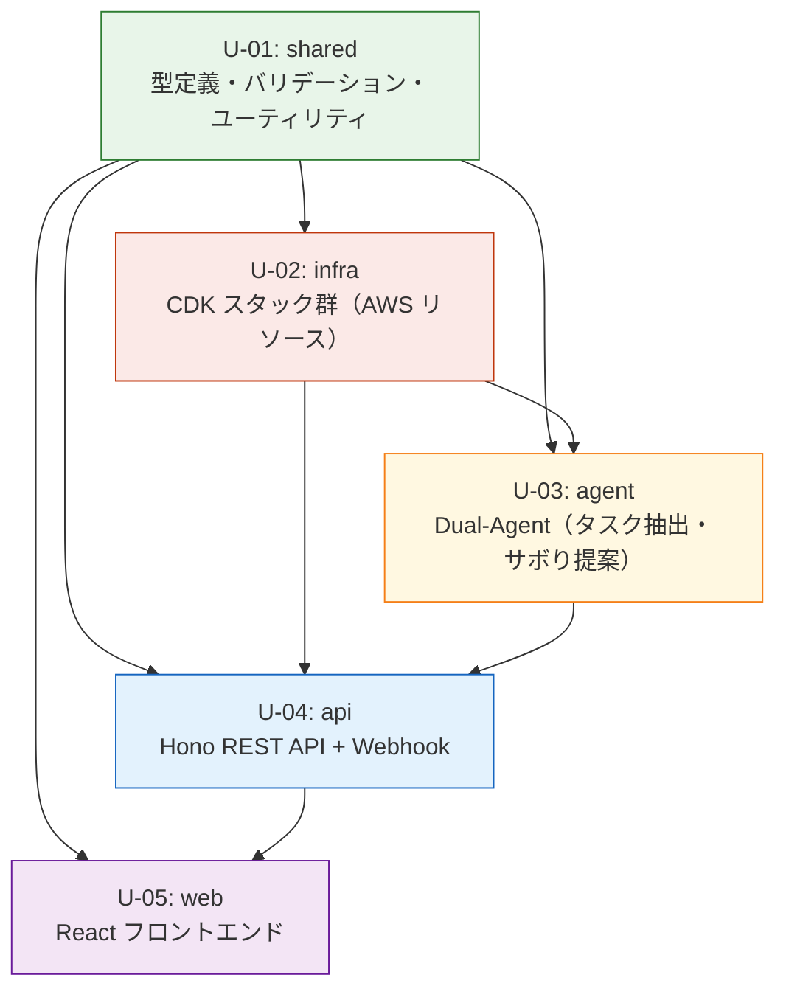

# Unit of Work 定義書 — SABOROU

**プロジェクト名**: SABOROU（サボロー）
**作成日**: 2026-05-09
**バージョン**: 1.0.0
**ステータス**: 承認待ち
**対象イベント**: AWS Summit Japan 2026 ハッカソン（書類審査: 2026-05-10）
**設計深度**: Comprehensive

---

## メタ情報

| 項目 | 内容 |
|------|------|
| 生成ステージ | INCEPTION - Units Generation |
| 参照成果物 | application-design.md / components.md / requirements.md / user-stories.md |
| Unit 総数 | 5（U-01〜U-05）|
| 実装方針 | モノレポ（packages/ + apps/ + infra/）|
| 依存順序 | shared → infra → agent → api → web |

---

## 1. Unit 一覧サマリ

| Unit ID | Unit 名 | 責務（1行） | 依存 Unit | 規模 | 優先度 |
|---------|---------|-----------|----------|------|--------|
| U-01 | shared | 全 Unit が共有する型定義・バリデーション・ユーティリティの提供 | なし | S | 最高 |
| U-02 | infra | AWS CDK による全インフラリソースのプロビジョニング | U-01 | M | 高 |
| U-03 | agent | Bedrock AgentCore を用いた Dual-Agent（タスク抽出・サボり提案）の実装 | U-01, U-02 | L | 高 |
| U-04 | api | Hono on Lambda による REST API + Webhook ハンドラの実装 | U-01, U-02, U-03 | L | 高 |
| U-05 | web | React + shadcn/ui によるフロントエンド全画面の実装 | U-01, U-04 | M | 中 |

---

## 2. Unit 間依存関係図



### テキスト代替表現

```
レイヤー 0（依存元なし）:
  U-01: shared ─────────────────────────────────────→ 全 Unit が参照

レイヤー 1（U-01 のみ依存）:
  U-02: infra ← U-01

レイヤー 2（U-01 + U-02 依存）:
  U-03: agent ← U-01, U-02

レイヤー 3（U-01 + U-02 + U-03 依存）:
  U-04: api ← U-01, U-02, U-03

レイヤー 4（U-01 + U-04 依存）:
  U-05: web ← U-01, U-04（型契約のみ使用）

実装順序: U-01 → U-02 → U-03 → U-04 → U-05
並行可能: U-01 完了後、U-02 と U-03 の設計を並行開始可
```

---

## 3. 各 Unit 詳細

---

### U-01: shared（共通基盤）

**Unit ID**: U-01
**Unit 名**: shared
**ディレクトリ**: `packages/shared/`
**規模**: S（Small）
**推定工数**: 2〜3時間

#### 責務

全 Unit が依存する共通の型定義・バリデーションスキーマ・ユーティリティを提供する単一責任 Unit。循環依存の防止のため、他 Unit には依存しない。

#### 含まれるコンポーネント

| コンポーネント | 内容 |
|-------------|------|
| TypeScript 型定義 | `Task` / `TaskCandidate` / `Proposal` / `HonneData` / `Persona` / `User` / `ServiceConnection` / `Verdict` / `QuickReplyType` |
| Zod スキーマ | 全エンティティの入力バリデーションスキーマ |
| DynamoDB リポジトリインタフェース | `ITaskRepository` / `IProposalRepository` / `IHonneRepository` / `IUserRepository` |
| エラークラス | `BedrockTimeoutError` / `TokenExpiredError` / `DynamoWriteFailedError` / `BedrockCostExceededError` |
| ユーティリティ | `generateUlid()` / `toIsoString()` / `guardTokenLimit()` / `pseudonymize()` |
| 定数 | `VERDICT_TYPE` / `SOURCE_TYPE` / `SERVICE_TYPE` / `MAX_TOKEN_LIMIT` |

#### 対応する FR / NFR / Story

| 対応 | 内容 |
|------|------|
| FR | FR-01〜FR-08（全機能要件の型基盤を提供） |
| NFR | NFR-07（仮名化ユーティリティ）/ NFR-06（トークン制限定数） |
| Story | US-01〜US-17（全ストーリーの共通型を提供） |

#### 入力（依存）

なし（ベース層 — 他 Unit には依存しない）

#### 出力（提供）

- TypeScript 型定義（全 Unit が `import type { Task, Proposal, ... } from '@saborou/shared'` で参照）
- Zod バリデーションスキーマ（U-04 api が入力検証に使用）
- リポジトリインタフェース（U-04 api が実装する契約）
- エラークラス（U-03 agent / U-04 api がスロー・補足する）
- ユーティリティ関数（U-03 / U-04 が呼び出す）

#### 使用 AWS サービス

なし（ビジネスロジックなし・AWS SDK 不使用）

#### 想定実装ステップ（Construction 各ステージ）

| ステージ | 担当内容 |
|---------|---------|
| Functional Design | 型ヒエラルキー確定・Zod スキーマ設計・エラークラス階層設計 |
| NFR Requirements | なし（U-01 に NFR 要件なし — スキップ可） |
| NFR Design | なし（スキップ） |
| Infrastructure Design | なし（AWS リソースなし — スキップ可） |
| Code Generation | `types/index.ts` / `schemas/index.ts` / `errors/index.ts` / `utils/index.ts` / `constants/index.ts` / `package.json` / `tsconfig.json` 生成 + 単体テスト |

#### 完了条件（Definition of Done）

- [ ] TypeScript コンパイルエラーなし（`tsc --noEmit`）
- [ ] ESLint / Prettier 通過
- [ ] 全型定義に JSDoc コメントあり
- [ ] Zod スキーマに対する単体テスト（Vitest）作成済み
- [ ] エラークラスのインスタンス確認テスト作成済み
- [ ] `package.json` に `@saborou/shared` パッケージ名設定済み
- [ ] 他 Unit からの `import` が正常に解決されること（ workspace 設定確認）

---

### U-02: infra（AWSインフラ）

**Unit ID**: U-02
**Unit 名**: infra
**ディレクトリ**: `infra/`
**規模**: M（Medium）
**推定工数**: 4〜6時間

#### 責務

AWS CDK v2（TypeScript）による全インフラリソースのプロビジョニング。6つの Stack として構成し、IAM 最小権限・暗号化・コスト最適化を Infrastructure as Code で表現する。

#### 含まれるコンポーネント

| コンポーネント（INF-ID） | 内容 |
|----------------------|------|
| INF-01: CognitoStack | User Pool + App Client + Google ソーシャル IdP / Hosted UI 設定 |
| INF-02: DataStack | DynamoDB 全テーブル（Users / ServiceConnections / TaskCandidates / Tasks / Proposals / HonneData / Personas）+ GSI + TTL 設定 |
| INF-03: ApiStack | API Gateway HTTP API + Hono Lambda + Cognito JWT オーソライザー + Lambda 環境変数注入 |
| INF-04: AgentStack | Bedrock AgentCore エージェント定義 + TaskExtractorAgent Lambda + SaboriProposerAgent Lambda + BackgroundRefreshHandler Lambda |
| INF-05: FrontendStack | S3 バケット（静的ホスティング）+ CloudFront ディストリビューション（OAC 設定）|
| INF-06: WebhookStack | Webhook Lambda + EventBridge カスタムバス + EventBridge Scheduler（定期再評価）|
| IAM ロール群 | 各 Lambda に最小権限ポリシーを個別付与 |
| Secrets Manager 参照 | Slack / Google OAuth トークン格納先定義 |
| CloudWatch アラート | Bedrock コスト監視（$50/月アラート）|

#### 対応する FR / NFR / Story

| 対応 | 内容 |
|------|------|
| FR | FR-01〜FR-08（全機能の実行環境を提供） |
| NFR | NFR-03（可用性）/ NFR-04（CloudFront CDN）/ NFR-06（Bedrock コスト監視）/ NFR-07（Secrets Manager）/ NFR-11（IAM 最小権限・暗号化） |
| Story | 全 Story（インフラが全機能の前提） |

#### 入力（依存）

- U-01 shared: 型定義（Lambda コードのインポート時に参照。CDK コード自体は型に直接依存しない）

#### 出力（提供）

- 全 AWS リソース（ARN / エンドポイント URL を CloudFormation Output として出力）
- 各 Lambda 関数 ARN（U-03 agent / U-04 api がデプロイ先として使用）
- DynamoDB テーブル名（U-03 / U-04 が環境変数経由で参照）
- API Gateway URL（U-05 web の `VITE_API_BASE_URL` に設定）
- CloudFront URL（U-05 web の配信元）

#### 使用 AWS サービス

Cognito / DynamoDB / Lambda / API Gateway HTTP API / S3 / CloudFront / EventBridge / Secrets Manager / Bedrock（AgentCore）/ CloudWatch / IAM

#### 想定実装ステップ（Construction 各ステージ）

| ステージ | 担当内容 |
|---------|---------|
| Functional Design | なし（インフラ Unit は Functional Design スキップ可） |
| NFR Requirements | コスト上限・可用性要件・セキュリティ要件のインフラ側反映を確認 |
| NFR Design | cdk-nag による Well-Architected チェック設計 / CloudWatch アラート設計 |
| Infrastructure Design | スタック分割戦略確定 / スタック間 Cross-Reference 設計 / デプロイ順序定義 |
| Code Generation | `bin/app.ts` / `lib/stacks/*.ts`（6スタック）/ `cdk.json` / `tsconfig.json` / `package.json` / スナップショットテスト生成 |

#### 完了条件（Definition of Done）

- [ ] `npx cdk synth` が全スタックでエラーなく完了
- [ ] `npx cdk diff` が正常動作
- [ ] cdk-nag による Well-Architected チェック通過（WARNING 以上ゼロ）
- [ ] CDK スナップショットテスト（Jest）作成済み
- [ ] 全スタックに `cdk.Tags.of(this).add('Project', 'saborou')` 付与
- [ ] `RemovalPolicy.DESTROY`（dev）/ `RemovalPolicy.RETAIN`（prod）を環境変数で切替
- [ ] `cdk.context.json` が git にコミット済み

---

### U-03: agent（エージェント実装）

**Unit ID**: U-03
**Unit 名**: agent
**ディレクトリ**: `packages/agent/`
**規模**: L（Large）
**推定工数**: 8〜12時間

#### 責務

Bedrock AgentCore SDK を用いた Dual-Agent の実装。「タスク抽出エージェント（AG-01）」と「サボり提案エージェント（AG-02）」を中心に、PersonaRenderer（AG-03）・ContextCollector（AG-04）を含む。AgentCore 障害時は Bedrock InvokeModel にフォールバックする。

#### 含まれるコンポーネント

| コンポーネント（AG-ID） | 内容 |
|----------------------|------|
| AG-01: TaskExtractorAgent | Slack/Gmail/Calendar のメッセージ → 構造化タスク候補変換。AgentCore プロンプト最適化（3,000 トークン以内） |
| AG-02: SaboriProposerAgent | コンテキスト統合 → `can_saboru` / `caution` / `danger` 判定 + reasoning 生成。ストリーミング対応（Bedrock Streaming API） |
| AG-03: PersonaRenderer | `おっとりサボロー` 口調変換。Personas テーブルからテンプレートを取得し verdict を会話文に変換 |
| AG-04: ContextCollector | Slack / Gmail / Calendar API を `Promise.allSettled` で並列呼び出し（最大30秒タイムアウト）。生データを即削除（NFR-07） |
| Bedrock AgentCore SDK ラッパー | AgentCore クライアントの抽象化レイヤー。InvokeModel フォールバックロジック内包 |
| Lambda ハンドラ | TaskExtractorAgent Lambda エントリポイント / SaboriProposerAgent Lambda エントリポイント / BackgroundRefreshHandler Lambda エントリポイント |

#### 対応する FR / NFR / Story

| 対応 | 内容 |
|------|------|
| FR | FR-01（タスク自動抽出）/ FR-03（サボり提案生成）/ FR-04（バックグラウンド再評価）|
| NFR | NFR-01（タスク抽出10秒以内）/ NFR-02（サボり提案10〜20秒 + SSE）/ NFR-06（Bedrock 月次コスト $50）/ NFR-07（生データ不保持）|
| Story | US-01, US-02, US-03（タスク自動抽出）/ US-08〜US-12（サボり提案・判定・再評価）|

#### 入力（依存）

- U-01 shared: `Task` / `TaskCandidate` / `Proposal` / `Verdict` 型 / `guardTokenLimit()` / `pseudonymize()` / `BedrockTimeoutError`
- U-02 infra: Bedrock AgentCore エンドポイント / Lambda 実行ロール ARN（環境変数）/ DynamoDB テーブル名（環境変数）/ Secrets Manager ARN（環境変数）

#### 出力（提供）

- `extractTasks(event: SlackEvent): Promise<TaskCandidate[]>` — TaskExtractorAgent Lambda エクスポート
- `propose(taskId: string, context: AgentContext): AsyncIterable<ProposalDelta>` — SaboriProposerAgent Lambda エクスポート（SSE ストリーミング対応）
- `refreshExpiredProposals(): Promise<void>` — BackgroundRefreshHandler Lambda エクスポート

#### 使用 AWS サービス

Lambda / Bedrock AgentCore / Bedrock InvokeModel（フォールバック）/ DynamoDB / Secrets Manager / EventBridge（受信トリガー）

#### 想定実装ステップ（Construction 各ステージ）

| ステージ | 担当内容 |
|---------|---------|
| Functional Design | サボり判定ロジック3状態の詳細設計 / next_check_at 計算ルール / プロンプトテンプレート設計 / フォールバック条件定義 |
| NFR Requirements | Bedrock レイテンシ要件 / トークン制限ガード / 生データ削除タイミング / 月次コスト上限 |
| NFR Design | `Promise.allSettled` 並列設計 / Bedrock Streaming 実装方針 / フォールバック制御フロー |
| Infrastructure Design | AgentCore エージェント定義（infra Unit と協調）/ Lambda メモリ・タイムアウト設定 |
| Code Generation | `src/agents/task-extractor.ts` / `src/agents/sabori-proposer.ts` / `src/renderer/persona-renderer.ts` / `src/collector/context-collector.ts` / `src/bedrock/client.ts` / Lambda ハンドラ 3本 / Vitest 単体テスト（プロンプト出力モック含む）|

#### 完了条件（Definition of Done）

- [ ] TypeScript コンパイルエラーなし
- [ ] `guardTokenLimit()` によるプロンプトトリム動作確認済み
- [ ] `Promise.allSettled` による並列呼び出しが30秒タイムアウト内で完了
- [ ] Bedrock フォールバック（AgentCore → InvokeModel）が正常動作
- [ ] 生データ削除（Lambda メモリからの即時解放）をコードレビューで確認
- [ ] Vitest カバレッジ 70% 以上（ビジネスロジック部分）
- [ ] プロンプトテンプレートがバージョン管理されている（Personas テーブル初期データ）

---

### U-04: api（バックエンドAPI）

**Unit ID**: U-04
**Unit 名**: api
**ディレクトリ**: `apps/api/`
**規模**: L（Large）
**推定工数**: 8〜12時間

#### 責務

Hono フレームワーク（on Lambda）による REST API + Webhook ハンドラの実装。Cognito JWT 検証ミドルウェア・DynamoDB Repository 実装・SSE（Server-Sent Events）ストリーミング・統一エラーハンドリングを含む。

#### 含まれるコンポーネント

| コンポーネント（BE-ID） | 内容 |
|----------------------|------|
| BE-01: AuthHandler | Cognito JWT 検証ミドルウェア（`aws-jwt-verify` 使用）。全認証要求ルートに適用 |
| BE-02: TaskHandler | `GET /api/tasks` / `POST /api/tasks` / `GET /api/tasks/:id` / `PATCH /api/tasks/:id` / `DELETE /api/tasks/:id` / `POST /api/tasks/candidates/:id/approve` |
| BE-03: ProposalHandler | `GET /api/tasks/:id/proposal`（SSE ストリーミング）。SaboriProposerAgent Lambda を invoke し delta event をフォワード |
| BE-04: HonneHandler | `POST /api/tasks/:id/honne`。PersonaRenderer を呼び出してサボローの返答を生成 |
| BE-05: ConnectionHandler | `GET /api/connections` / `POST /api/connections/slack/callback` / `POST /api/connections/google/callback` / `DELETE /api/connections/:service` |
| BE-06: WebhookHandler | `POST /webhooks/slack`（Slack Signing Secret 署名検証 → EventBridge PutEvents）|
| DynamoDB Repository 実装 | `ITaskRepository` / `IProposalRepository` / `IHonneRepository` / `IUserRepository` を実装するクラス群 |
| 統一エラーハンドリング | Hono ミドルウェアとして実装。`BedrockTimeoutError` → 503 / `TokenExpiredError` → 401 / `DynamoWriteFailedError` → 500 + リトライ |
| Lambda エントリポイント | `@hono/aws-lambda` アダプタ経由でのハンドラ定義 |

#### 対応する FR / NFR / Story

| 対応 | 内容 |
|------|------|
| FR | FR-01〜FR-08（全機能要件のHTTP契約を実装） |
| NFR | NFR-02（SSE ストリーミング）/ NFR-03（API Gateway スロットリング）/ NFR-04（HTTPS 必須）/ NFR-05（本音データ永続化）/ NFR-07（JWT + Signing Secret 検証）/ NFR-08（インライン編集）|
| Story | US-04〜US-17（ほぼ全ストーリーがAPI層を経由） |

#### 入力（依存）

- U-01 shared: 全型定義 / Zod スキーマ / IRepository インタフェース / エラークラス
- U-02 infra: DynamoDB テーブル名 / API Gateway 設定（環境変数）/ Secrets Manager ARN
- U-03 agent: `propose()` / `extractTasks()` Lambda ARN（Lambda SDK 経由で invoke）

#### 出力（提供）

- HTTP エンドポイント 14本（U-05 web の APIClient が呼び出す）
- SSE ストリーム（`GET /api/tasks/:id/proposal`）
- Webhook 受信エンドポイント（Slack Events API が呼び出す）

#### 使用 AWS サービス

Lambda / API Gateway HTTP API / DynamoDB / Secrets Manager / EventBridge / Cognito（JWT 検証）

#### 想定実装ステップ（Construction 各ステージ）

| ステージ | 担当内容 |
|---------|---------|
| Functional Design | 全エンドポイントのリクエスト/レスポンス型詳細設計 / SSE プロトコル設計 / エラーコード定義 / タスク承認フロー設計 |
| NFR Requirements | JWT 検証パフォーマンス / SSE タイムアウト設定 / DynamoDB リトライ戦略 / CORS 設定 |
| NFR Design | Hono ミドルウェアスタック設計 / Lambda コールドスタート対策（Provisioned Concurrency）/ 統一エラーレスポンス形式 |
| Infrastructure Design | ApiStack との整合（infra Unit と協調）/ Lambda メモリ・タイムアウト設定 / CORS Origin 設定 |
| Code Generation | `src/app.ts`（Hono アプリ定義）/ `src/routes/*.ts`（6ハンドラ）/ `src/repositories/*.ts`（4リポジトリ実装）/ `src/middleware/*.ts`（認証・エラー）/ Lambda エントリポイント / Vitest 統合テスト（DynamoDB ローカル使用）|

#### 完了条件（Definition of Done）

- [ ] TypeScript コンパイルエラーなし
- [ ] ESLint / Prettier 通過
- [ ] 全 14 エンドポイントに対する統合テスト作成済み（DynamoDB Local 使用）
- [ ] JWT 検証ミドルウェアの単体テスト（有効トークン / 期限切れ / 不正トークン）
- [ ] Slack Signing Secret 検証の単体テスト
- [ ] SSE ストリーミングの動作確認（curl / EventSource）
- [ ] Vitest カバレッジ 70% 以上
- [ ] `hono/cors` による CORS 設定確認（CloudFront ドメインのみ許可）

---

### U-05: web（フロントエンド）

**Unit ID**: U-05
**Unit 名**: web
**ディレクトリ**: `apps/web/`
**規模**: M（Medium）
**推定工数**: 6〜8時間

#### 責務

React 18 + Vite + shadcn/ui + Tailwind CSS によるフロントエンド全画面の実装。Cognito Hosted UI 経由の Google ログイン・SSE による提案のリアルタイム表示・タスク操作 UI を含む。S3 + CloudFront でホスティングされる SPA。

#### 含まれるコンポーネント

| コンポーネント（FE-ID） | 内容 |
|----------------------|------|
| FE-01: TaskListPage | タスク候補（pending）/ 承認済みタスク（approved）の2セクション表示。承認・編集・削除・手動追加 |
| FE-02: TaskDetailPage | 左ペイン（サボり判定 + 判断材料）/ 右ペイン（サボローチャット + クイック返信 + 自由入力）。SSE によるリアルタイム表示 |
| FE-03: LoginPage | Google ログインボタン（Cognito Hosted UI リダイレクト）|
| FE-04: SettingsPage | Slack / Gmail / Google Calendar 連携管理（接続・解除）|
| FE-05: AppShell | 認証ガード / グローバルナビゲーション / レイアウト |
| FE-06: AuthProvider | Cognito JWT の取得・保持・リフレッシュ。React Context で全コンポーネントに提供 |
| FE-07: APIClient | REST API 呼び出し集約（TanStack Query）/ SSE 受信（EventSource）/ エラーハンドリング |
| FE-08: TaskCard | タスクカード表示コンポーネント（verdict 3状態の色分け）|

#### 対応する FR / NFR / Story

| 対応 | 内容 |
|------|------|
| FR | FR-02（タスク管理 UI）/ FR-03（サボり提案 UI）/ FR-05（本音入力 UI）/ FR-06（サボり判定バッジ）/ FR-07（OAuth 連携 UI）/ FR-08（インライン編集）|
| NFR | NFR-04（CloudFront CDN）/ NFR-09（おっとりサボローキャラクター UI）/ NFR-10（シンプル・清潔感デザイン）|
| Story | US-04（ログイン）/ US-05〜US-07（タスク管理）/ US-08〜US-12（サボり提案閲覧）/ US-13〜US-15（本音入力）/ US-16（インライン編集）/ US-17（手動タスク追加）|

#### 入力（依存）

- U-01 shared: `Task` / `Proposal` / `HonneData` / `Verdict` 型（フロントエンド用型定義として利用）
- U-04 api: HTTP エンドポイント 14本（APIClient 経由）/ SSE ストリーム

#### 出力（提供）

- React SPA 成果物（`dist/` ディレクトリ）→ S3 + CloudFront でホスティング
- ユーザーインタフェース（審査員が操作するデモ画面）

#### 使用 AWS サービス

S3（静的ホスティング）/ CloudFront（CDN + OAC）/ Cognito Hosted UI（認証リダイレクト）

#### 想定実装ステップ（Construction 各ステージ）

| ステージ | 担当内容 |
|---------|---------|
| Functional Design | 画面遷移フロー / 状態管理（TanStack Query のキー設計）/ SSE 受信処理設計 / クイック返信 UI 仕様 |
| NFR Requirements | Core Web Vitals 目標値 / バンドルサイズ上限 / アクセシビリティ基準 |
| NFR Design | コード分割（React.lazy）/ 画像最適化 / shadcn/ui テーマカスタマイズ |
| Infrastructure Design | Vite ビルド設定（`VITE_API_BASE_URL` 環境変数）/ S3 デプロイスクリプト / CloudFront キャッシュ無効化 |
| Code Generation | `src/pages/*.tsx`（4画面）/ `src/components/*.tsx`（AppShell / TaskCard）/ `src/providers/AuthProvider.tsx` / `src/lib/api-client.ts` / `vite.config.ts` / Vitest + Testing Library コンポーネントテスト |

#### 完了条件（Definition of Done）

- [ ] `vite build` エラーなし
- [ ] ESLint / Prettier 通過
- [ ] TypeScript 型エラーなし
- [ ] TaskListPage / TaskDetailPage のコンポーネントテスト作成済み
- [ ] SSE 受信の動作確認（サボり提案がリアルタイムで流れる）
- [ ] Cognito Hosted UI のリダイレクト動作確認
- [ ] レスポンシブデザイン確認（SP / PC）
- [ ] サボり判定3状態の色分け UI 確認（黄 / 白 / 赤みがかり）
- [ ] `VITE_API_BASE_URL` が環境変数から正しく読み込まれる

---

## 4. 実装スケジュール（マイルストーンマトリクス）

### マイルストーン定義

| ID | マイルストーン | 日付 | 目標 |
|----|-------------|------|------|
| M1 | 書類審査 | 2026-05-10 | Inception 全成果物提出 |
| M2 | MVP デモ（予選）| 2026-05-30 | 動作する MVP（コア機能） |
| M3 | 決勝 | 2026-06-26 | AWS デプロイ済み完成品 |

### Unit × マイルストーン マトリクス

| Unit | M1（5/10）| M2（5/30）| M3（6/26）|
|------|-----------|-----------|-----------|
| U-01: shared | 設計書完成（Inception）| 実装完了・テスト完了 | 変更なし（安定） |
| U-02: infra | 設計書完成（Inception）| dev 環境デプロイ完了 | prod 環境デプロイ完了 |
| U-03: agent | 設計書完成（Inception）| TaskExtractorAgent + SaboriProposerAgent MVP 動作 | フォールバック実装・BackgroundRefresh 完成 |
| U-04: api | 設計書完成（Inception）| コア 10 エンドポイント動作（認証・タスク・提案）| 全 14 エンドポイント完成・統合テスト完了 |
| U-05: web | 設計書完成（Inception）| TaskList / TaskDetail / Login 画面 MVP 動作 | 全4画面完成・CloudFront 公開 |

### M2 MVP スコープ（5/30 デモで動くもの）

```
必須（MUST）:
  - Google ログイン（Cognito Hosted UI）
  - タスク候補の承認・表示（手動追加含む）
  - サボり提案生成・SSE ストリーミング表示
  - サボり判定3状態の色分け UI
  - サボローのクイック返信

条件付き（SHOULD）:
  - Slack Webhook 受信（タスク自動抽出）
  - Gmail / Calendar 連携
  - バックグラウンド再評価（EventBridge Scheduler）
```

---

## 5. リスクと緩和策

| Unit | リスク | 深刻度 | 緩和策 |
|------|--------|--------|--------|
| U-02: infra | Bedrock AgentCore が ap-northeast-1 で GA でない可能性 | 高 | InvokeModel のみで先行実装。AgentCore は後続で追加 |
| U-03: agent | プロンプト設計の反復調整に時間がかかる | 高 | M2 では判定ロジックをハードコード（モック）で代替し、デモを安定させる |
| U-03: agent | Bedrock コスト上振れ（ハッカソン期間中） | 中 | `guardTokenLimit()` でプロンプトトリム / CloudWatch $50 アラート必須 |
| U-04: api | SSE + Lambda のタイムアウト（デフォルト 29秒）| 中 | Lambda タイムアウトを 60秒に設定。API Gateway のタイムアウトは 29秒が上限なので、ストリーミングには Response Streaming（Lambda + Function URL）を検討 |
| U-04: api | DynamoDB アクセスパターンの設計漏れ | 中 | Application Design の7テーブル設計を Unit-04 Functional Design で再確認 |
| U-05: web | デザインの作り込みに時間超過 | 低 | M2 は shadcn/ui デフォルトコンポーネントを活用。ビジュアル磨きは M3 |
| 全 Unit | ハッカソン時間制約（M2 まで3週間）| 高 | U-01 → U-02 を先行完了させ、U-03 / U-04 / U-05 を並行開発 |

---

## 6. GitHub Issue 化方針

### Issue 化の基本方針

各 Unit を GitHub Issue として登録し、プロジェクトボードで進捗管理する。

### Issue タイトル候補

| Unit | Issue タイトル |
|------|-------------|
| U-01 | `[Construction] U-01: shared — 共通型定義・バリデーション・ユーティリティ実装` |
| U-02 | `[Construction] U-02: infra — CDK v2 全スタック実装（Cognito / Data / Api / Agent / Frontend / Webhook）` |
| U-03 | `[Construction] U-03: agent — Dual-Agent 実装（TaskExtractor + SaboriProposer + PersonaRenderer + ContextCollector）` |
| U-04 | `[Construction] U-04: api — Hono REST API + Webhook ハンドラ実装（14エンドポイント）` |
| U-05 | `[Construction] U-05: web — React フロントエンド全画面実装（4画面 + shadcn/ui）` |

### ラベル候補

| ラベル名 | 用途 |
|---------|------|
| `unit/shared` | U-01 関連タスク |
| `unit/infra` | U-02 関連タスク |
| `unit/agent` | U-03 関連タスク |
| `unit/api` | U-04 関連タスク |
| `unit/web` | U-05 関連タスク |
| `phase/construction` | Construction フェーズタスク |
| `milestone/m2-mvp` | M2 MVP スコープ |
| `milestone/m3-final` | M3 決勝スコープ |
| `priority/critical` | クリティカルパス上のタスク |

### Issue テンプレートの活用

`.github/ISSUE_TEMPLATE/unit-of-work.md` テンプレートを使用して、各 Unit Issue を登録する。
Unit の「完了条件（Definition of Done）」セクションのチェックボックスをそのまま Issue に貼り付ける。

---

## 7. モノレポ構成

本 Unit 設計に基づくリポジトリ構成は以下の通り。

```
SABOROU/
├── packages/
│   ├── shared/           ← U-01
│   │   ├── src/
│   │   │   ├── types/
│   │   │   ├── schemas/
│   │   │   ├── errors/
│   │   │   ├── utils/
│   │   │   └── constants/
│   │   ├── package.json
│   │   └── tsconfig.json
│   │
│   └── agent/            ← U-03
│       ├── src/
│       │   ├── agents/
│       │   ├── renderer/
│       │   ├── collector/
│       │   └── bedrock/
│       ├── handlers/
│       └── package.json
│
├── apps/
│   ├── api/              ← U-04
│   │   ├── src/
│   │   │   ├── routes/
│   │   │   ├── repositories/
│   │   │   └── middleware/
│   │   └── package.json
│   │
│   └── web/              ← U-05
│       ├── src/
│       │   ├── pages/
│       │   ├── components/
│       │   ├── providers/
│       │   └── lib/
│       └── package.json
│
├── infra/                ← U-02
│   ├── bin/
│   ├── lib/
│   │   └── stacks/
│   └── package.json
│
├── package.json          ← ワークスペースルート（npm workspaces）
└── tsconfig.base.json    ← 共通 TypeScript 設定
```

---

## 8. 参照文書

| 文書 | パス |
|------|------|
| アプリケーション設計書 | `aidlc-docs/inception/application-design/application-design.md` |
| コンポーネント定義 | `aidlc-docs/inception/application-design/components.md` |
| コンポーネントメソッド | `aidlc-docs/inception/application-design/component-methods.md` |
| サービス定義 | `aidlc-docs/inception/application-design/services.md` |
| Unit 間依存関係 | `aidlc-docs/inception/units/unit-dependencies.md` |
| ストーリーマップ | `aidlc-docs/inception/units/unit-story-map.md` |
| 要件定義書 | `aidlc-docs/inception/requirements/requirements.md` |
| ユーザーストーリー | `aidlc-docs/inception/user-stories/stories.md` |

---

*本文書は Units Generation ステージの成果物です。ユーザーの承認後、CONSTRUCTION フェーズ（U-01: shared から）に進みます。*
