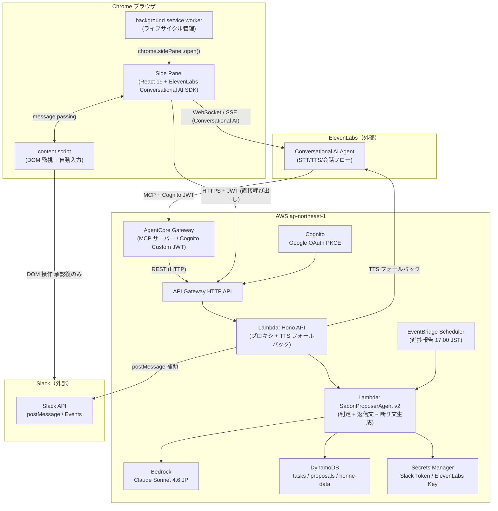
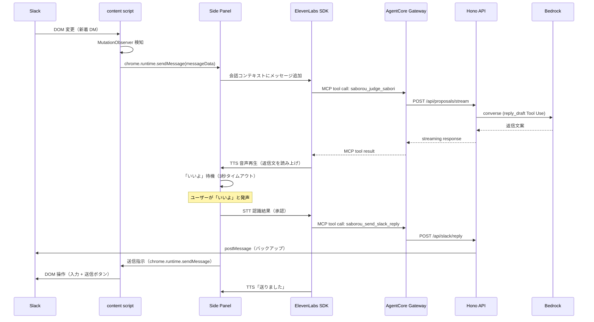

# SABOROU v2 アプリケーション設計

**バージョン**: 1.0.0
**作成日**: 2026-06-14
**参照リファレンス**: AgentCore gateway.md / ブリーフ §7.6 / v1 application-design.md

---

## 1. v2 全体アーキテクチャ



---

## 2. コンポーネント一覧

### Chrome 拡張コンポーネント（pkgs/extension）

| ID | コンポーネント | 役割 |
|----|-------------|------|
| EXT-01 | `SidePanel` (React App) | チャット UI / 音声入力ボタン / 承認インタラクション |
| EXT-02 | `useConversationalAgent` | ElevenLabs SDK Hook（STT/TTS/MCP 接続） |
| EXT-03 | `VoiceApprovalHandler` | 「いいよ」認識・承認フロー制御・3 秒タイムアウト |
| EXT-04 | `ContentScriptBridge` | Side Panel ↔ content script の message passing |
| EXT-05 | `content-script` | Slack DOM 監視 / 自分宛てメッセージ検知 / 自動入力・送信 |
| EXT-06 | `background-sw` | 拡張機能ライフサイクル管理 / Side Panel 起動 |
| EXT-07 | `ExtensionAuth` | Cognito PKCE フロー（Chrome 拡張対応版） |

### バックエンドコンポーネント（pkgs/backend 拡張）

| ID | コンポーネント | 役割 |
|----|-------------|------|
| API-V2-01 | `SlackReplyRoute` | `POST /api/slack/reply` — 承認後の Slack 返信送信 |
| API-V2-02 | `ProgressReportRoute` | `POST /api/tasks/{id}/report` — 進捗報告スケジューリング |
| API-V2-03 | `TtsProxyRoute` | `POST /api/tts` — ElevenLabs TTS プロキシ（フォールバック） |

### エージェントコンポーネント（pkgs/agent 拡張）

| ID | コンポーネント | 役割 |
|----|-------------|------|
| AG-V2-01 | `ReplyDraftTool` | `reply_draft` Tool Use スキーマ（返信文生成用） |
| AG-V2-02 | `DeclineDraftTool` | `decline_draft` Tool Use スキーマ（断り文生成用） |
| AG-V2-03 | `SaboriProposerAgentV2` | v1 を拡張。新ツールを並列追加 / PersonaRenderer に TTS 用短文整形を追加 |

### インフラコンポーネント（pkgs/cdk 拡張）

| ID | コンポーネント | 役割 |
|----|-------------|------|
| INF-V2-01 | `AgentCoreStack` | AgentCore Gateway + S3 スキーマバケット + IAM ロール |
| INF-V2-02 | `AgentCoreStack` > `Gateway` | `protocolType: MCP` / `authorizerType: CUSTOM_JWT` (Cognito) |
| INF-V2-03 | `AgentCoreStack` > `GatewayTarget` | OpenAPI スキーマ（S3）から MCP ツール自動生成 |

---

## 3. AgentCore Gateway 設計詳細

### 認証フロー

```
ElevenLabs SDK → AgentCore Gateway: Cognito JWT（Bearer）
  authorizerType: CUSTOM_JWT
  discoveryUrl: https://cognito-idp.ap-northeast-1.amazonaws.com/<USER_POOL_ID>/.well-known/openid-configuration

AgentCore Gateway → Hono API Lambda:
  API Gateway JWT Authorizer（既存の Cognito 認証を流用）
  IAM: AgentCore Gateway サービスロールに execute-api:Invoke の特定 ARN のみ許可
```

### CDK 実装方針（AgentCoreStack）

```typescript
// pkgs/cdk/lib/stacks/agentcore-stack.ts（新規作成）
import * as agentcore from 'aws-cdk-lib/aws_bedrockagentcore';
import * as s3 from 'aws-cdk-lib/aws-s3';

// 1. OpenAPI スキーマ保管用 S3 バケット
const schemaBucket = new s3.Bucket(this, 'SaborouSchemaBucket', {
  bucketName: `saborou-agentcore-schema-${this.account}`,
  encryption: s3.BucketEncryption.S3_MANAGED,
  blockPublicAccess: s3.BlockPublicAccess.BLOCK_ALL,
  enforceSSL: true,
  removalPolicy: cdk.RemovalPolicy.DESTROY,
});

// 2. Gateway（Cognito Custom JWT 認証）
const gateway = new agentcore.Gateway(this, 'SaborouGateway', {
  gatewayName: 'saborou-mcp-gateway',
  protocolConfiguration: new agentcore.McpProtocolConfiguration({
    instructions: 'SABOROU task management and Slack reply tools for voice-driven workflow automation',
    searchType: agentcore.McpGatewaySearchType.SEMANTIC,
    supportedVersions: [agentcore.MCPProtocolVersion.MCP_2025_03_26],
  }),
  authorizerConfiguration: agentcore.GatewayAuthorizer.usingCustomJwt({
    discoveryUrl: props.cognitoDiscoveryUrl,
    allowedClients: [props.cognitoClientId],
    allowedAudiences: [props.cognitoClientId],
    allowedScopes: ['openid', 'email', 'profile'],
  }),
});

// 3. Gateway Target（OpenAPI スキーマ → MCP ツール自動生成）
gateway.addOpenApiTarget('HonoApiTools', {
  apiSchema: agentcore.ApiSchema.fromS3File(schemaBucket, 'saborou-openapi.yaml'),
  credentialProviderConfigurations: [
    agentcore.GatewayCredentialProvider.fromGatewayIamRole(),
  ],
});
```

### 公開 MCP ツール定義

| MCP ツール名 | OpenAPI operationId | 説明 |
|------------|-------------------|------|
| `saborou_get_tasks` | `listTasks` | 現在のタスク一覧取得（文脈収集用） |
| `saborou_judge_sabori` | `streamProposal` | サボり判定・返信文生成（Bedrock / SaboriProposerAgent v2） |
| `saborou_send_slack_reply` | `sendSlackReply` | Slack メッセージへの自動返信送信（承認後） |
| `saborou_schedule_report` | `scheduleProgressReport` | 進捗報告スケジューリング（UC-03） |

**重要**: OpenAPI スキーマの `operationId` と `description` の品質が MCP ツールの使いやすさに直結する。`description` は AI が意図を正確に理解できるよう英語で記述する（Hono の `@hono/zod-openapi` で生成）。

---

## 4. ElevenLabs Conversational AI SDK 統合設計

### useConversationalAgent Hook（EXT-02）

```typescript
// pkgs/extension/src/panel/hooks/useConversationalAgent.ts
import { useConversation } from "@11labs/client";

const AGENTCORE_GATEWAY_URL = process.env.AGENTCORE_GATEWAY_URL!;
const ELEVENLABS_AGENT_ID = process.env.ELEVENLABS_AGENT_ID!;

export function useConversationalAgent(cognitoJwt: string) {
  return useConversation({
    agentId: ELEVENLABS_AGENT_ID,
    clientTools: {
      // MCP クライアント設定（TP-06: SDK バージョン依存のため実装前に最新ドキュメント確認）
      mcp: {
        serverUrl: `${AGENTCORE_GATEWAY_URL}/mcp`,
        authToken: cognitoJwt,
      },
    },
    onConnect: () => console.info("[SABOROU] Conversational AI connected"),
    onDisconnect: () => console.info("[SABOROU] Conversational AI disconnected"),
    onError: (error) => console.error("[SABOROU] Conversational AI error", error),
  });
}
```

### 注意点（TP-06）

- `@11labs/client` の `clientTools.mcp` オプションの正確なパラメータ名（`serverUrl` / `authToken`）は実装前に最新 ElevenLabs ドキュメントで確認する
- SDK バージョンを `package.json` で固定し、`>=` などの loose バージョン指定を使わない
- MCP が未サポートの場合のフォールバック: Hono API への直接 HTTPS 呼び出し

---

## 5. content script 設計（EXT-05）

### Slack DOM 監視

```typescript
// pkgs/extension/src/content/index.ts（概略）
const observer = new MutationObserver(debounce((mutations) => {
  for (const mutation of mutations) {
    const messages = document.querySelectorAll('[data-qa="message_container"]');
    for (const msg of messages) {
      if (isMentionedToMe(msg) && !isAlreadyProcessed(msg)) {
        handleNewMessage(msg);
      }
    }
  }
}, 300));

observer.observe(document.body, { childList: true, subtree: true });
```

### Slack 自動入力・送信

```typescript
// Slack ContentEditable への自動入力（React 合成イベント対応）
async function typeIntoSlackInput(text: string): Promise<void> {
  const input = document.querySelector('[data-qa="message_input"]');
  if (!input) throw new Error("Slack input not found");

  // React 合成イベントをシミュレート
  input.focus();
  document.execCommand('insertText', false, text); // deprecated だが現時点で機能
  // フォールバック: InputEvent dispatch
  input.dispatchEvent(new InputEvent('input', { bubbles: true, data: text }));
}

// 送信ボタンクリック
async function clickSendButton(): Promise<void> {
  const sendBtn = document.querySelector('[data-qa="texty_send_button"]');
  sendBtn?.dispatchEvent(new MouseEvent('click', { bubbles: true }));
}
```

---

## 6. シーケンス図

### UC-01: Slack メッセージ検知 → 音声承認 → 自動送信



---

## 7. セキュリティ設計

| 境界 | 方針 |
|------|------|
| Chrome 拡張 ↔ AWS | HTTPS + Cognito JWT。拡張に API キー・Slack トークン不保持 |
| ElevenLabs SDK ↔ AgentCore Gateway | Cognito JWT（Bearer）。AgentCore が JWT 検証 |
| AgentCore Gateway ↔ Hono API | IAM ロール（execute-api:Invoke 最小権限） |
| Hono API ↔ ElevenLabs | Lambda 内で Secrets Manager からキー取得。HTTPS |
| content script 権限 | `https://app.slack.com/*` のみ。DOM 書き込みは承認後のみ |
| ChromeStorage | JWT / 設定のみ。Slack トークン・API キー不保持 |
| CSP | `unsafe-eval` 禁止。`manifest.json` に明示 |

---

## 8. v1 との差分サマリ

| レイヤー | v1 | v2 変更点 |
|--------|----|---------| 
| フロントエンド | React SPA（`pkgs/frontend`） | Chrome 拡張 Side Panel（`pkgs/extension` 新規） |
| 音声 | なし | ElevenLabs Conversational AI SDK フロント直結 |
| MCP | なし | AgentCore Gateway（新規 `AgentCoreStack`） |
| Slack 連携 | Webhook 受信のみ | DOM 検知（content script）+ Webhook 補助 |
| エージェント | サボり判定のみ | 判定 + 返信文生成 + 断り文生成（SaboriProposerAgentV2） |
| CDK スタック | 8 スタック | +1 スタック（AgentCoreStack）/ FrontendStack 役割変更 |
