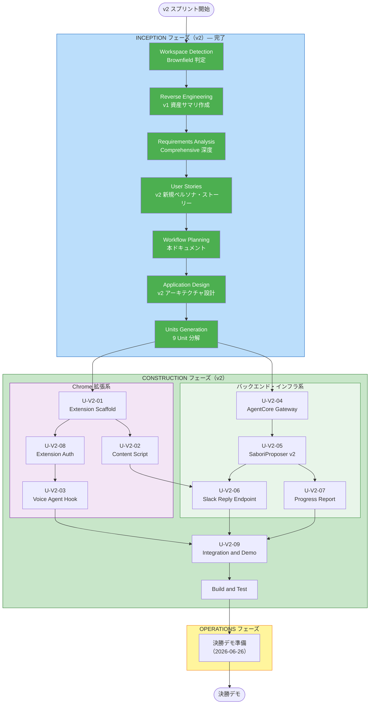

# SABOROU v2 実行計画（Execution Plan）

**バージョン**: 1.0.0
**作成日**: 2026-06-14
**決勝日**: 2026-06-26（幕張メッセ）
**残り日数**: 12 日

---

## 1. v2 スプリントの目標

| 目標 | 内容 |
|------|------|
| **デモ品質** | 決勝当日（6/26）に Slack DOM 検知 → 音声承認 → 自動送信の全フローが動作する |
| **技術的独自性** | AgentCore Gateway MCP 化 + ElevenLabs Conversational AI SDK のフロント直結 |
| **AI-DLC 証跡** | v2 の全 Inception・Construction 成果物が audit.md に記録されている |
| **後方互換性** | v1 の実装・テスト・デプロイに影響を与えない |

---

## 2. Unit of Work 一覧

| Unit ID | Unit 名 | 規模 | 流用資産 | 依存 |
|---------|--------|------|---------|------|
| U-V2-01 | extension-scaffold | S | pkgs/frontend（fork） | なし |
| U-V2-02 | content-script | M | なし（新規） | U-V2-01 |
| U-V2-03 | voice-agent-hook | M | ElevenLabs SDK | U-V2-01 |
| U-V2-04 | agentcore-gateway | M | Hono API / CDK | なし |
| U-V2-05 | sabori-proposer-v2 | M | SaboriProposerAgent | U-V2-04 |
| U-V2-06 | slack-reply-endpoint | S | SlackClient / Hono | U-V2-05 |
| U-V2-07 | progress-report | S | EventBridge Scheduler | U-V2-05 |
| U-V2-08 | extension-auth | S | Cognito（v1） | U-V2-01 |
| U-V2-09 | integration-and-demo | M | 全 Unit | U-V2-01〜08 |

**実装優先順序（決勝デモに向けた依存解決順）**:

```
U-V2-04（AgentCore Gateway）→ U-V2-05（SaboriProposerAgent v2）
U-V2-01（extension-scaffold）→ U-V2-08（認証）→ U-V2-03（音声エージェント Hook）
U-V2-02（content script）→ U-V2-06（Slack 返信エンドポイント）
U-V2-07（進捗報告）
↓ 全 Unit 完了後
U-V2-09（統合・デモリハーサル）
```

---

## 3. ワークフロー可視化



---

## 4. タイムライン（残り 12 日）

| 日付 | 作業 | Unit |
|------|------|------|
| 6/14（今日） | Inception 完了・Construction 計画確定 | — |
| 6/15 | AgentCore Gateway セットアップ・疎通確認 | U-V2-04 |
| 6/16 | SaboriProposer v2 拡張（返信文・断り文生成モード） | U-V2-05 |
| 6/17 | Extension scaffold（pkgs/extension 新規作成・Side Panel UI） | U-V2-01 |
| 6/18 | Cognito PKCE 拡張（Chrome 拡張対応） | U-V2-08 |
| 6/19 | ElevenLabs Conversational AI SDK Hook 実装 | U-V2-03 |
| 6/20 | content script（DOM 監視・自動入力） | U-V2-02 |
| 6/21 | Slack Reply Endpoint + MCP ツール登録 | U-V2-06 |
| 6/22 | 進捗報告 EventBridge Scheduler 追加 | U-V2-07 |
| 6/23 | 統合・フルフロー結合テスト | U-V2-09 |
| 6/24 | デモリハーサル・バグ修正 | — |
| 6/25 | 最終確認・バックアップ動画作成 | — |
| 6/26 | **決勝当日（幕張メッセ）** | — |

---

## 5. 各 Unit の Construction ステージ計画

| Unit | FD | NFR Req | NFR Design | Infra | Code Gen |
|------|----|---------|-----------|----|---------|
| U-V2-01 extension-scaffold | SKIP（シンプルなスキャフォルド） | SKIP | SKIP | SKIP | ALWAYS |
| U-V2-02 content-script | YES | YES | SKIP | SKIP | ALWAYS |
| U-V2-03 voice-agent-hook | YES | YES | SKIP | SKIP | ALWAYS |
| U-V2-04 agentcore-gateway | YES | YES | YES | YES | ALWAYS |
| U-V2-05 sabori-proposer-v2 | YES | SKIP（v1 NFR 流用） | SKIP | YES | ALWAYS |
| U-V2-06 slack-reply-endpoint | YES | SKIP（v1 NFR 流用） | SKIP | SKIP | ALWAYS |
| U-V2-07 progress-report | SKIP（シンプルなスケジュール追加） | SKIP | SKIP | YES | ALWAYS |
| U-V2-08 extension-auth | YES | SKIP（v1 NFR 流用） | SKIP | SKIP | ALWAYS |
| U-V2-09 integration-and-demo | SKIP | SKIP | SKIP | SKIP | ALWAYS（統合テスト） |

---

## 6. リスク管理と判断基準

### クリティカルパス

```
AgentCore Gateway GA 確認（TP-05）→ extension-scaffold → voice-agent-hook → content-script → Slack Reply → 統合テスト
```

### カットライン設計（品質 vs. 時間のトレードオフ）

| カットライン | 条件 | 対応 |
|-----------|------|------|
| Level A | AgentCore Gateway が `ap-northeast-1` で利用不可 | `us-east-1` に Gateway を移動。Hono API は CORS 対応でリージョン越し呼び出し |
| Level B | ElevenLabs SDK の MCP クライアント設定が不明 | 直接 API 呼び出し（Lambda プロキシ経由 TTS）に切り替え。MCP は MVP OUT |
| Level C | content script の Slack DOM 操作が不安定 | 「いいよ」ボタンクリック後の Slack API 直接呼び出し（`postMessage`）に切り替え |
| Level D | 音声認識が会場で動作しない | 「いいよ」ボタンのみで全フロー動作するよう事前確認 |

---

## 7. 品質ゲート

Construction フェーズの各 Unit 完了時に以下を確認する:

- TypeScript コンパイルエラーゼロ（`tsc --noEmit`）
- 既存テストの全パス維持（v1 の全テストを壊さない）
- Biome lint エラーゼロ
- CDK synth 成功（インフラ変更がある Unit）
- 手動動作確認（UC-01 全フロー）

---

## 8. AI-DLC Extension 設定（v2 で変更）

| Extension | v1 設定 | v2 設定 | 変更理由 |
|---------|--------|---------|---------|
| Security Baseline | 無効 | **有効** | Chrome 拡張・AgentCore Gateway・ElevenLabs SDK の新規攻撃面増加 |
| Property-Based Testing | 無効 | 無効（継続） | ブラウザ環境依存の E2E テストが主 |

---

*ユーザーへの注記: この実行計画はあなたが上書き・修正できます。Unit の追加・除外・順序変更は Construction 開始前に反映してください。*
