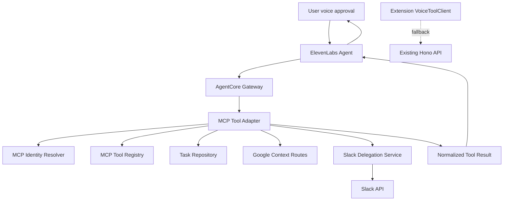

# SABOROU v3 Component Dependencies

**作成日**: 2026-06-16

---

## Dependency Matrix

| Component | Depends On | Used By | Communication |
|-----------|------------|---------|---------------|
| AgentCoreGatewayFacade | Cognito, McpToolAdapter, McpToolRegistry | ElevenLabs Agent | MCP `streamable_http` primary, `sse` fallback |
| McpToolAdapter | McpIdentityResolver, McpToolRegistry, backend services | AgentCoreGatewayFacade | Lambda/internal call |
| McpIdentityResolver | Cognito claims / AgentCore request context | McpToolAdapter | in-process |
| McpToolRegistry | OpenAPI schema, allowlist | AgentCoreGatewayFacade, tests, adapter | static config/schema |
| SlackDelegationService | TaskRepository, SlackClient, Secrets Manager | McpToolAdapter, Hono route | in-process + Slack API |
| VoiceToolClient | Hono API fallback, registered MCP config | Extension UI / fallback clientTools | HTTPS fallback |
| McpVerificationHarness | CDK outputs, AgentCore APIs, ElevenLabs, Slack | developers/demo operators | CLI/manual/API |

---

## Data Flow

### Mermaid Diagram

### Text Alternative

1. User speaks to ElevenLabs Agent.
2. ElevenLabs Agent calls the registered SABOROU MCP server using `streamable_http` or `sse`.
3. Gateway routes to MCP Tool Adapter.
4. Adapter resolves user identity and checks tool allowlist.
5. Adapter dispatches to task, Google, Slack, or delegation services.
6. Side-effect tools require explicit human approval.
7. Result returns to ElevenLabs Agent for voice response.
8. Extension keeps direct Hono fallback for demo resilience.

---

## Communication Patterns

- **Agent to Gateway**: Remote MCP via `streamable_http` first; `sse` bridge only if compatibility requires it.
- **Gateway to Adapter**: AgentCore target invocation. Exact target type to be finalized in Units/Construction based on deploy-time compatibility; design requires identity context availability.
- **Adapter to Domain Services**: In-process calls preferred to avoid re-authenticating through API Gateway.
- **Extension Fallback to Hono**: Existing JWT bearer direct API calls remain supported.
- **Slack Posting**: Slack Web API `chat.postMessage` with per-user Bot Token from Secrets Manager.

---

## Security Boundary

- User identity is trusted only after Cognito/AgentCore verification.
- IAM role identity is not enough to authorize user resources.
- Tool allowlist prevents exposing OAuth callbacks, webhooks, health, and internal routes.
- Human approval is mandatory for Slack post, Slack sync, Google fetch, Gmail fetch, and `@Claude` delegation.
