# SABOROU v3 Execution Plan - MCP Serverization

**作成日**: 2026-06-16
**ステータス**: Review Required
**対象**: AgentCore Gateway本命のSABOROU API MCPサーバー化、ElevenLabs Agent実接続、Slack `@Claude` 委譲

---

## Detailed Analysis Summary

### Transformation Scope

- **Transformation Type**: Architectural + API contract + Infrastructure integration.
- **Primary Changes**:
  - AgentCore GatewayからHono APIへユーザー文脈付きで安全に到達する認証経路を確定する。
  - AgentCore用OpenAPI schemaの公開ツール範囲を拡張し、同期テストで固定する。
  - Slack `@Claude` 委譲API/ツールを追加する。
  - ElevenLabs Agentから実MCP経路で呼び出せることを検証する。
- **Related Components**:
  - `pkgs/cdk`: AgentCore Gateway、API Gateway認証、schema deployment、tests
  - `pkgs/backend`: Hono routes、auth middleware、OpenAPI docs、Slack delegation
  - `pkgs/extension`: ElevenLabs clientTools、agentClient fallback、voice UI behavior
  - `pkgs/agent`: SlackClient reuse、draft/voice output support
  - `aidlc-docs`: setup/demo/verification guide

### Change Impact Assessment

- **User-facing changes**: Yes. Voice task readout, Slack reply approval, Google/Slack context ingestion, `@Claude` delegation.
- **Structural changes**: Yes. AgentCore Gateway to Hono API auth path must be redesigned.
- **Data model changes**: No new persistent table required in MVP. Slack delegation may reuse existing task and Slack token data.
- **API changes**: Yes. New delegation endpoint/tool, expanded MCP OpenAPI schema, possibly MCP-specific auth adapter.
- **NFR impact**: Yes. Security, authorization, logging, observability, real integration verification.

### Component Relationships

| Component | Change Type | Reason | Priority |
|-----------|-------------|--------|----------|
| `pkgs/cdk/lib/stacks/agentcore-stack.ts` | Minor/Major depending auth design | Gateway target, instructions, logging/outputs, schema target | Critical |
| `pkgs/cdk/schemas/saborou-openapi.yaml` | Major | Expand MCP tool allowlist and schemas | Critical |
| `pkgs/cdk/lib/stacks/api-stack.ts` | Minor/Major depending auth design | AgentCore to API Gateway auth compatibility | Critical |
| `pkgs/backend/src/middleware/auth.ts` | Major | User identity extraction for Gateway path | Critical |
| `pkgs/backend/src/routes/slack.ts` | Minor | Add `@Claude` delegation endpoint | Critical |
| `pkgs/backend/src/routes/google.ts` | Minor | Expose selected routes in MCP schema | Important |
| `pkgs/backend/src/routes/tasks.ts` | Minor | Ensure task read/detail/report contracts are MCP-safe | Important |
| `pkgs/extension/src/panel/lib/agentClient.ts` | Major | Replace pseudo-MCP assumption or document true fallback | Critical |
| `pkgs/extension/src/panel/hooks/useConversationalAgent.ts` | Minor/Major | Add/adjust tool handlers for expanded tools | Important |
| `aidlc-docs/construction/v3` | New | Verification and demo handoff docs | Important |

### Risk Assessment

- **Risk Level**: High
- **Rollback Complexity**: Moderate. Existing Hono direct API fallback should remain intact; AgentCore path can be disabled with `enableAgentCore=false`.
- **Testing Complexity**: Complex. Requires unit tests, schema tests, CDK synth/tests, extension tests, and real AWS/AgentCore/ElevenLabs manual verification.
- **Primary Security Risk**: AgentCore IAM path bypassing or conflicting with Cognito JWT user authorization.

---

## Module Update Strategy

- **Update Approach**: Hybrid sequential.
- **Critical Path**:
  1. Application Design to resolve AgentCore to Hono auth path.
  2. Units Generation to split work across CDK/backend/extension/docs.
  3. Implement auth/schema foundation before expanded tools.
  4. Implement `@Claude` delegation after Slack route contract is fixed.
  5. Update extension/ElevenLabs tool layer after server contracts are stable.
  6. Run integrated build/test and real connection verification.
- **Coordination Points**:
  - OpenAPI operationId and tool names
  - Cognito JWT and Gateway user identity propagation
  - Slack side-effect approval contract
  - Extension fallback behavior
  - AgentCore deployment outputs
- **Testing Checkpoints**:
  - Schema allowlist test before CDK deployment
  - Backend route tests before extension tool changes
  - CDK synth/test before real deploy
  - Extension build/test before real ElevenLabs verification

---

## Workflow Visualization

### Mermaid Diagram

```mermaid
flowchart TD
    Start(["User Request"])

    subgraph INCEPTION["INCEPTION PHASE"]
        WD["Workspace Detection<br/><b>COMPLETED</b>"]
        RE["Reverse Engineering<br/><b>SKIP EXISTING V2 CONTEXT</b>"]
        RA["Requirements Analysis<br/><b>COMPLETED</b>"]
        US["User Stories<br/><b>COMPLETED</b>"]
        WP["Workflow Planning<br/><b>IN PROGRESS</b>"]
        AD["Application Design<br/><b>EXECUTE</b>"]
        UG["Units Generation<br/><b>EXECUTE</b>"]
    end

    subgraph CONSTRUCTION["CONSTRUCTION PHASE"]
        FD["Functional Design<br/><b>EXECUTE PER UNIT</b>"]
        NFRA["NFR Requirements<br/><b>EXECUTE</b>"]
        NFRD["NFR Design<br/><b>EXECUTE</b>"]
        ID["Infrastructure Design<br/><b>EXECUTE</b>"]
        CG["Code Generation<br/><b>EXECUTE</b>"]
        BT["Build and Test<br/><b>EXECUTE</b>"]
    end

    subgraph OPERATIONS["OPERATIONS PHASE"]
        OPS["Operations<br/><b>PLACEHOLDER</b>"]
    end

    Start --> WD
    WD --> RE
    RE --> RA
    RA --> US
    US --> WP
    WP --> AD
    AD --> UG
    UG --> FD
    FD --> NFRA
    NFRA --> NFRD
    NFRD --> ID
    ID --> CG
    CG --> BT
    BT --> End(["Complete"])
    BT -.-> OPS

    style WD fill:#4CAF50,stroke:#1B5E20,stroke-width:3px,color:#fff
    style RA fill:#4CAF50,stroke:#1B5E20,stroke-width:3px,color:#fff
    style US fill:#4CAF50,stroke:#1B5E20,stroke-width:3px,color:#fff
    style WP fill:#4CAF50,stroke:#1B5E20,stroke-width:3px,color:#fff
    style RE fill:#BDBDBD,stroke:#424242,stroke-width:2px,stroke-dasharray: 5 5,color:#000
    style AD fill:#FFA726,stroke:#E65100,stroke-width:3px,stroke-dasharray: 5 5,color:#000
    style UG fill:#FFA726,stroke:#E65100,stroke-width:3px,stroke-dasharray: 5 5,color:#000
    style FD fill:#FFA726,stroke:#E65100,stroke-width:3px,stroke-dasharray: 5 5,color:#000
    style NFRA fill:#FFA726,stroke:#E65100,stroke-width:3px,stroke-dasharray: 5 5,color:#000
    style NFRD fill:#FFA726,stroke:#E65100,stroke-width:3px,stroke-dasharray: 5 5,color:#000
    style ID fill:#FFA726,stroke:#E65100,stroke-width:3px,stroke-dasharray: 5 5,color:#000
    style CG fill:#4CAF50,stroke:#1B5E20,stroke-width:3px,color:#fff
    style BT fill:#4CAF50,stroke:#1B5E20,stroke-width:3px,color:#fff
    style OPS fill:#BDBDBD,stroke:#424242,stroke-width:2px,stroke-dasharray: 5 5,color:#000
    style Start fill:#CE93D8,stroke:#6A1B9A,stroke-width:3px,color:#000
    style End fill:#CE93D8,stroke:#6A1B9A,stroke-width:3px,color:#000
    style INCEPTION fill:#BBDEFB,stroke:#1565C0,stroke-width:3px,color:#000
    style CONSTRUCTION fill:#C8E6C9,stroke:#2E7D32,stroke-width:3px,color:#000
    style OPERATIONS fill:#FFF59D,stroke:#F57F17,stroke-width:3px,color:#000
    linkStyle default stroke:#333,stroke-width:2px
```

### Text Alternative

1. INCEPTION: Workspace Detection completed, Reverse Engineering skipped because v2 context and code-aware gap analysis are current.
2. INCEPTION: Requirements Analysis completed with GAP-V3-01 through GAP-V3-08.
3. INCEPTION: User Stories completed with 3 personas and 9 stories.
4. INCEPTION: Workflow Planning in progress.
5. INCEPTION: Application Design will execute to resolve auth path, MCP protocol strategy, OpenAPI sync, and tool contracts.
6. INCEPTION: Units Generation will execute because multiple packages and infrastructure are affected.
7. CONSTRUCTION: Functional Design, NFR Requirements, NFR Design, Infrastructure Design, Code Generation, and Build/Test will execute.
8. OPERATIONS: Placeholder only.

---

## Phases to Execute

### INCEPTION PHASE

- [x] Workspace Detection - Completed
- [x] Reverse Engineering - Skipped for this v3 increment; existing v2 artifacts plus direct code gap analysis are current
- [x] Requirements Analysis - Completed
- [x] User Stories - Completed
- [x] Workflow Planning - In Progress
- [ ] Application Design - EXECUTE
  - **Rationale**: Required to resolve SECURITY-02/08 blocking gaps, AgentCore to Hono auth path, true MCP call strategy, OpenAPI sync strategy, and `@Claude` delegation contract.
- [ ] Units Generation - EXECUTE
  - **Rationale**: Changes span CDK, backend, extension, schema, tests, and docs.

### CONSTRUCTION PHASE

- [ ] Functional Design - EXECUTE
  - **Rationale**: `@Claude` delegation, side-effect approval, and tool contracts need detailed business rules.
- [ ] NFR Requirements - EXECUTE
  - **Rationale**: Security Baseline is enabled and blocking gaps exist.
- [ ] NFR Design - EXECUTE
  - **Rationale**: Auth, logging, failure handling, and fallback behavior require explicit patterns.
- [ ] Infrastructure Design - EXECUTE
  - **Rationale**: AgentCore Gateway, API Gateway authorizer/IAM path, CDK outputs, and deployment verification are affected.
- [ ] Code Generation - EXECUTE
  - **Rationale**: Implementation planning and code generation are required.
- [ ] Build and Test - EXECUTE
  - **Rationale**: Unit, schema, CDK, extension, integration, and real connection verification are required.

### OPERATIONS PHASE

- [ ] Operations - PLACEHOLDER
  - **Rationale**: Future deployment and monitoring workflows. v3 will create verification and demo handoff docs under Construction.

---

## Provisional Unit Sequence

Formal unit definitions will be created in Units Generation. Current provisional sequence:

| Order | Provisional Unit | Packages | Purpose |
|-------|------------------|----------|---------|
| 1 | U-V3-01 agentcore-auth-path | `pkgs/cdk`, `pkgs/backend` | Resolve Gateway to Hono user identity and authorization |
| 2 | U-V3-02 mcp-openapi-schema | `pkgs/cdk`, `pkgs/backend` | Expand/sync AgentCore schema and add allowlist tests |
| 3 | U-V3-03 claude-delegation-api | `pkgs/backend`, `pkgs/agent` | Add Slack `@Claude` delegation endpoint/tool |
| 4 | U-V3-04 extension-voice-tools | `pkgs/extension` | Align ElevenLabs clientTools/fallback with server contracts |
| 5 | U-V3-05 integration-verification | all affected packages + docs | Build/test, deploy verification, real AgentCore/ElevenLabs/Slack guide |

---

## Estimated Timeline

- **Total major stages remaining before code**: 2 Inception stages (Application Design, Units Generation)
- **Construction units**: Approximately 5 provisional units
- **Estimated duration**: 1 to 2 focused implementation sessions for code plus external deployment/credential verification time

---

## Success Criteria

- AgentCore Gateway can expose the selected SABOROU tools from OpenAPI.
- Gateway to Hono API preserves per-user authorization.
- MCP tool allowlist includes required voice-callable APIs and excludes OAuth/webhook/health/internal routes.
- `@Claude` delegation posts only after explicit approval.
- Extension/ElevenLabs flow can call read-only and side-effect tools safely.
- Existing Hono direct API fallback remains usable.
- Required package tests, typechecks, builds, CDK tests/synth, and documented real connection verification are complete.

---

## Security Baseline Compliance

| Rule | Planning Status | Rationale |
|------|-----------------|-----------|
| SECURITY-01 | Applicable | Existing storage and schema bucket encryption must remain intact |
| SECURITY-02 | Blocking Gap to resolve in Application/Infrastructure Design | AgentCore Gateway and API Gateway access/audit logging must be specified |
| SECURITY-03 | Applicable | Tool calls need structured logs without token/PII leakage |
| SECURITY-04 | N/A | No new HTML-serving endpoint planned |
| SECURITY-05 | Applicable | All tool inputs require Zod/OpenAPI validation |
| SECURITY-06 | Applicable | Gateway role and API permissions must remain scoped |
| SECURITY-07 | N/A | No new VPC/security group change planned |
| SECURITY-08 | Blocking Gap to resolve in Application Design | Gateway IAM path and Hono JWT user authorization mismatch must be resolved |
| SECURITY-09 | Applicable | Error responses must avoid internal details |
| SECURITY-10 | Applicable | Dependency lockfile and trusted dependencies required |
| SECURITY-11 | Applicable | Side-effect tools require explicit approval and misuse handling |
| SECURITY-12 | Applicable | Cognito/JWT and credential handling remain central |
| SECURITY-13 | Applicable | Tool allowlist/schema changes must be auditable |
| SECURITY-14 | Applicable | Auth failures and Slack send failures need observable handling |

**Blocking Findings**: SECURITY-02 and SECURITY-08 remain open by design at this planning stage and must be closed in Application Design before Code Generation.
