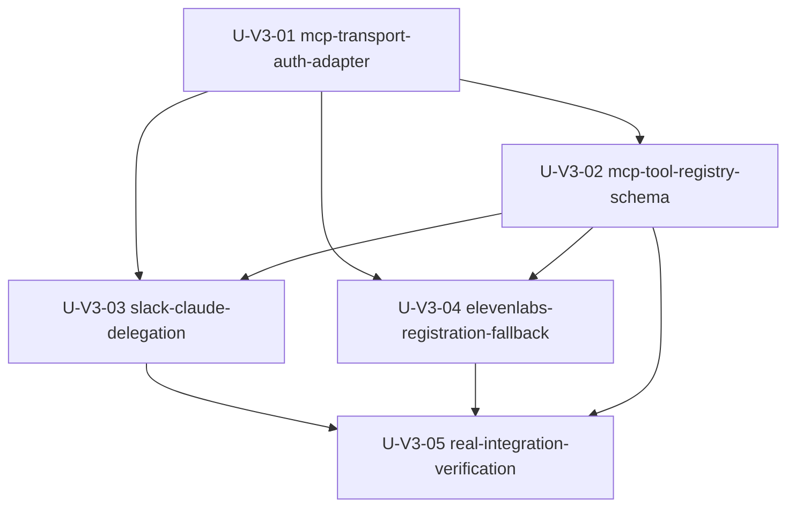

# SABOROU v3 Unit of Work Dependencies

**作成日**: 2026-06-16
**対象**: SABOROU MCP Serverization

---

## Dependency Matrix

| Unit | Depends On | Blocks | Dependency Reason |
|------|------------|--------|-------------------|
| U-V3-01 mcp-transport-auth-adapter | None | U-V3-02, U-V3-03, U-V3-04, U-V3-05 | Auth, identity, and adapter boundaries must exist before tools are expanded or verified. |
| U-V3-02 mcp-tool-registry-schema | U-V3-01 | U-V3-03, U-V3-04, U-V3-05 | Tool contracts and allowlist are needed before side-effect tools and ElevenLabs registration. |
| U-V3-03 slack-claude-delegation | U-V3-01, U-V3-02 | U-V3-05 | Delegation depends on user identity, approval semantics, and tool registry conventions. |
| U-V3-04 elevenlabs-registration-fallback | U-V3-01, U-V3-02 | U-V3-05 | Dashboard registration requires a stable MCP endpoint and tool schema. |
| U-V3-05 real-integration-verification | U-V3-01, U-V3-02, U-V3-03, U-V3-04 | None | Verification proves the complete integrated demo path. |

---

## Mermaid Dependency Diagram

### Text Alternative

1. Implement U-V3-01 first because identity and authorization are the highest-risk dependencies.
2. Implement U-V3-02 second because all tool exposure must follow the adapter and authorization boundary.
3. Implement U-V3-03 and U-V3-04 after U-V3-02. They can proceed in parallel once contracts are stable.
4. Implement U-V3-05 last because it verifies all units together with real AWS, AgentCore, ElevenLabs, and Slack.

---

## Recommended Implementation Order

| Step | Unit | Can Run In Parallel? | Notes |
|------|------|----------------------|-------|
| 1 | U-V3-01 | No | Foundation for all downstream units. |
| 2 | U-V3-02 | No | Stabilizes tool names, schemas, and allowlist. |
| 3a | U-V3-03 | Yes, with U-V3-04 after U-V3-02 | Backend/agent side-effect feature. |
| 3b | U-V3-04 | Yes, with U-V3-03 after U-V3-02 | Extension/config/docs and optional SSE bridge decision. |
| 4 | U-V3-05 | No | Requires all implemented pieces for real verification. |

---

## Boundary Validation

| Check | Result | Rationale |
|-------|--------|-----------|
| No circular dependencies | Pass | All dependencies point from lower-order foundation units to higher-order verification units. |
| Auth before side effects | Pass | U-V3-01 precedes Slack reply, Google/Slack context, and `@Claude` delegation tools. |
| Schema before registration | Pass | U-V3-02 precedes ElevenLabs Dashboard registration in U-V3-04. |
| Real verification last | Pass | U-V3-05 depends on every implementation unit. |
| Fallback preserved | Pass | U-V3-04 explicitly keeps Hono direct fallback separate from MCP primary path. |

---

## Risk Controls By Dependency

| Risk | Controlled By |
|------|---------------|
| AgentCore IAM path bypasses user authorization | U-V3-01 before all tool execution units |
| Tool schema drift breaks voice behavior | U-V3-02 before ElevenLabs registration |
| Side-effect tools post without approval | U-V3-01 approval contract plus U-V3-03 tests |
| Dashboard MCP transport mismatch | U-V3-04 after endpoint/schema stabilization |
| Demo-only local success without real cloud proof | U-V3-05 after all units |
