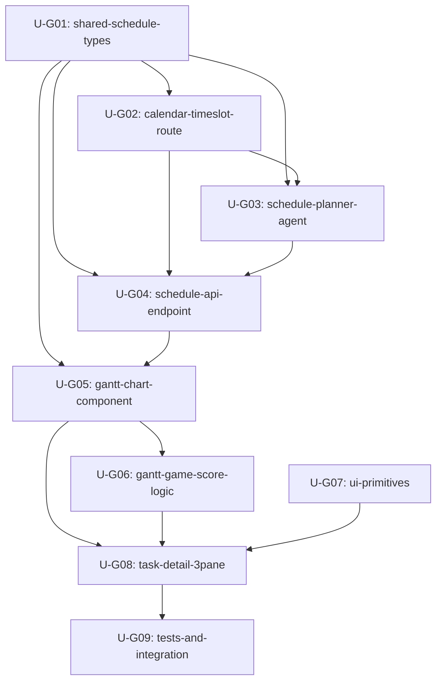

# 更新計画書: 3バンドガントチャート + ゲーミフィケーション土台再編

**作成日時**: 2026-05-26T00:00:00Z
**ドキュメントバージョン**: v1.0.0
**対象ブランチ**: feature/gantt-gamification（新規）
**決勝締切**: 2026-06-26

---

## 実装ステータス（2026-05-26 完了）

全 Unit（U-G01〜U-G09）実装完了。確定方針: 論点1=スコア/さぼり時間のみ保存方針へ（現状は揮発、フロントlocalStorage連動）/ 論点2=no-store / 論点3=ダミーで常時ガント表示 / 論点4=詳細ページ独立4タブ / 論点5=now起点。

| Unit | 内容 | コミット |
|------|------|---------|
| U-G01 | shared スケジュール型(SaboriSchedule/ScheduleBlock/BandType/BusySlot) | c035bfa |
| U-G02 | CalendarTimeslotService（PII維持・時間区間取得） | 2360102 |
| U-G03 | SchedulePlannerAgent（Bedrock Tool Use + 決定論的さぼろう帯算出） | f72935b |
| U-G04 | GET /api/tasks/:id/schedule | ef9395c |
| U-G07 | 汎用UI部品 Drawer/Popover/BottomSheet | 4bf3f03 |
| U-G05 | GanttChart（3バンド・NOW/締切ライン・凡例） | 71baba0 |
| U-G06 | ガント結果→ゲームスコア連動 | 30a684e |
| U-G08 | TaskDetailPage 3ペイン/4タブ再編・全ゲーム要素を押下開閉UXへ | e8b1b64 |
| U-G09 | 統合・品質ゲート | — |

**品質ゲート結果**: 全テスト 1123件パス（shared123/agent224/backend334/frontend373/cdk69）・全パッケージ typecheck エラーゼロ・全パッケージ build 成功・CDK synth(test) 成功・今回変更ファイルは Biome クリーン。agent/shared カバレッジ100%維持。

---

## 1. 概要と目的

### 1.1 背景

ピッチ（SABOROU_pitch.md）の中核UX「3バンドガントチャート」が現在の実装に存在しない。
審査員・デモ観客が「さぼれる理由の見える化」を期待しているにもかかわらず、
実際のタスク詳細画面にはガント表示がなく、ピッチとプロダクトの乖離が生じている。

### 1.2 目的

1. **3バンドガントチャートを実装する** — ガントを「さぼろう帯を勝ち取る盤面」として設計
2. **ゲーミフィケーションをプロダクトの土台に再編する** — 既存ゲーム資産を全て活かしつつ、
   押下で開くUIアーキテクチャに整理して「賑やかだが読める」UXにする
3. **デモインパクトを最大化する** — 6/26 決勝でスクリーンに映える動くガント盤面を完成させる

### 1.3 スコープ

- **含む**: SchedulePlannerAgent新規 / スケジュールAPIエンドポイント新設 / GanttChartコンポーネント /
  TaskDetailPage 3ペイン化 / 汎用UI部品（Drawer/Popover/BottomSheet）/ ゲーム連動スコアロジック /
  shared型拡張 / カレンダー時間区間取得経路
- **含まない**: 既存ゲーム資産の削除・厳選（全て残す）/ バックエンドの大幅リファクタリング /
  新規AWSリソース追加（Lambda/DynamoDB追加なし、既存エンドポイント拡張のみ）

---

## 2. ガント設計仕様

### 2.1 3バンド構造

```
時間軸（横）: 1時間を基準単位、15分刻みのグリッド
縦軸（行）: AI が分解した作業ステップ（通常3〜7行）

バンド種別:
  SABORU   (緑  #22C55E / 塗りつぶし)   — 「さぼろう」区間
  WORK     (白  #FFFFFF / 白枠)          — 実際の作業区間
  DECISION (黄  #EAB308 / 塗りつぶし)   — 意思決定が必要な区間

ライン:
  NOWライン (青点線 #3B82F6 + 青チップ)  — 現在時刻
  締切ライン (赤実線 #EF4444)            — タスクdeadline
```

### 2.2 データ流通経路（PII方針維持）

```
GET /api/tasks/:id/schedule 呼び出し
  ↓
Lambda: SchedulePlannerAgent 起動
  ↓
Google Calendar events.list 呼び出し（その場限り）
  ↓
時間区間（開始時刻・終了時刻）をLLM入力に組み込む
  ↓
Bedrock ConverseAPI (plan_schedule ツール)
  ↓
ScheduleBlock[] + SaboriSchedule を返却
  ↓
永続化なし（レスポンス後即破棄）— PII方針維持
```

---

## 3. データモデル設計案

### 3.1 TypeScript型定義

```typescript
// pkgs/shared/src/types/schedule.ts に追加

/** ガントチャートのバンド種別 */
export type BandType = "saboru" | "work" | "decision";

/**
 * スケジュールブロック — ガントの1バンド（1行 × 1時間区間）
 * 永続化しない（レスポンス用の一時型）
 */
export interface ScheduleBlock {
  /** ステップID（行の識別子、行内一意） */
  stepId: string;
  /** ステップ名（表示ラベル） */
  stepLabel: string;
  /** バンド種別 */
  bandType: BandType;
  /** 開始時刻 ISO 8601（date付き） */
  startAt: string;
  /** 終了時刻 ISO 8601（date付き） */
  endAt: string;
  /** 所要時間（分） */
  durationMinutes: number;
  /** LLMが付けた根拠テキスト（任意、表示用） */
  rationale?: string;
}

/**
 * サボリスケジュール — /api/tasks/:id/schedule のレスポンス型
 * DynamoDBには保存しない（揮発性データ）
 */
export interface SaboriSchedule {
  taskId: string;
  /** スケジュール生成日時 */
  generatedAt: string;
  /** ガント表示の開始時刻（グリッド左端） */
  viewStartAt: string;
  /** ガント表示の終了時刻（グリッド右端） */
  viewEndAt: string;
  /** ブロック一覧（ガント行） */
  blocks: ScheduleBlock[];
  /** 「さぼろう」合計時間（分）— 決定論的算出 */
  totalSaboruMinutes: number;
  /** 「さぼろう」根拠の強さスコア 0.0〜1.0 */
  saboruEvidenceScore: number;
  /** ガントゲームスコア（後述の計算式で算出） */
  ganttGameScore: number;
  /** カレンダー時間区間を使用したか（デバッグ用） */
  calendarUsed: boolean;
}

/**
 * スケジュールAPI レスポンス型
 */
export interface ScheduleApiResponse {
  schedule: SaboriSchedule;
}
```

### 3.2 永続化方針

| データ | 保存先 | 方針 |
|--------|--------|------|
| SaboriSchedule | なし（揮発性） | レスポンス後破棄 |
| カレンダー時間区間（raw） | なし | DP-04踏襲・即破棄 |
| ganttGameScore | Proposal の拡張フィールド検討 | 「判定時にスケジュールあり」の場合のみ付与 |
| totalSaboruMinutes | Proposal への追加フィールド案 | 後述のゲームスコア連動に使用 |

> **設計判断**: SaboriSchedule は Proposal に内包しない。Proposal はサボり判定の恒久記録であり、
> スケジュールは「今この瞬間のカレンダー状況」に基づく揮発データ。
> 別エンティティとして扱い、永続化しないことで PII 方針との整合を維持する。

---

## 4. Bedrock Tool Use スキーマ案

### 4.1 plan_schedule ツール定義

```typescript
// pkgs/agent/src/schedule-planner/tools.ts

import { z } from "zod";

/** LLMから受け取るステップ定義 */
export const ScheduleStepSchema = z.object({
  stepId: z.string().min(1).max(30),
  stepLabel: z.string().min(1).max(60),
  durationMinutes: z.number().int().min(5).max(480),
  bandType: z.enum(["work", "decision"]),
  rationale: z.string().max(200).optional(),
});

/** plan_schedule ツールの出力スキーマ（LLMが返す） */
export const PlanScheduleOutputSchema = z.object({
  steps: z.array(ScheduleStepSchema).min(2).max(8),
  totalWorkMinutes: z.number().int().min(5).max(480),
});

export type PlanScheduleOutput = z.infer<typeof PlanScheduleOutputSchema>;

/** Bedrock ConverseAPI に渡すツール定義 */
export const PLAN_SCHEDULE_TOOL = {
  toolSpec: {
    name: "plan_schedule",
    description:
      "タスクを作業ステップに分解し、各ステップの所要時間とバンド種別（work/decision）を返す。" +
      "さぼろう帯（saboru）はこのツールでは生成しない。算出は呼び出し元が決定論的に行う。",
    inputSchema: {
      json: {
        type: "object",
        properties: {
          steps: {
            type: "array",
            description: "作業ステップの配列（2〜8ステップ）",
            items: {
              type: "object",
              properties: {
                stepId: { type: "string", description: "ステップID（s1, s2, ...）" },
                stepLabel: { type: "string", description: "ステップ表示名（最大60文字）" },
                durationMinutes: { type: "integer", description: "所要時間（分、5〜480）" },
                bandType: {
                  type: "string",
                  enum: ["work", "decision"],
                  description: "work=通常作業 / decision=意思決定が必要",
                },
                rationale: { type: "string", description: "根拠テキスト（任意、最大200文字）" },
              },
              required: ["stepId", "stepLabel", "durationMinutes", "bandType"],
            },
            minItems: 2,
            maxItems: 8,
          },
          totalWorkMinutes: { type: "integer", description: "総作業時間（分）" },
        },
        required: ["steps", "totalWorkMinutes"],
      },
    },
  },
};
```

### 4.2 さぼろう帯の決定論的算出ロジック（擬似コード）

```typescript
/**
 * さぼろう帯を決定論的に算出する
 * LLMが返したステップ間の「空き時間」＝さぼろう帯
 *
 * 前提:
 *   - カレンダーブロック（busy区間）が既知
 *   - 締切（deadline）が既知
 *   - 現在時刻（now）が既知
 *   - LLMが返した steps[] が既知
 *
 * アルゴリズム:
 *   1. now から deadline まで「利用可能タイムライン」を構築
 *   2. カレンダーbusy区間を除去 → 「空きスロット」を取得
 *   3. 各空きスロットにLLMのworkステップを順番に配置
 *   4. workステップ間に余った空きスロット = SABORU帯
 *   5. deadline前に最低限の作業が入るかバリデーション
 */
function calcSaboruBlocks(params: {
  steps: PlanScheduleOutput["steps"];
  calendarBusySlots: Array<{ start: string; end: string }>;
  deadline: string;
  now: string;
}): ScheduleBlock[] {
  const { steps, calendarBusySlots, deadline, now } = params;
  const blocks: ScheduleBlock[] = [];

  // 利用可能時間を計算（カレンダーbusy除去後）
  const availableSlots = buildAvailableSlots(now, deadline, calendarBusySlots);

  // 作業ステップを配置（貪欲法: 最初の利用可能スロットから詰め込む）
  let cursor = 0; // availableSlots index
  let slotOffset = 0; // 現スロット内の使用済み分数

  for (const step of steps) {
    const placed = placeStep(step, availableSlots, cursor, slotOffset);
    blocks.push({ ...placed, bandType: step.bandType });
    cursor = placed.nextCursor;
    slotOffset = placed.nextOffset;

    // 配置後の余白 = さぼろう帯
    if (placed.gapMinutes > 0) {
      blocks.push({
        stepId: `saboru_${step.stepId}`,
        stepLabel: "さぼろう",
        bandType: "saboru",
        startAt: placed.endAt,
        endAt: placed.nextSlotStart,
        durationMinutes: placed.gapMinutes,
      });
    }
  }

  return blocks;
}
```

---

## 5. ガントのゲーム盤面化: 数値設計

### 5.1 ガントゲームスコア計算式

```
ganttGameScore = totalSaboruMinutes × qualityMultiplier × comboMultiplier

qualityMultiplier:
  根拠（reasoning）の件数 ≥ 3  → 1.5
  根拠（reasoning）の件数 = 2  → 1.2
  根拠（reasoning）の件数 = 1  → 1.0
  根拠（reasoning）の件数 = 0  → 0.5

comboMultiplier: getComboMultiplier(comboCount) // 既存関数を流用
```

### 5.2 ガントグレードとガントスコアの対応

| ガントグレード | 条件 | 演出 |
|--------------|------|------|
| A+ JACKPOT   | totalSaboruMinutes ≥ 60 かつ qualityMultiplier = 1.5 かつ isComboActive | JackpotOverlay 全画面演出 |
| A さぼり鬼  | totalSaboruMinutes ≥ 45 かつ qualityMultiplier ≥ 1.2 | GrowthJourneyBanner + 称号エフェクト |
| B 余裕あり  | totalSaboruMinutes ≥ 30 | 通常グレード表示 |
| C ギリセーフ | totalSaboruMinutes ≥ 15 | 通常グレード表示 |
| D 微妙       | totalSaboruMinutes ≥ 5 | グレード表示のみ |
| E 無理       | totalSaboruMinutes < 5 | 赤表示 |

### 5.3 既存 calcSaboriGrade / useSaboriGamification との接続

```typescript
// 既存 calcSaboriGrade の signalCount に「ガントスコア由来のボーナス」を加算
function calcGanttAugmentedGrade(params: {
  verdict: Verdict;
  signalCount: number;
  dependencyScore: number;
  isComboActive: boolean;
  // ガント由来の追加パラメータ
  ganttGameScore?: number;
  totalSaboruMinutes?: number;
}): SaboriGrade {
  // ガントがある場合のみ signalCount にボーナス加算
  const ganttBonus = params.ganttGameScore
    ? Math.floor(params.ganttGameScore / 30)  // 30点ごとに+1シグナル
    : 0;

  return calcSaboriGrade({
    verdict: params.verdict,
    signalCount: params.signalCount + ganttBonus,
    dependencyScore: params.dependencyScore,
    isComboActive: params.isComboActive,
  });
}

// useSaboriGamification フックへの追加フィールド
interface GamificationStateExtension {
  // 既存フィールドに加えて追加
  ganttGameScore: number;           // 現在のガントゲームスコア
  totalSaboruMinutes: number;       // 今回さぼれた時間（分）
  setGanttResult: (score: number, saboruMinutes: number) => void;
}
```

---

## 6. UI再編設計（PC / スマホ 要素配置表）

### 6.1 PC 3ペイン構成

```
┌──────────────────────────────────────────────────────────┐
│  SideNav │   左ペイン (280px)  │  中央ペイン (flex-1)  │  右ペイン (320px)  │
│          │  タスク文脈 + 判定  │     ガント盤面        │   チャット         │
└──────────────────────────────────────────────────────────┘

左ペイン（固定幅 280px, overflow-y: auto）:
  - VerdictBox（判定結果・常駐表示）
  - DependencyScoreDisplay（常駐HUD）
  - SaboriStreakBadge（常駐HUD）
  - ComboCounter（常駐HUD）
  - PositioningCard（Popover で開く）
  - PsychSignalsCard（Popover で開く）
  - EvidenceList（Popover で開く）
  - DeferralCountdown（常駐HUD）

中央ペイン（flex-1, min-width: 0）:
  - GanttChart（メイン表示・常駐）
  - ガントグレード表示（ガント下部に常駐）
  - SaboriScoreCard（ガント下部に常駐）
  - GrowthJourneyBanner（ガント下部 Popover）
  - JackpotOverlay（全画面オーバーレイ）
  - AchievementToast（右下固定 Toast）

右ペイン（固定幅 320px）:
  - ChatPane（常駐）
  - ManualProgressCard（ドロワーで開く）
  - WeeklyChallengeCard（ドロワーで開く）
  - SeasonBanner（ドロワーで開く）
  - GuildMockCard（ドロワーで開く）
  - PvPMockCard（ドロワーで開く）
  - ShareButton（Popover で開く）
  - SlackShareControl（Popover で開く）
```

### 6.2 スマホ タブ切替構成（4タブ）

```
BottomNav に 4タブ追加（既存3タブ → 4タブ）:
  [ガント] [判定] [チャット] [ゲーム]

ガントタブ:
  - GanttChart（フル幅表示）
  - ガントグレード + SaboriScoreCard
  - スクロールで PositioningCard / PsychSignalsCard / EvidenceList

判定タブ（現在の TaskDetailPage 相当）:
  - VerdictBox
  - DependencyScoreDisplay
  - SaboriStreakBadge + ComboCounter（横並び）
  - DeferralCountdown

チャットタブ:
  - ChatPane（フル幅）

ゲームタブ（押して開くUIまとめ）:
  - ManualProgressCard
  - WeeklyChallengeCard
  - SeasonBanner
  - GuildMockCard
  - PvPMockCard
  - ShareButton / SlackShareControl
```

### 6.3 ゲーム要素「開き方」一覧表（全要素）

| コンポーネント | PC | スマホ | 根拠 |
|-------------|----|----|------|
| VerdictBox | 左ペイン常駐 | 判定タブ | コア情報・常に見せる |
| DependencyScoreDisplay | 左ペイン常駐 | 判定タブ | 育成ゲームの核 |
| SaboriStreakBadge | 左ペイン常駐 | 判定タブ横並び | 継続感の演出 |
| ComboCounter | 左ペイン常駐 | 判定タブ横並び | コンボアクティブ時に目立つ |
| DeferralCountdown | 左ペイン常駐 | 判定タブ | 時間軸の緊張感 |
| GanttChart | 中央ペイン常駐 | ガントタブ | 主役 |
| SaboriScoreCard | ガント下部常駐 | ガントタブ | ガント結果と紐付け |
| GrowthJourneyBanner | Popover（ガント下ボタン） | Popover | 称号解除演出は時々見せる |
| JackpotOverlay | 全画面 overlay | 全画面 overlay | 特別演出は画面を占有してOK |
| AchievementToast | 右下 Toast | 右下 Toast | 通知的位置づけ |
| PositioningCard | 左ペイン Popover | ガントタブ Popover | 補足情報 |
| PsychSignalsCard | 左ペイン Popover | ガントタブ Popover | 補足情報 |
| EvidenceList | 左ペイン Popover | ガントタブ Popover | 補足情報 |
| ChatPane | 右ペイン常駐 | チャットタブ | チャットは独立UIとして常駐 |
| ManualProgressCard | 右ペイン ドロワー | ゲームタブ常駐 | 育成進捗・時々確認 |
| WeeklyChallengeCard | 右ペイン ドロワー | ゲームタブ常駐 | チャレンジは定期確認 |
| SeasonBanner | 右ペイン ドロワー | ゲームタブ常駐 | シーズン情報は軽め |
| GuildMockCard | 右ペイン ドロワー | ゲームタブ常駐 | Coming Soon コンテンツ |
| PvPMockCard | 右ペイン ドロワー | ゲームタブ常駐 | Coming Soon コンテンツ |
| ShareButton | Popover | ゲームタブ Popover | 共有は任意アクション |
| SlackShareControl | Popover | ゲームタブ Popover | 共有は任意アクション |

---

## 7. Unit 分解

### 7.1 Unit一覧

| Unit | 名称 | パッケージ | 規模 | 依存 |
|------|------|-----------|------|------|
| U-G01 | shared-schedule-types | pkgs/shared | S | なし |
| U-G02 | calendar-timeslot-route | pkgs/backend | S | U-G01 |
| U-G03 | schedule-planner-agent | pkgs/agent | M | U-G01, U-G02 |
| U-G04 | schedule-api-endpoint | pkgs/backend | M | U-G01, U-G02, U-G03 |
| U-G05 | gantt-chart-component | pkgs/frontend | L | U-G01, U-G04 |
| U-G06 | gantt-game-score-logic | pkgs/frontend | S | U-G01, U-G05 |
| U-G07 | ui-primitives | pkgs/frontend | M | なし（独立） |
| U-G08 | task-detail-3pane | pkgs/frontend | L | U-G05, U-G06, U-G07 |
| U-G09 | tests-and-integration | 全pkgs | M | 全Unit |

### 7.2 Unit 詳細

---

#### U-G01: shared-schedule-types

**目的**: ScheduleBlock / SaboriSchedule / BandType 等の共有型をpkgs/sharedに追加する

**対象パッケージ**: pkgs/shared

**規模**: S（新規ファイル1〜2本、既存エクスポート追加のみ）

**主要成果物**:
- `pkgs/shared/src/types/schedule.ts`（新規）
- `pkgs/shared/src/index.ts`（エクスポート追加）
- `pkgs/shared/src/__tests__/schedule.test.ts`（型バリデーションテスト）

**カバレッジ要件**: 100%維持（branches/functions/statements）

**依存関係**: なし（先行して実装可能）

---

#### U-G02: calendar-timeslot-route

**目的**: `GET /api/tasks/:id/schedule` から呼ばれるカレンダー時間区間取得ロジックをbackendに実装する

**対象パッケージ**: pkgs/backend

**規模**: S（既存 google.ts の calendar fetch ロジックを関数として切り出し、時間区間配列を返す）

**主要成果物**:
- `pkgs/backend/src/services/CalendarTimeslotService.ts`（新規）
  - `fetchBusySlotsForSchedule(userId, windowStartAt, windowEndAt): Promise<BusySlot[]>`
  - Google events.list 呼び出し → 時間区間配列を返す → 呼び出し元がレスポンス後に破棄
- `pkgs/backend/src/services/__tests__/CalendarTimeslotService.test.ts`（新規）

**重要制約**:
- BusySlot の時刻・タイトルは永続化しない（DP-04踏襲）
- Google連携未設定ユーザーの場合は空配列を返す（グレースフルデグレード）

**依存関係**: U-G01（BusySlot型を shared から参照）

---

#### U-G03: schedule-planner-agent

**目的**: 新規 SchedulePlannerAgent を pkgs/agent に追加する。
Bedrock Tool Use（toolChoice 強制 + Zod 二重検証）で作業ステップ分解と時間配置を行う。

**対象パッケージ**: pkgs/agent

**規模**: M（新規エージェントファイル群 5〜8本）

**主要成果物**:
- `pkgs/agent/src/schedule-planner/SchedulePlannerAgent.ts`（新規）
  - `plan(input: SchedulePlannerInput): Promise<SaboriSchedule>`
  - toolChoice: `{ tool: { name: "plan_schedule" } }` で強制
  - Zod バリデーション2回（LLMレスポンスのparse + ScheduleBlock配列の整合性チェック）
- `pkgs/agent/src/schedule-planner/tools.ts`（新規 — §4.1 のスキーマ）
- `pkgs/agent/src/schedule-planner/saboruBlockCalc.ts`（新規 — §4.2 の決定論的算出）
- `pkgs/agent/src/schedule-planner/types.ts`（新規）
- `pkgs/agent/src/schedule-planner/__tests__/`（新規）

**SchedulePlannerInput 型**:
```typescript
interface SchedulePlannerInput {
  task: Task;
  busySlots: Array<{ startAt: string; endAt: string }>;
  now: string;
  calendarUsed: boolean;
}
```

**モデル**: `jp.anthropic.claude-sonnet-4-6`（判定と同じ）
**toolChoice**: `{ tool: { name: "plan_schedule" } }`（saboriJudgmentTool.ts のパターン踏襲）

**カバレッジ要件**: agent パッケージ カバレッジ 90%以上維持（100%は新規ファイルに適用）

**依存関係**: U-G01（SaboriSchedule型）/ U-G02（BusySlot型）

---

#### U-G04: schedule-api-endpoint

**目的**: `GET /api/tasks/:id/schedule` エンドポイントを実装する。
判定エンドポイントとは独立し、即時性を損なわない設計。

**対象パッケージ**: pkgs/backend

**規模**: M（新規ルートファイル1本 + Lambda エントリポイント更新）

**主要成果物**:
- `pkgs/backend/src/routes/schedule.ts`（新規）
- `pkgs/backend/src/index.ts`（ルート登録追加）
- `pkgs/backend/src/__tests__/routes/schedule.test.ts`（新規）

**エンドポイント仕様**:
```
GET /api/tasks/:id/schedule
  認証: JWT必須（authMiddleware）
  レスポンス: ScheduleApiResponse
  エラー: 404（タスク不在）/ 503（Bedrock一時エラー）
  タイムアウト: Lambda timeout = 30s（判定の90sより短く設定）
  キャッシュ: Cache-Control: no-store（揮発データなのでキャッシュしない）
```

**依存関係**: U-G01 / U-G02 / U-G03

---

#### U-G05: gantt-chart-component

**目的**: GanttChart コンポーネントを pkgs/frontend に新規実装する。
PC/スマホ両対応・さぼろう帯を視覚的に際立たせるゲーム盤面デザイン。

**対象パッケージ**: pkgs/frontend

**規模**: L（新規ファイル 8〜12本）

**主要成果物**:
- `pkgs/frontend/src/components/gantt/GanttChart.tsx`（主要コンポーネント）
  - Props: `{ schedule: SaboriSchedule; now?: Date; className?: string }`
  - PC: 横スクロール可能な全幅表示（min-width: 600px）
  - スマホ: ピンチズーム不要・15分グリッドで読める最小フォント設計
- `pkgs/frontend/src/components/gantt/GanttRow.tsx`（1行 = 1ステップ）
- `pkgs/frontend/src/components/gantt/GanttBand.tsx`（1バンド）
- `pkgs/frontend/src/components/gantt/GanttTimeline.tsx`（時間軸ヘッダー）
- `pkgs/frontend/src/components/gantt/GanttNowLine.tsx`（NOWライン・リアルタイム更新）
- `pkgs/frontend/src/components/gantt/GanttDeadlineLine.tsx`（締切ライン）
- `pkgs/frontend/src/components/gantt/GanttLegend.tsx`（凡例チップ）
- `pkgs/frontend/src/components/gantt/__tests__/GanttChart.test.tsx`（新規）

**レイアウト仕様**:
- 時間グリッド: 15分刻み
- 左ラベル列幅: 120px固定（ステップ名）
- バンド高さ: 40px（スマホ: 36px）
- 角丸: 6px
- NOWライン: `position: absolute` で時間に応じて `left` を計算、1秒ごと更新

**依存関係**: U-G01（SaboriSchedule型）/ U-G04（APIクライアント呼び出し）

---

#### U-G06: gantt-game-score-logic

**目的**: ガントスコア計算ロジック・ガントグレード・既存ゲームシステムとの接続をフロントエンドに実装する。

**対象パッケージ**: pkgs/frontend

**規模**: S（既存 gamificationUtils.ts の拡張 + フック更新）

**主要成果物**:
- `pkgs/frontend/src/lib/ganttScoringUtils.ts`（新規）
  - `calcGanttGameScore(saboruMinutes, evidenceScore, combo): number`
  - `calcGanttGrade(ganttGameScore, saboruMinutes): GanttGrade`
  - `calcGanttAugmentedGrade(...)` — 既存 calcSaboriGrade と統合
- `pkgs/frontend/src/hooks/useSaboriGamification.ts`（既存拡張）
  - `ganttGameScore`, `totalSaboruMinutes`, `setGanttResult` を追加
- `pkgs/frontend/src/lib/__tests__/ganttScoringUtils.test.ts`（新規）

**依存関係**: U-G05（SaboriSchedule型を受け取る）

---

#### U-G07: ui-primitives

**目的**: 汎用 Drawer / Popover / BottomSheet コンポーネントを新規作成する。
TaskDetailPage 再編（U-G08）および将来の全画面で再利用可能な基盤部品。

**対象パッケージ**: pkgs/frontend

**規模**: M（新規ファイル 6〜8本）

**主要成果物**:
- `pkgs/frontend/src/components/ui/Drawer.tsx`（PC・スマホ兼用のサイドドロワー）
  - `props: { open, onClose, title, children, side?: "left" | "right" }`
  - PC: 右スライドイン / スマホ: ボトムシート的なアニメーション
- `pkgs/frontend/src/components/ui/Popover.tsx`（インラインポップオーバー）
  - `props: { trigger, children, placement? }`
  - Radix UI ベースでなく軽量実装（shadcn/ui のカスタム部品として）
- `pkgs/frontend/src/components/ui/BottomSheet.tsx`（スマホ専用ボトムシート）
  - `props: { open, onClose, title, snapPoints?, children }`
  - ドラッグで閉じられる
- `pkgs/frontend/src/components/ui/__tests__/Drawer.test.tsx`（新規）
- `pkgs/frontend/src/components/ui/__tests__/Popover.test.tsx`（新規）
- `pkgs/frontend/src/components/ui/__tests__/BottomSheet.test.tsx`（新規）

**依存関係**: なし（独立して先行実装可能）

---

#### U-G08: task-detail-3pane

**目的**: TaskDetailPage を3ペイン（PC）/ 4タブ（スマホ）に再編する。
GanttChart をメインに据え、全ゲーム要素を「押して開く」UIに整理する。

**対象パッケージ**: pkgs/frontend

**規模**: L（既存 TaskDetailPage.tsx の全面改修 + 複数コンポーネント更新）

**主要成果物**:
- `pkgs/frontend/src/pages/TaskDetailPage.tsx`（全面改修）
  - PC: `lg:grid lg:grid-cols-[280px_1fr_320px]` の3ペインレイアウト
  - スマホ: BottomNav に「ガント/判定/チャット/ゲーム」4タブ追加
- `pkgs/frontend/src/components/layout/ThreePaneLayout.tsx`（新規）
- `pkgs/frontend/src/hooks/useGanttSchedule.ts`（新規）
  - `GET /api/tasks/:id/schedule` を呼ぶカスタムフック
  - ローディング状態・エラー状態を管理
- `pkgs/frontend/src/pages/__tests__/TaskDetailPage.test.tsx`（更新）

**PC レイアウトコード例**:
```tsx
// TaskDetailPage の骨格
<AppShell>
  <div className="hidden lg:grid lg:grid-cols-[280px_1fr_320px] lg:h-[calc(100vh-56px)]">
    <LeftPane />   {/* VerdictBox + HUD + Popoverトリガー */}
    <CenterPane /> {/* GanttChart + GanttGrade + SaboriScoreCard */}
    <RightPane />  {/* ChatPane + ゲームドロワートリガー群 */}
  </div>
  {/* スマホ: 既存タブUI + Ganttタブ追加 */}
  <div className="lg:hidden">
    <MobileTabView />
  </div>
</AppShell>
```

**依存関係**: U-G05 / U-G06 / U-G07

---

#### U-G09: tests-and-integration

**目的**: 全パッケージのテスト維持確認・統合テスト・品質ゲート全通過を確認する。

**対象パッケージ**: 全 pkgs/

**規模**: M

**主要成果物**:
- 全パッケージ typecheck パス
- Biome エラーゼロ
- CDK synth 成功（スタック変更なしのため最小変更）
- `pnpm -r test` 全パス
- `aidlc-docs/construction/gantt-gamification/build-and-test/build-and-test-summary.md`（新規）

**依存関係**: U-G01〜U-G08（全Unit完了後）

---

### 7.3 依存関係グラフ



### 7.4 並列実装可能な組合せ

- U-G01 完了後 → U-G02 と U-G07 を並列実施可能（相互依存なし）
- U-G02・U-G03 完了後 → U-G04 実施
- U-G04・U-G07 完了後 → U-G05 実施
- U-G05・U-G07 完了後 → U-G06 と U-G08 を並列実施可能

---

## 8. 実装順序とマイルストーン

### 8.1 優先順位の考え方

1. **デモで映える順序を最優先** — GanttChart（U-G05）が動くことが最大インパクト
2. **依存関係の順守** — shared → backend → agent → frontend
3. **品質ゲートを最後にまとめず各Unit完了時に確認**

### 8.2 タイムライン（決勝 6/26 を見据えた計画）

| 期間 | Unit | 目標 |
|------|------|------|
| Week 1 (5/26〜6/1) | U-G01 → U-G02 + U-G07 並列 | shared型確定・カレンダー時間区間取得・UI部品完成 |
| Week 2 (6/2〜6/8) | U-G03 → U-G04 | SchedulePlannerAgent完成・APIエンドポイント稼働 |
| Week 3 (6/9〜6/15) | U-G05 → U-G06 | GanttChart コンポーネント完成・ゲームスコア連動 |
| Week 4 (6/16〜6/22) | U-G08 → U-G09 | 3ペイン統合・全テスト通過 |
| Buffer (6/23〜6/25) | デモリハーサル・バグ修正 | 決勝デモ準備完了 |

### 8.3 デモで映える最小セット（カットライン）

決勝デモに必須の機能（これが動かないとデモが成立しない）:
- U-G01（型定義） — 必須
- U-G04（APIエンドポイント） — 必須
- U-G05（GanttChart表示） — **最重要**
- U-G06（ガントゲームスコア演出） — 必須
- U-G08（3ペイン）のPC3ペイン部分のみ — 必須

以下はデモ品質を上げるが、カットライン以降での実装でも可:
- U-G02（カレンダー連携 → ダミーデータでフォールバック可）
- U-G03 のカレンダー統合部分（ダミーでフォールバック可）
- U-G07（UI部品の精度 → 簡易実装でスタートでも可）
- スマホ対応（U-G08のモバイルビュー）

---

## 9. 品質ゲート

### 9.1 全Unit共通ゲート

| 項目 | 基準 |
|------|------|
| TypeScript typecheck | エラーゼロ（strict: true） |
| Biome lint | エラーゼロ（--unsafe は原則不使用） |
| CDK synth | Errors: 0 |
| pnpm -r test | 全テストパス |

### 9.2 パッケージ別カバレッジ基準

| パッケージ | ブランチ | ステートメント | 関数 |
|-----------|--------|-------------|------|
| pkgs/shared | 100% | 100% | 100% |
| pkgs/agent（既存ファイル） | 84%以上維持 | 88%以上維持 | 90%以上維持 |
| pkgs/agent（新規ファイル） | 90%以上 | 95%以上 | 100% |
| pkgs/backend（新規ルート） | 70%以上 | 75%以上 | 80%以上 |
| pkgs/frontend（新規コンポーネント） | 70%以上 | 75%以上 | 80%以上 |

### 9.3 Biome --unsafe に関する注意

> 過去の feedback: `--unsafe` を使うと `noDelete` ルールが `delete` を `= undefined` に変換し、
> テストを壊すケースがあった。今回のリファクタリングでは `--unsafe` フラグを原則使用しない。
> 個別 suppress コメントで対処する。

---

## 10. リスクと未確定事項

### 10.1 ユーザーへの確認が必要な論点

以下の事項は実装開始前にユーザーの判断が必要:

**[論点 1] SaboriSchedule の永続化範囲**

現行方針: 永続化なし（揮発性）。
検討余地: `ganttGameScore` と `totalSaboruMinutes` を Proposal の拡張フィールドとして保存すれば、
タスク一覧ページで「前回のさぼりスコア」を表示できる。
→ **保存する / 保存しない を確認したい**

**[論点 2] スケジュールAPIのキャッシュ方針**

現行方針: `Cache-Control: no-store`（毎回Bedrockを叩く）。
コスト考慮: Bedrockコストが積み上がる場合、5分間TTLのインメモリキャッシュを Lambda 内に持つ選択肢あり。
→ **コストとリアルタイム性のトレードオフをどう取るか確認したい**

**[論点 3] GanttChart の「さぼろう帯なし」時の表示**

Google Calendar 連携未設定 / スケジュール生成失敗時に GanttChart をどう表示するか:
- A: 「スケジュールを生成中...」ローディング表示 → タイムアウトで「生成できませんでした」
- B: ガント表示をスキップしてVerdictBox + ChatPane の2ペインにフォールバック
- C: ダミーデータで常にガントを表示（デモ映え優先）
→ **どのフォールバック方針を採用するか確認したい**

**[論点 4] スマホの 4タブ vs 現在の BottomNav との整合**

現在の BottomNav は「タスク一覧 / 追加 / 設定」の3タブ。
TaskDetailPage 内で 4タブを追加すると BottomNav が2段になるか、
詳細ページ専用の別ナビに切り替える必要がある。
→ **スマホのナビゲーション設計の優先方針を確認したい（詳細ページは独立ナビOK?）**

**[論点 5] ガントの時間軸開始位置**

- A: タスク生成時の「now」から表示（動的・リアルタイム）
- B: 今日の業務開始時刻（9:00 固定）から表示
- C: ユーザーが設定できる（設定ページに追加）
→ **どの開始時刻方針を採用するか確認したい**

### 10.2 技術的リスク

| リスク | 影響度 | 発生確率 | 対策 |
|--------|--------|--------|------|
| Bedrock plan_schedule の応答品質が不安定 | 高 | 中 | Zod 二重バリデーション + フォールバックプロンプト / リトライ2回 |
| Google Calendar events.list の権限エラー（連携済みユーザーのトークン失効） | 中 | 中 | GoogleTokenService の自動リフレッシュ機構を流用（既存実装あり）|
| GanttChart の CSS レイアウトがスマホで崩れる | 中 | 高 | スマホ用の別コンポーネント分岐 / min-width + horizontal scroll |
| TaskDetailPage の3ペイン化でバンドル肥大化 | 低 | 低 | 既存 lazy import パターンを継続 |
| CDK スタックへの変更が想定外の差分を生む | 低 | 低 | schedule API は既存 Lambda に追加するだけ（新スタック不要）|

### 10.3 前提確認が必要な実装依存

- `GoogleTokenService.getValidAccessToken()` がSchedulePlannerAgent から呼べるか確認が必要
  （現状 backend 側にあり、agent からは直接呼べない可能性 → backend 側の route 内で token を取得してから agent に渡す構成が適切）
- `jp.anthropic.claude-sonnet-4-6` のリクエストクォータが並列実行で枯渇しないか
  （判定 + スケジュール生成が同時に走る場合を考慮した throttle 設計が必要）

---

## 11. ドキュメント成果物一覧

本計画書作成時に生成するドキュメント:

| ファイルパス | 内容 |
|------------|------|
| `aidlc-docs/update-plans/update-plan-20260526-gantt-gamification.md` | 本計画書 |
| `aidlc-docs/aidlc-state.md` | UPDATE-PLAN エントリ追記 |
| `aidlc-docs/audit.md` | 今回のユーザー入力ログ追記 |

Construction フェーズのドキュメントは、各 Unit の実装開始時に
`aidlc-docs/construction/gantt-gamification/U-G{nn}/` 配下に作成する。

---

*計画書終了*
