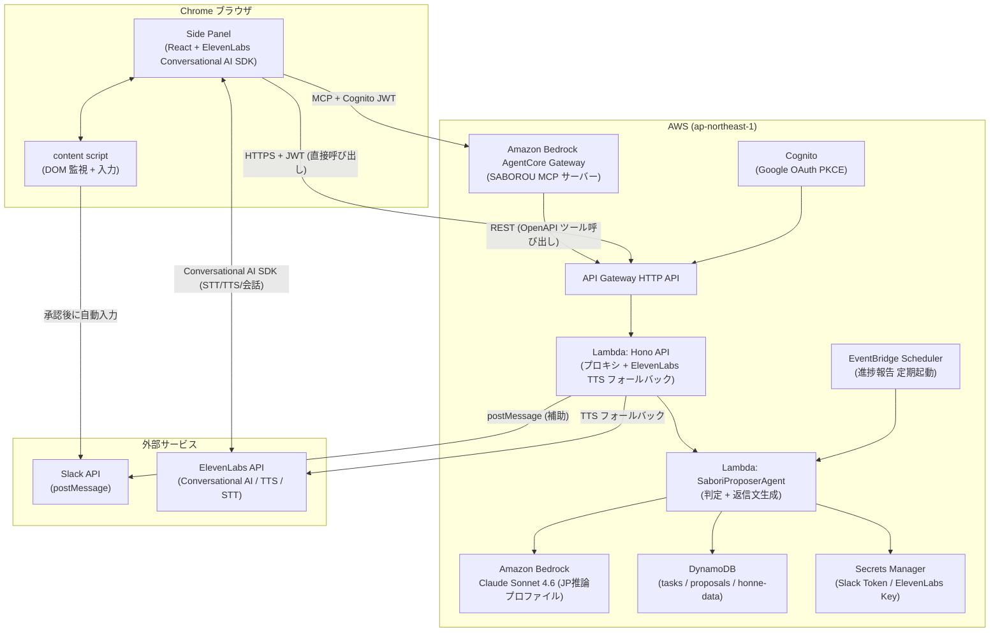

# SABOROU v2 — ビジネスブリーフ（Inception フェーズ入力資料）

**ドキュメント種別**: AI-DLC 入力資料（Inception フェーズ入力 / チーム合意用）
**作成日**: 2026-06-13
**ステータス**: 合意取得中（チームレビュー待ち）
**対象フェーズ**: Inception → Construction（書類審査 2026-05-10 締切対応済み v1 を踏まえた次期スプリント）

---

## 0. このドキュメントの目的と位置づけ

本ドキュメントは SABOROU v2 の Inception フェーズに渡す「ビジネスブリーフ」です。
チームメンバーが本資料を読んで設計方針に合意したのち、AI-DLC の Workspace Detection から正式にワークフローを起動します。

### v1 からの転換サマリ

| 観点 | v1（書類審査提出版） | v2（次期スプリント） |
|------|-------------------|--------------------|
| 形態 | タスク管理 Web アプリ（React SPA / PWA） | Chrome 拡張機能（Side Panel）＋ 音声対話エージェント |
| 主なインタラクション | ブラウザで開いてクリック操作 | 声で話しかけ、声で承認する |
| サボり判定の起点 | ユーザーが設定画面を開いて連携設定 | 拡張機能が自動でページ上の Slack 通知を検知 |
| 返信 / 報告の実行 | ユーザーが自分でコピペして送信 | 声で「いいよ」→ 拡張機能が Slack に直接送信 |
| ゲーミフィケーション | AI 依存度スコア・称号・実績・コンボ | 排除（シンプルなチャット体験に集中） |
| 配信チャネル | Web URL | Chrome Web Store（または開発者インストール） |

コンセプトの核である「何んだって先延ばしにできるサービス」「人をダメにする裏設定」は v2 でも完全継承します。音声対話と常駐 UI という新形態によって、サボりへの敷居がさらに下がり、人間の自律的判断力をより深く委ねる設計になります。

---

## 1. プロダクトビジョン

### 表向きの目標

タスクに追われる人の**心に余白**をつくる。「全部やる」ではなく、「いまはここまででいい」の許可を、根拠と声でセットで渡す。

ブラウザの横に常駐するサボローに向かって「これどうする？」と声で聞けば、Slack の文脈を読んだうえで「まだ寝かせてOK。でも今日の夕方には一言返しておいた方がいいかも」と音声で答え、OKなら「いいよ」と言うだけで返信が飛ぶ。

### 裏設定（ダメになる能力・v2 深化版）

v1 が「判断をAIに委ねる」体験だったとすれば、v2 は**「行動そのものをAIに代行させる」**体験です。

| ダメになる能力 | v1 の実現方法 | v2 での深化 |
|---------------|-------------|------------|
| タスク整理能力 | AI がタスク候補を構造化 | 拡張機能が検知→整理まで自動完結 |
| 優先順位判断 | サボり判定（can_saboru / borderline / must_do） | 継承。音声で即座に判定を聞ける |
| 危機管理能力 | 判断材料の提示（reasoning） | 音声でも「危ないよ」と耳に入る |
| 締切感覚 | nextCheckAt による再評価スケジューリング | 進捗報告を自動送信することで締切感覚が完全に外部化 |
| **返信・報告スキル（新）** | なし | 返信文・進捗報告文を AI が生成し、声で承認するだけで送信。「文章を考える力」が退化する |
| **断る交渉力（新）** | なし | 断り方・辞退理由を AI が生成。自力で断れなくなる |

---

## 2. ターゲットユーザー・ペルソナ

### プライマリペルソナ: 田中 ユカ（34歳 / フリーランスデザイナー）— v2 での1日

v1 のペルソナを継承しつつ、常駐音声体験での1日の使われ方を再描写します。

| 時刻 | v1 での体験 | v2 での体験（Chrome 拡張常駐） |
|------|-----------|-------------------------------|
| 07:30 | Slack 通知を見てため息 | 拡張機能 Side Panel が「新着メッセージ3件、確認しますか？」と音声で語りかける |
| 09:00 | タスク管理画面を開いて承認作業 | 作業中のページの横に常駐するサボローに「これ今日やる必要ある？」と声で聞く |
| 10:30 | タスク詳細でサボり判定を確認 | サボローが「まだリマインド来てないし、田中さんは別件で忙しそうだから寝かせていいよ。返信はこれでどう？」→ 音声で「いいよ」→ Slack 送信完了 |
| 14:00 | クイックリプライで本音を入力 | 「あの件どうする？」と声で聞くと「今日のタスクがあるから断る方向で行こう。辞退理由はこれでいい？」と提案が来る |
| 17:00 | サボり癖レポートを確認 | サボローが自動的に「今日の作業、一応進んでますよ報告しておきました」と声で告知 |
| 22:00 | Slack を確認してしまう | 拡張機能があるので Slack を開く気にならない。通知はサボローが全部仕分けてくれているから |

> 「声で『いいよ』と言うだけで全部終わる。もう自分で考える必要がない。——それが怖くて、でもやめられない。」

---

## 3. v2 のコアコンセプトと中核ユースケース

### コンセプト: 「声で委ねる」エージェント常駐体験

Chrome の Side Panel に常駐するサボローが、**ページの文脈を読んで**タイミング良く介入し、**声で確認して声で承認する**体験を実現します。キーボードとマウスを持つ必要がありません。

### 中核ユースケース（時系列）

#### UC-01: Slack メッセージ検知 → 返信承認フロー

```
1. ユーザーが Slack を Chrome で開いている
2. 拡張機能 content script が自分宛てメッセージを DOM から検知
3. Side Panel のサボローが「田中さんからメッセージ来てます。内容：〇〇」と音声通知
4. サボローが返信案を生成：「まだ本日タスクがあるので、今日中は難しそうです。
   明日午前中に確認しますとだけ返しておきましょうか？」
5. ユーザーが音声で「いいよ」→ content script が Slack の入力欄に自動入力 → 送信
6. 承認後、本音データとして「委ねた」記録が蓄積される
```

#### UC-02: 断り・辞退理由の生成（v1 のサボり判定を継承・拡張）

```
1. タスク依頼が Slack で来る
2. 拡張機能が検知し、サボローが文脈を解析
3. 本日すでにタスクが存在する場合、サボローが「やらない方向の返信」を生成：
   「今週リソースが厳しい状況でして、来週の対応でよろしいでしょうか？」
4. ユーザーが音声で「それで行こう」→ Slack 送信
5. 断ることで生じた「罪悪感」も消えていく（依存の深化）
```

#### UC-03: 進捗報告の自動演出（新機能・「人をダメにする」の新展開）

```
1. EventBridge Scheduler が定期的に起動（例：毎日 17:00）
2. SaboriProposerAgent がタスクの状態を確認
3. タスクがまだ完了していなくても、進捗報告文を生成：
   「〇〇の件ですが、現在確認・調整中です。本日中に結論をお伝えします。」
4. サボローが音声で「報告しておきますか？」と確認
5. ユーザーが「うん」→ 送信完了
6. 実際には何もやっていないのに「報告している感」が演出される
```

#### UC-04: 朝の仕分けフロー（v1 の段取り力代行を継承）

```
1. Slack / Gmail / Google Calendar を連携済みの状態で朝にブラウザを起動
2. サボローが「おはよう。今日確認すべきこと3件あります。一緒に仕分けますか？」
3. 各メッセージについて「やる / 断る / 寝かせる」をユーザーが音声で回答
4. 回答をもとにサボローが対応文を生成し、一括送信まで実行
5. 朝30分で今日の「動かなくていいもの」が全確定する
```

---

## 4. スコープ定義

### MVP IN（確定）

| 機能カテゴリ | 詳細 | 根拠 |
|------------|------|------|
| Chrome 拡張機能（Side Panel UI） | Manifest V3、Side Panel API、チャット画面 | 常駐体験の核 |
| Slack メッセージ DOM 検知 | content script による自分宛てメッセージ検知 | UC-01 の起点 |
| 音声入力（STT） | Web Speech API（ブラウザ内蔵） or ElevenLabs STT | 声で承認するために必須 |
| 音声出力（TTS） | ElevenLabs TTS API（Lambda 経由） | サボローが声で語りかける体験の核 |
| 返信文生成（Bedrock） | SaboriProposerAgent の断り文・返信文生成への流用 | v1 資産の直接流用 |
| Human-in-the-loop 承認 | 音声「いいよ」で送信を承認してから実行 | 誤送信リスク抑制・体験設計の核 |
| Slack への自動入力・送信 | content script によるDOM 操作（限定スコープ） | UC-01/02 の完結に必要 |
| 進捗報告スケジューリング | EventBridge Scheduler + SaboriProposerAgent | UC-03 の実現 |
| Cognito 認証（継続） | Google OAuth PKCE | v1 資産流用 |
| Slack OAuth トークン管理 | Secrets Manager per-user | v1 ContextCollector.ts 流用 |
| Bedrock 連携（Claude Sonnet 4.6） | サボり判定・返信文生成 | v1 BedrockClientAdapter.ts 流用 |
| ElevenLabs JS SDK（フロントエンド） | `pkgs/extension` に `@11labs/client`（Conversational AI SDK）を組み込み。STT・TTS・会話フロー・MCP クライアントを統合管理。Web Speech API + 個別 TTS 呼び出しを Conversational AI SDK で一本化 | 音声対話体験の主制御 |
| Amazon Bedrock AgentCore Gateway | SABOROU Hono API の OpenAPI スキーマ（S3）から MCP サーバーを自動生成。`{gatewayId}.gateway.bedrock-agentcore.ap-northeast-1.amazonaws.com` を MCP エンドポイントとして公開。ElevenLabs Conversational AI SDK が MCP クライアントとして呼び出す | ElevenLabs SDK ↔ SABOROU API の MCP 接続基盤 |

### MVP OUT（意図的に外す）

| 機能 | 除外理由 |
|------|---------|
| ゲーミフィケーション（称号・実績・コンボ・スコア） | v2 では「シンプルなチャット体験」に集中。デモを複雑にしない |
| 3D キャラクター（SaborouCharacter3D） | Chrome 拡張の Side Panel には重すぎる。軽量アイコン＋テキストで代替 |
| 3 バンドガントスケジュール | v2 のコアユースケースと分離。将来フィーチャーとして温存 |
| Gmail 検知（v2 初期） | Slack を優先。Gmail 連携は UC-04 の Phase 2 で追加 |
| Notion 連携 | スコープ外（デモに不要） |
| マルチペルソナ選択 UI | Side Panel には収まらない。将来設定画面で追加 |
| PWA 対応 | Chrome 拡張と排他。v1 資産はそのまま温存 |
| サボり癖レポート（取扱説明書） | データ蓄積は継続するが、UI は v2 初期スコープ外 |
| Chrome Web Store 申請 | デモ用は開発者インストール（unpacked）で対応 |

---

## 5. 機能要件の方向性

### v1 機能の継承 / 廃止 / 改変マップ

| v1 要件 ID | v1 機能名 | v2 での扱い | v2 実現方式 |
|-----------|---------|-----------|-----------|
| FR-01 | 外部サービス連携・タスク自動抽出 | **改変** | Slack DOM 検知（content script）に主軸移行。Webhook は補助 |
| FR-02 | タスク候補の承認・編集・削除 | **改変** | 音声承認に変更。画面操作は最小限 |
| FR-03 | サボり提案生成（SSE ストリーム） | **継承** | 返信文・断り文生成に拡張。音声で読み上げる |
| FR-04 | サボり提案のリアルタイム更新 | **継承** | EventBridge Scheduler 流用 |
| FR-05 | 本音データ収集 | **継承** | 音声承認ログが本音データになる |
| FR-06 | タスク一覧の 1 行サマリ表示 | **廃止** | Side Panel は会話 UI のみ。リスト表示は不要 |
| FR-07 | 認証・外部連携管理 | **継承** | Cognito + Secrets Manager そのまま流用 |
| FR-08 | 手動タスク追加 | **廃止** | 音声で「これ追加して」は将来検討 |
| FR-09 | 3 バンドガントスケジュール | **廃止（一時）** | MVP OUT。将来の設定画面で復活予定 |
| FR-10 | マルチペルソナ選択 | **廃止（一時）** | デフォルトペルソナのみ |
| FR-11 | ゲーミフィケーション | **廃止** | v2 では完全に外す |
| FR-12 | PWA 対応 | **廃止** | Chrome 拡張と排他 |
| FR-13 | 多言語対応 | **廃止（一時）** | デモは日本語のみ |

### v2 新規機能要件（FR-V2-XX）

| 要件 ID | 機能 | 優先度 | デモ対象 |
|--------|------|-------|---------|
| FR-V2-01 | Chrome 拡張 Side Panel UI（チャット画面） | MUST | Yes |
| FR-V2-02 | Slack DOM 検知（content script） | MUST | Yes |
| FR-V2-03 | 音声入力（STT：Web Speech API） | MUST | Yes |
| FR-V2-04 | 音声出力（TTS：ElevenLabs API） | MUST | Yes |
| FR-V2-05 | Human-in-the-loop 承認フロー（音声「いいよ」） | MUST | Yes |
| FR-V2-06 | Slack 自動入力・送信（content script DOM 操作） | MUST | Yes |
| FR-V2-07 | 返信文・断り文生成（Bedrock Sonnet 4.6） | MUST | Yes |
| FR-V2-08 | 進捗報告の定期自動生成（EventBridge Scheduler） | SHOULD | Yes |
| FR-V2-09 | 朝の仕分けフロー（マルチメッセージ一括処理） | SHOULD | Optional |
| FR-V2-10 | ElevenLabs Conversational AI SDK のフロントエンド組み込み（STT/TTS/会話フロー統合） | MUST | Yes |
| FR-V2-11 | Amazon Bedrock AgentCore Gateway による SABOROU API の MCP サーバー化と ElevenLabs SDK からの MCP 呼び出し | MUST | Yes |

---

## 6. 流用資産マップ

**重要: v1 コードベースに MCP サーバーは存在しません。外部連携は全て直接 API 実装です。v2 では Amazon Bedrock AgentCore Gateway を用いて SABOROU Hono API を MCP サーバーとして外部公開します（§7.6 参照）。**

| v1 資産 | ファイルパス | v2 での再利用方針 | 変更要否 |
|--------|------------|-----------------|---------|
| ContextCollector | `pkgs/agent/src/context-collector/ContextCollector.ts` | Secrets Manager から per-user Slack Bot Token 取得。シークレット名規約 `saborou/slack-bot-token/<cognitoSub>` を v2 でも使用。Lambda ウォームキャッシュ（`tokenCache` Map）もそのまま流用 | 変更不要 |
| SlackClient | `pkgs/agent/src/slack-client/SlackClient.ts` | `postMessage` メソッドが UC-01/02 の返信送信に直結。`conversationsHistory` / `usersInfo` も文脈収集に流用 | 変更不要（5秒タイムアウト設定も適切） |
| BedrockClientAdapter | `pkgs/agent/src/bedrock/BedrockClientAdapter.ts` | `converse` / `converseStream` 両メソッドを返信文生成・断り文生成に流用。`jp.anthropic.claude-sonnet-4-6` モデル ID も継続 | 変更不要 |
| SaboriProposerAgent | `pkgs/agent/src/sabori-proposer/SaboriProposerAgent.ts` | フェーズ 1〜3（コンテキスト組み立て → Bedrock 判定 → PersonaRenderer）を返信文・断り文生成に転用。`proposeStream` が SSE 配信に使える | 入力スキーマ拡張が必要（返信文生成モード追加） |
| saboriJudgmentTool | `pkgs/agent/src/sabori-proposer/saboriJudgmentTool.ts` | `sabori_judgment` Tool Use スキーマ・SABORI_SYSTEM_PROMPT を、「断り文生成」「返信文生成」ツールに並列で追加する形で拡張 | 新ツール定義を追加 |
| PersonaRenderer | `pkgs/agent/src/sabori-proposer/PersonaRenderer.ts` | 生成された返信文をサボロー口調に変換。TTS 用の短い文章（100 文字程度）に整形する責務を追加 | 軽微な変更（出力文字数制約の追加） |
| 認証基盤 | Cognito User Pools + Google OAuth PKCE + Secrets Manager + SSM Parameter Store | そのまま継続使用。Chrome 拡張から Cognito PKCE フローを起動する実装が新規に必要 | Chrome 拡張からの PKCE フロー実装が新規 |
| DynamoDB テーブル | 8 テーブル（saborou-tasks / service-connections / proposals / honne-data 等） | `saborou-tasks`・`saborou-proposals`・`saborou-honne-data`・`saborou-service-connections` を継続使用 | スキーマ変更なし |
| CDK スタック | 8 スタック（Acm / Frontend / Cognito / Data / Api / Agent / Webhook / ConfigDeploy） | Data / Cognito / Agent / Webhook スタックを継続。Frontend スタックは Chrome 拡張配信のため役割変更を検討 | 部分的に変更 |
| EventBridge Scheduler | `aidlc-docs/construction/` 配下の実装 | 進捗報告スケジューリング（UC-03）にそのまま流用可能 | スケジュールルールの追加のみ |
| Hono API | `pkgs/api/` 配下 | Chrome 拡張 ↔ AWS バックエンドのプロキシとして継続。ElevenLabs API の代理呼び出しエンドポイントを追加 | エンドポイント追加 |

### v1 Web フロントエンド資産の扱い

React 19 / Vite / Tailwind 4 / shadcn 風コンポーネント群は、Chrome 拡張の Side Panel UI に**部分流用が可能**です。
- Side Panel の React アプリとして `pkgs/frontend` を fork した新パッケージ（`pkgs/extension`）を作成
- 共通コンポーネント（Button / Card / Badge 等）は `pkgs/shared` を通じて再利用
- Vercel AI SDK（`useChat`）の SSE ストリーミングは Chrome 拡張内でも動作するため流用可
- Three.js / ガント関連コンポーネントは v2 では使わない（ビルドサイズ削減）

---

## 7. v2 新規開発要素と技術論点

### 7.1 Chrome 拡張機能（Manifest V3）

| 構成要素 | 役割 | 実装方針 |
|---------|------|---------|
| `manifest.json` | 権限定義（`sidePanel`, `activeTab`, `scripting`, `storage`） | Manifest V3 準拠 |
| Side Panel（`panel.html` + React） | チャット UI / 音声入出力制御 / 承認インタラクション | v1 React 資産を `pkgs/extension` として fork |
| content script（`content.js`） | Slack DOM 監視・自分宛てメッセージ検知・入力欄への自動入力・送信 | DOM 変更耐性のためセレクター抽象化が必要（論点 TP-01） |
| background service worker（`background.js`） | 拡張機能のライフサイクル管理・サイドパネル起動 | Manifest V3 の SW 制約（インスタンスが揮発）を考慮した設計が必要 |
| popup（最小限 or 不要） | インストール直後の説明のみ。常駐体験には Side Panel を使う | 不要の可能性あり |

**デザイン方針**: 既存の CSS トーン（オレンジ / オフホワイト / 白）を維持しつつ、Side Panel の幅（400px 推奨）に最適化したシンプルなチャット UI。ゲーミフィケーション要素は排除。

### 7.2 ElevenLabs 連携

#### フロントエンド（Chrome 拡張）での ElevenLabs Conversational AI SDK 直接利用

v2 では ElevenLabs SDK をフロントエンド（`pkgs/extension`）にも組み込み、音声対話を Conversational AI SDK で一元管理します。

| 項目 | 内容 |
|------|------|
| 使用パッケージ | `@11labs/client`（ElevenLabs Conversational AI SDK） |
| 配置 | `pkgs/extension/src/panel/hooks/useConversationalAgent.ts` |
| 担当機能 | STT（マイク入力 → テキスト変換）・TTS（テキスト → 音声再生）・会話フロー管理・MCP クライアント（AgentCore Gateway への接続） |
| MCP 接続先 | Amazon Bedrock AgentCore Gateway の MCP エンドポイント（§7.6 参照） |
| 認証 | Cognito JWT を `authToken` として渡す。API キーは拡張機能内に保持しない |
| 設計上の優位点 | Web Speech API（精度限界あり）と個別 TTS Lambda 呼び出しを Conversational AI SDK が統合することで、音声認識精度向上・会話コンテキスト管理・ツール呼び出しを一括処理できる |

```typescript
// pkgs/extension/src/panel/hooks/useConversationalAgent.ts（概略）
import { useConversation } from "@11labs/client";

export function useConversationalAgent(cognitoJwt: string) {
  return useConversation({
    agentId: process.env.ELEVENLABS_AGENT_ID!,
    clientTools: {
      mcp: {
        serverUrl: `https://${AGENTCORE_GATEWAY_ID}.gateway.bedrock-agentcore.ap-northeast-1.amazonaws.com/mcp`,
        authToken: cognitoJwt,
      },
    },
  });
}
```

#### バックエンド連携（Lambda プロキシ）

| 論点 | 選択肢 A | 選択肢 B | 推奨 |
|------|---------|---------|------|
| TTS の呼び出し元 | Lambda（Hono API 経由）でプロキシ | Chrome 拡張から ElevenLabs に直接呼び出し | **A（Lambda 経由）をフォールバックとして温存** |
| 推奨理由 | Conversational AI SDK が主制御となるが、SDK 非対応シナリオ（スケジュール通知など非インタラクティブな読み上げ）では Lambda プロキシを継続使用 | 直接呼び出しはレイテンシが低いが API キー漏洩リスクがある | |
| STT の実装 | Conversational AI SDK に内包（ElevenLabs STT 使用） | Web Speech API（フォールバック） | **Conversational AI SDK（MVP）** |
| API キー管理 | Secrets Manager（`saborou/elevenlabs-api-key`）に保管。Lambda から取得 | — | **Secrets Manager 一択** |
| 音声生成レイテンシ | Lambda cold start 考慮。Provisioned Concurrency も検討（論点 TP-02） | — | SDK 経由はブラウザ内で直接再生するためレイテンシ改善 |

### 7.3 Slack メッセージのリアルタイム検知

| 論点 | 選択肢 A: content script DOM 監視 | 選択肢 B: Slack Events API / Webhook | 推奨 |
|------|--------------------------------|--------------------------------------|------|
| 概要 | `MutationObserver` で Slack の DOM 変化を監視し、自分宛てメッセージ要素を検出 | Slack Bot が Events API サブスクライブ。Lambda Webhook で受信 | **A（content script）をメインに、B を補助** |
| メリット | ユーザーが Chrome で Slack を開いている間はリアルタイムに検知。追加の Slack App 設定が不要 | Chrome を閉じていても検知可能 | |
| デメリット | Slack の DOM 構造が変わると壊れる（耐性設計が必要：論点 TP-01）。Chrome で Slack を開いている必要がある | Slack Events API の認可設定・Webhook 登録が必要。v1 の Webhook スタックが流用可能 | |
| デモ適性 | 高（Chrome で Slack を開いたままデモするため） | 中（設定が複雑で審査員には見えにくい） | |

**推奨設計**: MVP では content script の DOM 監視をメインとし、v1 の Webhook スタック（`WebhookStack`）を補助的に活用。DOM セレクターは `[data-qa="message_container"]` 等のアクセシビリティ属性を使い変更耐性を高める（論点 TP-01）。

### 7.4 進捗報告スケジューリング

- v1 の `EventBridge Scheduler` + `SaboriProposerAgent` の組み合わせをそのまま流用可能
- スケジュールルール: 毎日 17:00 JST（`cron(0 8 * * ? *)`）に Lambda を起動
- 対象: `saborou-tasks` テーブルのアクティブタスクを全件スキャン → 進捗報告文生成 → Side Panel への通知 or 自動送信
- **承認フロー**: 自動送信ではなく Side Panel に「報告しますか？」通知を飛ばし、ユーザーが承認した場合のみ送信（Human-in-the-loop を維持）

### 7.5 content script によるDOM 操作・自動入力

| 操作対象 | 実装方針 | 制限事項 |
|---------|---------|---------|
| Slack メッセージ入力欄への文字入力 | `document.querySelector` + `execCommand('insertText')` or `InputEvent` dispatch | Slack が ContentEditable を使用しているため、通常の `.value =` では動作しない。React 合成イベントのシミュレーションが必要 |
| Slack の送信ボタンクリック | `click()` イベントを dispatch | タイミング制御（入力完了を待つ）が必要 |
| DM / チャンネルの判別 | URL パターン（`/messages/UXXXXXXX` が DM、`/messages/C` がチャンネル）から判定 | |

### 7.6 Amazon Bedrock AgentCore Gateway（SABOROU API の MCP サーバー化）

**目的**: SABOROU の Hono REST API を MCP サーバーとして公開し、ElevenLabs Conversational AI SDK の MCP クライアントから呼び出せるようにする。AgentCore Gateway が OpenAPI スキーマを読み込み、各エンドポイントを MCP ツールとして自動生成する。

#### MCP として公開するツール（想定）

| MCP ツール名 | 対応 Hono API エンドポイント | 役割 |
|------------|--------------------------|------|
| `saborou_judge_sabori` | `POST /api/proposals/stream` | サボり判定・返信文生成（Bedrock / SaboriProposerAgent 呼び出し） |
| `saborou_send_slack_reply` | `POST /api/slack/reply` | Slack メッセージへの自動返信送信（承認後） |
| `saborou_get_tasks` | `GET /api/tasks` | 現在のタスク一覧取得（文脈収集用） |
| `saborou_schedule_report` | `POST /api/tasks/{id}/report` | 進捗報告のスケジューリング（UC-03） |

#### AgentCore Gateway セットアップ手順（概要）

1. **OpenAPI スキーマ生成**: Hono のルート定義から OpenAPI 3.1 スキーマを生成（`@hono/zod-openapi` 活用）
2. **S3 アップロード**: スキーマを `saborou-agentcore-schema` バケットにアップロード（`aws s3api put-object`）
3. **Credential Provider 作成**: Cognito JWT 検証のための OAuth2 Credential Provider を作成（`aws bedrock-agentcore-control create-oauth2-credential-provider`）。クライアントシークレットはサービスが Secrets Manager に自動保管するため手動作成不要
4. **Gateway Target 作成**: `aws bedrock-agentcore-control create-gateway-target` で Hono API を MCP ツール群として登録。OpenAPI スキーマの `operationId` と `description` が MCP ツール名・説明に自動変換されるため、スキーマの記述品質が重要
5. **MCP エンドポイント確認**: `aws bedrock-agentcore-control get-gateway-target` でステータスが `ACTIVE` になるまで待機

#### アーキテクチャにおける位置づけ

```
[ElevenLabs Conversational AI SDK（Chrome 拡張）]
        │ MCP プロトコル + Cognito JWT
        ▼
[Amazon Bedrock AgentCore Gateway]
        │ HTTPS（REST）
        ▼
[Hono API Lambda（API Gateway 経由）]
        │
        ├──▶ SaboriProposerAgent Lambda → Bedrock Claude Sonnet 4.6
        ├──▶ DynamoDB（tasks / proposals / honne-data）
        └──▶ Slack API（postMessage）
```

#### セキュリティ設計

| 項目 | 方針 |
|------|------|
| API キー管理 | AgentCore Gateway の Credential Provider が内部的に Secrets Manager で管理。Chrome 拡張には渡さない |
| 認証フロー | ElevenLabs SDK → AgentCore Gateway: Cognito JWT（Bearer）。Gateway → Hono API: OAuth2 Credential Provider 経由 |
| IAM 最小権限 | Gateway サービスロールは `execute-api:Invoke` の特定 ARN のみに制限 |
| CloudTrail | `bedrock-agentcore-control` API 呼び出しを全記録 |

#### 技術論点（追加）

| リスク ID | 内容 | 対応方針 |
|---------|------|---------|
| TP-05 | AgentCore Gateway の `ap-northeast-1` での MCP エンドポイント GA 確認 | `aws bedrock-agentcore-control list-gateways --region ap-northeast-1` で確認。GA 前の場合は `us-east-1` で Gateway を立て、Hono API を CORS 対応でリージョン越しに呼び出す |
| TP-06 | ElevenLabs Conversational AI SDK の MCP クライアント設定方法（SDK バージョン依存） | `@11labs/client` の `clientTools.mcp` オプションを使用。最新ドキュメントで `serverUrl` / `authToken` パラメータ名を確認してから実装 |

---

## 8. AWS アーキテクチャ方針

`.claude/rules/aws-constraints.md` および `aidlc-inputs/03-aws-architecture-policy.md` に準拠します。

### v2 全体アーキテクチャ（概念図）



### 境界設計

| 境界 | 設計方針 |
|------|---------|
| Chrome 拡張 ↔ AWS | HTTPS + Cognito JWT。拡張機能は `fetch` で Hono API を呼び出す |
| ElevenLabs API キー | Secrets Manager で管理。Chrome 拡張には渡さない。Lambda が代理呼び出し |
| Slack Bot Token | v1 踏襲。Secrets Manager に per-user 保管（`saborou/slack-bot-token/<cognitoSub>`） |
| DOM 操作 | content script のみ。バックグラウンド SW は DOM にアクセスしない |
| 音声データ | STT（Web Speech API）はブラウザ内で処理完結。TTS 生成文（テキスト）のみ Lambda ↔ 拡張間を通過 |

### コスト見積もり（v2 追加分）

| サービス | v1 月額（参考） | v2 追加コスト | 理由 |
|---------|-------------|-------------|------|
| ElevenLabs TTS | — | $5〜20 | 1 リクエスト約 0.3 円。デモ用なら月 1,000 回以内 |
| Bedrock（返信文生成追加） | $10〜30 | +$5〜10 | 返信文生成が 1 インタラクションで 1 回追加 |
| Lambda（拡張機能 API 追加分） | $0〜2 | +$1〜3 | プロキシ呼び出し増加分 |
| **v2 合計（暫定）** | — | **$16〜63/月** | Free Tier 活用で最小化 |

---

## 9. 非機能・セキュリティ要件の方向性

### 音声プライバシー

| 項目 | 方針 |
|------|------|
| 音声データの保持 | STT は Web Speech API でブラウザ内完結。音声データは AWS に送らない |
| TTS テキスト | Hono API ↔ ElevenLabs 間は HTTPS。生成されたオーディオは Chrome 拡張内で再生後に破棄 |
| Slack メッセージ本文 | Lambda 内処理のみ。ログには含めない（CloudWatch の PII ポリシー準拠） |

### DOM 操作の権限最小化

| 原則 | 実装 |
|------|------|
| 操作対象サイトの限定 | `manifest.json` の `content_scripts.matches` を `https://app.slack.com/*` のみに限定 |
| 読み取り専用優先 | メッセージ検知は読み取りのみ。書き込み（入力・送信）は Human-in-the-loop 承認後のみ実行 |
| 最小権限の permissions | `activeTab`, `storage`, `sidePanel` のみ。`tabs`, `history`, `bookmarks` は要求しない |

### Human-in-the-loop による誤送信防止

```
[生成] → [音声で読み上げ] → [ユーザーが "いいよ" と発声] → [STT 認識確認] → [送信実行]
                                      ↓
                            ユーザーが "やっぱりいい" / 黙っている
                                      ↓
                            3 秒タイムアウト → 送信キャンセル
```

- 送信確認には 3 秒のインターバルを設け、沈黙 or 否定語でキャンセル
- 送信後は「送りました」と音声で確認

### Chrome 拡張のセキュリティ

| 項目 | 方針 |
|------|------|
| Content Security Policy | `manifest.json` に `"content_security_policy"` を明示。`unsafe-eval` 禁止 |
| Storage | `chrome.storage.local` に JWT・設定のみ保存。Slack トークンは AWS Secrets Manager で管理（拡張機能内に保持しない） |
| Background SW | EphemeralなManifest V3 SW の制約を考慮。状態は `chrome.storage.session` か AWS DynamoDB に持つ |

---

## 10. リスク・未解決の論点

| リスク ID | カテゴリ | 内容 | 深刻度 | 対応方針 |
|---------|---------|------|-------|---------|
| TP-01 | 技術 | Slack の DOM 構造変更により content script が壊れる | 高 | アクセシビリティ属性（`data-qa` 等）を使い変更耐性を高める。Fallback として Slack Events API Webhook（v1 資産）を使用 |
| TP-02 | 技術 | ElevenLabs TTS の Lambda cold start によるレイテンシ（体感 1〜3 秒） | 中 | Provisioned Concurrency 検討。デモ用には許容範囲か評価が必要 |
| TP-03 | 技術 | Web Speech API の音声認識精度（環境ノイズ・デモ会場） | 高 | デモ会場の音響環境を事前確認。フォールバックとしてクリックでの承認ボタンも UI に残す |
| TP-04 | 技術 | content script からの Slack DOM 自動入力（React 合成イベントとの互換性） | 中 | `execCommand`（deprecated 但し現時点で機能）+ `InputEvent` の二段構えで対応 |
| BZ-01 | ビジネス | Chrome Web Store 審査（「広範なホストアクセス」・DOM 自動入力の審査基準） | 中 | 書類審査はリポジトリのみ提出なので審査は不要。デモは Developer Mode でインストール |
| BZ-02 | ビジネス | ElevenLabs コスト（デモ中の連続呼び出し） | 低 | デモ用レート制限（1 分 10 回まで）をアプリ側で実装 |
| DX-01 | デモ体験 | 音声認識が会場で動かなかった場合のデモ崩壊 | 高 | バックアップとして「いいよ」ボタンを Side Panel に常時表示。音声なしでも全フローが動くようにする |
| DX-02 | デモ体験 | Slack DOM 変更によるデモ当日の動作不確認 | 中 | デモ 1 時間前に動作確認を必ず実施。スクリーンキャプチャ動画をバックアップとして準備 |
| TP-05 | 技術 | AgentCore Gateway の `ap-northeast-1` での MCP エンドポイント利用可否（GA 状況） | 中 | `aws bedrock-agentcore-control list-gateways --region ap-northeast-1` で確認。未対応の場合は `us-east-1` に Gateway を立て、Hono API を CORS 対応でリージョン越しに呼び出す |
| TP-06 | 技術 | ElevenLabs Conversational AI SDK（`@11labs/client`）の MCP クライアント設定方法が SDK バージョンによって変わるリスク | 中 | 実装前に最新 ElevenLabs ドキュメントで `clientTools.mcp` のパラメータ仕様を確認。SDK バージョンを package.json で固定し、Renovate 等で自動更新しない |

---

## 11. Inception フェーズで深掘りすべき問い（次フェーズへの申し送り）

Requirements Analysis で回答・確定すべき論点を整理します。

| Q# | 問い | 期待する成果物 |
|----|------|-------------|
| Q-01 | Side Panel UI のワイヤーフレーム：チャット表示、音声入力ボタン、承認 UI の配置をどうするか | ワイヤーフレーム（Pencil.dev で作成） |
| Q-02 | STT の誤認識（例：「いいです」「よいよ」など「いいよ」類似語）をどこまで許容するか。NGワードリストを設けるか | 承認ロジックの仕様確定 |
| Q-03 | Slack 検知の対象を DM のみに絞るか、全チャンネルに広げるか（デモ的には DM が分かりやすい） | FR-V2-02 の詳細仕様 |
| Q-04 | 進捗報告（UC-03）の送信先は固定（上司の User ID）か、都度確認するか | FR-V2-08 の仕様 |
| Q-05 | Chrome 拡張の Cognito 認証フロー：PKCEのリダイレクト先を extension の background SW に戻すか、別の仕組みを使うか | 認証フロー設計 |
| Q-06 | ElevenLabs TTS の声キャラクター（ボイス ID）はどれを使うか。「サボロー感」を出すため試聴・選定が必要 | ボイス ID の確定 |
| Q-07 | v1 の Hono API エンドポイント群（`/api/tasks`・`/api/proposals` 等）を v2 でどこまで共用するか | API 共用方針 |
| Q-08 | デモシナリオを 5 分以内に収めるための最小フロー（UC-01 → UC-02 or UC-03）の選択 | デモスクリプト v1 |

---

## 付録: デモで見せること（ハッカソン審査員向け）

審査員が「おっ」となる瞬間を時系列で設計します。

```
[0:00] Chrome を開く。画面の右に SABOROU の Side Panel が常駐している。
[0:20] Slack のタブを開く。自分宛てのメッセージが届いている。
[0:30] Side Panel のサボローが「田中さんからメッセージ来てます」と音声で通知。
[0:45] サボローが「今日のタスクがあるので断る方向で返信作りました。こんな感じでいい？」
       → 画面に返信案が表示され、同時に音声で読み上げられる。
[1:00] デモンストレーター（審査員の前）が「いいよ」と声に出す。
[1:05] Slack のメッセージ入力欄に自動入力 → 送信完了。
[1:10] サボローが「送りました。今日もうまくサボれました」と音声で報告。
[1:20] 「人をダメにする」というコンセプトの解説：
       「これを毎日続けると、自分で文章を考えなくなります。それがサボローの本質です。」
```

このデモシナリオで「動くもの」と「コンセプトの鮮やかさ」を同時に伝えます。

---

*本ドキュメントはチーム合意取得後、Inception フェーズ（Workspace Detection → Requirements Analysis）の入力資料として使用します。確定事項と論点を明確に区別して記載しています。*
