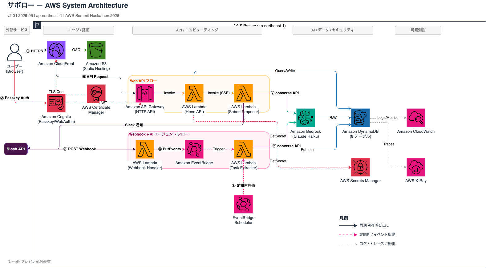
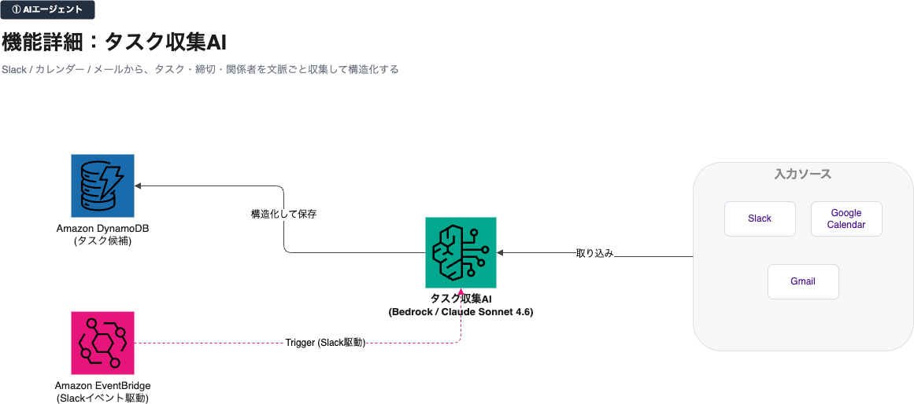
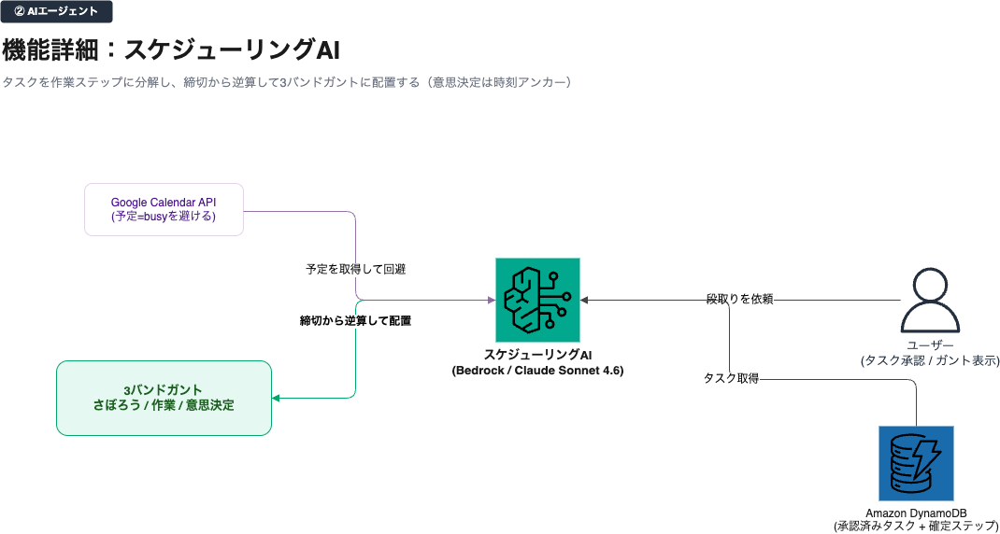
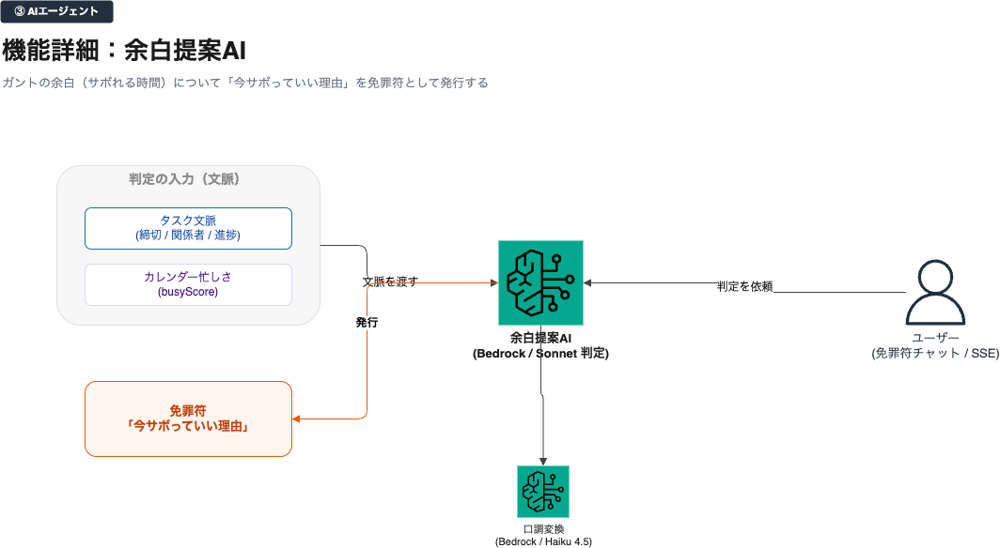
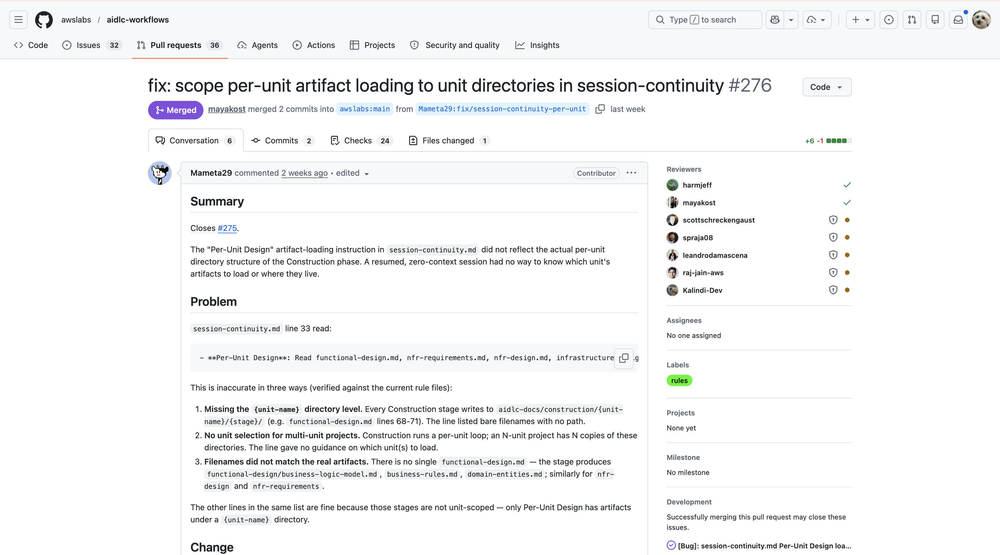

<!-- _paginate: false -->
<!-- _class: title -->

# 技術アーキテクチャー と AI-DLC の実践と工夫
## SABOROU — AWS Summit Japan 2026 Hackathon

---

<!-- _class: section -->
<!-- _paginate: false -->

## 技術アーキテクチャー

心理学 × AI Agent × フルサーバーレス

---



---



---



---



---

## 3 AI Agents がつくる「サボり判定エンジン」

<div class="columns col-3">
<div class="card accent">

### Agent ① 抽出
<strong>TaskExtractorAgent</strong>

Slack Webhookを受信し
Bedrock Tool Use で
タスクを<strong>構造化抽出</strong>

</div>
<div class="card warn">

### Agent ② 整理
<strong>SchedulePlannerAgent</strong>

依存関係を解析し
心理学5理論で
<em>サボれる度</em>スコアを算出

</div>
<div class="card success">

### Agent ③ 提案
<strong>SaboriProposerAgent</strong>

根拠付きのサボり提案を生成
PersonaRenderer で
<strong>おっとり口調</strong>に変換

</div>
</div>

<div class="highlight">

EventBridge でイベント駆動連携 — Slack Webhook から <br/>SSE ストリーミング配信まで、3 Agents が<strong>疎結合で一気通貫</strong>

</div>

---
<!-- _class: dark -->

## Bedrock Tool Use で「説明できるAI判定」を実現

<div class="columns">
<div>

### 構造化出力を強制する設計

```typescript
// Tool Use で LLM の出力形式を保証
toolChoice: { type: "tool",
              name: "sabori_judgment" }
```

判定結果は必ずこの5フィールドで返る:

<table>
<thead><tr><th>フィールド</th><th>内容</th></tr></thead>
<tbody>
<tr><td style="color:#FF9900;"><code>verdict</code></td><td style="color:#FF9900;">can_saboru / borderline / must_do</td></tr>
<tr><td style="color:#FF9900;"><code>reasoning</code></td><td style="color:#FF9900;">判断の根拠（自然言語）</td></tr>
<tr><td style="color:#FF9900;"><code>summaryText</code></td><td style="color:#FF9900;">1行サマリ</td></tr>
<tr><td style="color:#FF9900;"><code>rawChatMessage</code></td><td style="color:#FF9900;">元の入力メッセージ</td></tr>
<tr><td style="color:#FF9900;"><code>nextCheckOffsetMinutes</code></td><td style="color:#FF9900;">次に確認する分数</td></tr>
</tbody>
</table>

> AIが<strong>何を根拠に判断したか</strong>をユーザーに開示。<br/>ブラックボックスにしない設計

</div>
<div>

### 心理学5理論をContextSignalに変換

<div class="card accent"><strong>Collective Effort Model</strong> 文脈欠損を検出</div>
<div class="card accent"><strong>Identifiability Effect</strong> 監視度を評価</div>
<div class="card accent"><strong>Self-Determination Theory</strong> <br/>外発プレッシャーを定量化</div>
<div class="card accent"><strong>Expectancy Theory</strong> 今やる期待値を算出</div>
<div class="card accent"><strong>Sucker Effect</strong> —損な役回りを検出</div>

<div style="margin-top:10px; font-size:0.8em; color:#FF9900;">
5理論中4理論に査読論文 DOI あり<br/>（Expectancy Theory は書籍）
</div>

</div>
</div>

---

## プロダクション品質のサーバーレスインフラ

<div class="columns">
<div>

### AWS CDK v2 — 7スタック構成

<div class="cdkgrid">
<div class="cdk-item"><strong>CognitoStack</strong> 認証・Google OAuth</div>
<div class="cdk-item"><strong>DataStack</strong> DynamoDB 8テーブル</div>
<div class="cdk-item"><strong>ApiStack</strong> Hono on Lambda</div>
<div class="cdk-item"><strong>AgentStack</strong> 3 AI Agents</div>
<div class="cdk-item"><strong>WebhookStack</strong> EventBridge</div>
<div class="cdk-item"><strong>FrontendStack</strong> CloudFront+S3</div>
<div class="cdk-item"><strong>ConfigDeployStack</strong> 環境設定・デプロイ制御</div>
</div>

<div style="margin-top:10px; margin-bottom:6px;">
<span class="aws-badge">Lambda</span>
<span class="aws-badge">DynamoDB</span>
<span class="aws-badge">Bedrock</span>
<span class="aws-badge">EventBridge</span>
<span class="aws-badge">Cognito</span>
<span class="aws-badge">CDK v2</span>
</div>

<div style="font-size:0.72em; color:#64748b; line-height:1.7;">
Lambda = サーバーレスでコスト最適 / DynamoDB = On-Demand で0→スケール対応<br>
Bedrock = モデルガバナンスとTool Use強制 / EventBridge = Agent間の疎結合
</div>

</div>
<div>

### 品質の証拠

<div class="stat-grid">
<div class="stat-item">
<span class="stat-value">1,322</span>
<span class="stat-label">テスト全パス</span>
</div>
<div class="stat-item">
<span class="stat-value green">0</span>
<span class="stat-label">cdk-nag エラー</span>
</div>
<div class="stat-item">
<span class="stat-value blue">$31</span>
<span class="stat-label">月額コスト</span>
</div>
</div>

<div class="highlight">

Cognito PKCE + <strong>HMAC-SHA256 署名</strong>付き OAuth state でCSRF対策済み。Slack Webhook 署名検証。<strong>入力生データは永続化せず、構造化データをTTL 30日保持</strong>

</div>

</div>
</div>

---

<!-- _class: section -->
<!-- _paginate: false -->

## AI-DLC の工夫

ただ使うのではなく、強化した

---

## 工夫 1 — Inception 前に環境を整え、AIをロジック設計に集中させた

<div class="columns">
<div>

### AI-DLC 開始前にやったこと

<div class="steps">
<div class="step">

<strong>モノレポ構築</strong> (pnpm workspaces)
7 Unit の依存順序を先に設計

</div>
<div class="step">

<strong>CI / テスト環境を先行整備</strong>
Vitest・Playwright・Biome を設定済みに

</div>
<div class="step">

<strong>チームでゴールイメージを徹底すり合わせ</strong>
要件・設計・ユーザーストーリーを何度も確認

</div>
</div>

</div>
<div>

### 効果

<div class="card warn">

<strong>AIへの「ノイズ」を排除</strong>

環境整備を人間側で実施して開始することで、AIが<strong>アーキテクチャ設計とロジック実装だけに集中</strong>できる状態を作った

</div>

<div class="card success">

<strong>人間が何度も確認・修正した →</strong>
要件・設計・ストーリーを繰り返しレビューし<br>チームで<strong>合意してから</strong>実装に進んだ

</div>

</div>
</div>

---
<!-- _class: dark -->

## 工夫 2 — 形式検証をワークフローに追加し、安全性を通学的に証明した

<div class="columns">
<div>

### 証明した3つのコアロジック

<div class="card accent"><strong>GuardTokenLimit</strong> <br/>　— 二分探索の<strong>終了性</strong>と境界値安全性</div>
<div class="card accent"><strong>Pseudonymize</strong><br/> 　— <strong>旧実装の衝突存在</strong>・HMAC 単射性</div>
<div class="card accent"><strong>ContextUtils</strong><br/> 　— スコアの<strong>単調性</strong></div>

### 専用 SKILL + サブエージェントを自作

Inception Application Design 完了後、<strong>実装前に</strong>Leanで定理を証明してから Construction へ進むフローを AI-DLC に組み込んだ

</div>
<div>

### オフバイワン証明（核心）

```lean
-- 通常の mid だと low=h-1 で無限ループ!
-- 上側バイアス式で終了を数学的に保証:
def upperBiasedMid (low high : Nat) :=
  (low + high + 1) / 2

theorem upperBiasedMid_gt_low
    (h : low < high) :
    upperBiasedMid low high > low := by
  simp [upperBiasedMid]; omega  -- QED ✓
```

<div class="highlight">

AIが設計したロジックの正しさを<br><strong>数学的定理として証明</strong>してから実装

</div>

</div>
</div>

---

## 工夫 3 — AI-DLCのバグを発見し、公式OSSに PR してマージさせた

<div class="columns col-6-4 middle">
<div>

### 発見したバグ: `session-continuity.md` の不整合

Construction 実行時に遭遇した問題:

<div class="card accent"><strong>問題①</strong> パスに `{unit-name}` が含まれない <br/>→ ファイルが見つからない</div>
<div class="card accent"><strong>問題②</strong> 複数ユニット時にどれを読むか指示がない</div>
<div class="card accent"><strong>問題③</strong> 実在しないファイル名を指定していた</div>

### 修正方針

`Read functional-design.md` を
`aidlc-docs/construction/{unit-name}/functional-design/` に修正し、`aidlc-state.md` から進行中ユニットを特定するよう改善

</div>
<div>

<div class="merged-hero">
<div class="repo">awslabs / aidlc-workflows</div>
<div class="pr-num">PR #276</div>
<div class="badge">✓ MERGED</div>
<div class="approvers">
Approved by<br>
<span class="approver-name">harmjeff</span><br>
<span class="approver-name">mayakost</span>
</div>

<a href="https://github.com/awslabs/aidlc-workflows/pull/276"
   style="display:inline-block; margin-top:10px; font-size:0.55em;
          color:#a78bfa; text-decoration:none; word-break:break-all;">
  PRのリンクはこちら
</a>
</div>

</div>
</div>

---

